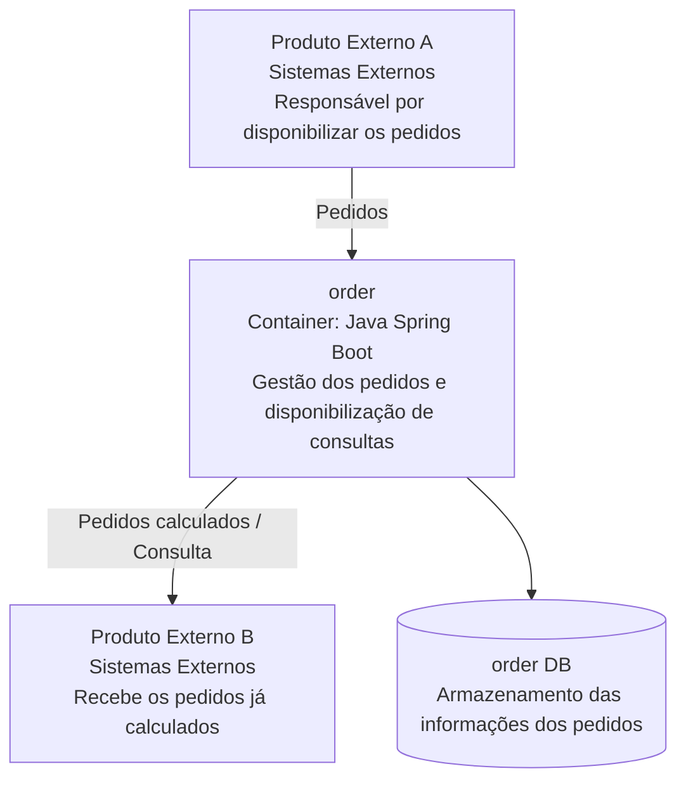

# Implementação do gerenciamento dos pedidos

## Objetivo
Criar um serviço **order** responsável por gerenciar e calcular os produtos de um pedido. Os pedidos serão disponibilizados por um **Produto Externo A** e, após a gestão e o cálculo realizados no serviço **order**, deverão ser disponibilizados para um **Produto Externo B**.

---

## Descrição
Será necessária uma integração com o **Produto Externo A** para o recebimento dos pedidos. No serviço **order**, será realizada a gestão do pedido e o cálculo do valor total dos produtos, somando o valor de cada item do pedido.

Além disso, será necessário disponibilizar uma forma de **consulta de pedidos e produtos**, incluindo seus **status**, para que o **Produto Externo B** possa receber os pedidos já calculados.

> Considerar uma volumetria de **150 mil a 200 mil pedidos por dia**.

---

## Desenho da Arquitetura (Exemplo)

- **Azul**: representa o serviço a ser implementado (order).
- **Cinza**: representa sistemas externos.

---

## Informativo

### Pontos extras
- Verificação de **duplicação de pedidos**.
- Garantia de **alta disponibilidade** do serviço diante da volumetria elevada.
- Garantia de **consistência dos dados** e controle de **concorrência**.
- Avaliação se a volumetria pode **engargalar o banco de dados** escolhido.

---

## Soluções propostas
- Implementação dos requisitos mencionados.
- Liberdade para elaborar a solução considerando a abordagem mais adequada.
  - Os pontos listados servem como **direcionamento**, não como limitação.
- Utilização dos **protocolos de comunicação** que forem considerados mais adequados.
- Aplicação de **boas práticas de arquitetura e desenvolvimento**.
- Apresentação de um **novo desenho do modelo final** desenvolvido, destacando as adequações realizadas para atingir o objetivo.
- **Implementação apenas do serviço `order`**.
  - Não há necessidade de implementar os sistemas externos A e B.

---

## Tecnologias
- O sistema deve ser construído utilizando **Java com Spring Boot**.
- É permitido escolher o **banco de dados** mais adequado ao cenário.
- Podem ser utilizadas **bibliotecas adicionais** conforme necessário para atingir o objetivo.

---

## Entregáveis
- Entrega rápida, com possibilidade de **apresentação do código durante a entrevista** (compartilhamento de tela).
- Código disponibilizado em um **repositório Git**.
- Aplicação rodando localmente, com **exemplos das integrações externas A e B** (mockadas ou simuladas).
- **Desenho final da solução proposta**.
  - O desenho inicial pode ser ajustado conforme considerado mais adequado.

