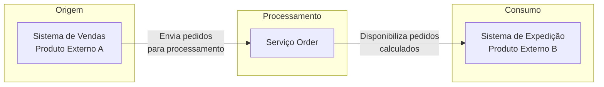
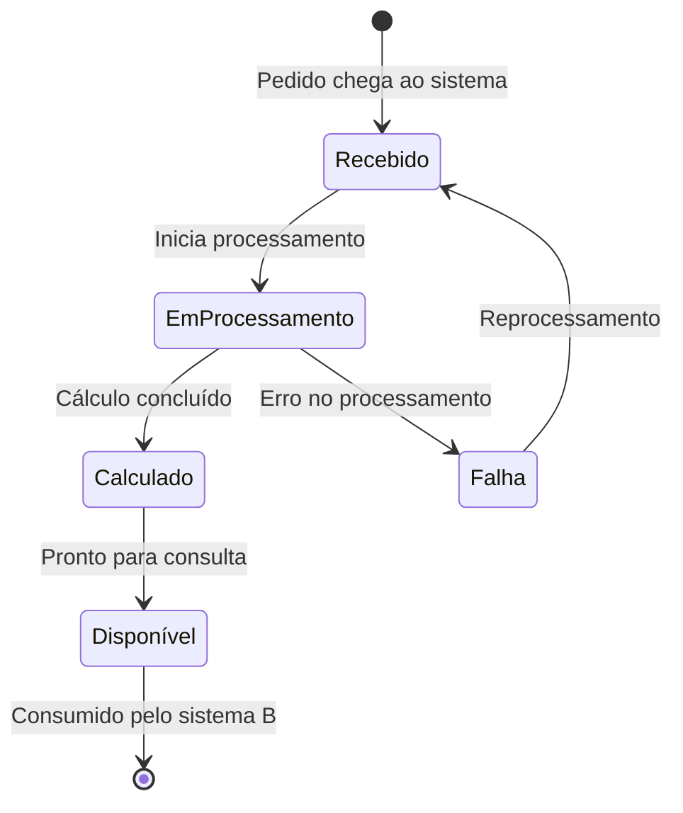
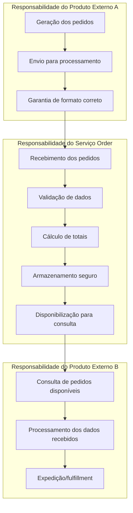

# Order Management Service

## Visão Geral

O **Serviço Order** é responsável pelo gerenciamento centralizado de pedidos no ecossistema de vendas. Este serviço atua como ponto de integração entre sistemas de origem de pedidos e sistemas de consumo, garantindo o processamento, cálculo e disponibilização de informações de forma confiável.

## Objetivo de Negócio

Prover uma solução robusta para:

- **Receber pedidos** de sistemas parceiros externos
- **Processar e calcular** valores totais dos pedidos automaticamente
- **Disponibilizar consultas** para sistemas consumidores acessarem pedidos prontos

## Fluxo de Negócio



### Etapas do Fluxo

1. **Recebimento**: O sistema de vendas (Produto Externo A) envia pedidos para processamento
2. **Validação**: O serviço valida a integridade e consistência dos dados recebidos
3. **Cálculo**: Os valores totais são calculados automaticamente (soma dos itens)
4. **Disponibilização**: Pedidos calculados ficam disponíveis para consulta pelo sistema de expedição

## Estados do Pedido



| Estado | Descrição |
|--------|-----------|
| **Recebido** | Pedido chegou ao sistema e aguarda processamento |
| **Em Processamento** | Pedido está sendo validado e calculado |
| **Calculado** | Valores totais foram calculados com sucesso |
| **Disponível** | Pedido está pronto para ser consultado pelo sistema B |
| **Falha** | Ocorreu erro no processamento (será reprocessado) |

## Regras de Negócio

### Cálculo de Totais

O valor total de um pedido é calculado pela soma dos valores de cada item:

```
Total do Pedido = Σ (Preço Unitário × Quantidade)
```

**Exemplo:**

| Item | Preço Unitário | Quantidade | Subtotal |
|------|----------------|------------|----------|
| Produto A | R$ 50,00 | 2 | R$ 100,00 |
| Produto B | R$ 30,00 | 3 | R$ 90,00 |
| **Total** | | | **R$ 190,00** |

### Validações

- Todo pedido deve ter pelo menos um item
- Preço unitário deve ser maior que zero
- Quantidade deve ser maior que zero
- Identificador do pedido deve ser único (sem duplicidades)

## Consultas Disponíveis

O sistema de expedição (Produto Externo B) pode consultar:

| Consulta | Descrição |
|----------|-----------|
| **Por Status** | Lista pedidos filtrados por estado (ex: apenas "Disponível") |
| **Por Período** | Lista pedidos de um intervalo de datas |
| **Por Identificador** | Busca pedido específico pelo código |
| **Listagem Geral** | Lista todos os pedidos com paginação |

## Volumetria Esperada

O serviço foi projetado para suportar:

- **150.000 a 200.000 pedidos por dia**
- Picos de demanda em horários comerciais
- Consultas simultâneas de múltiplos sistemas

## Garantias do Serviço

| Garantia | Descrição |
|----------|-----------|
| **Sem Duplicidade** | Pedidos com mesmo identificador não são processados duas vezes |
| **Consistência** | Dados persistidos são íntegros e confiáveis |
| **Disponibilidade** | Serviço projetado para alta disponibilidade |
| **Rastreabilidade** | Todos os pedidos podem ser consultados por seu identificador único |

## Responsabilidades no Ecossistema



## Contato

Para dúvidas sobre regras de negócio ou integrações, entre em contato com a equipe responsável pelo serviço.
