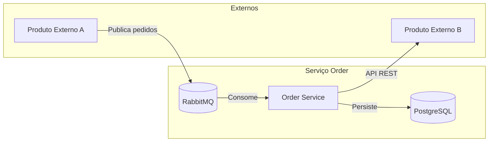
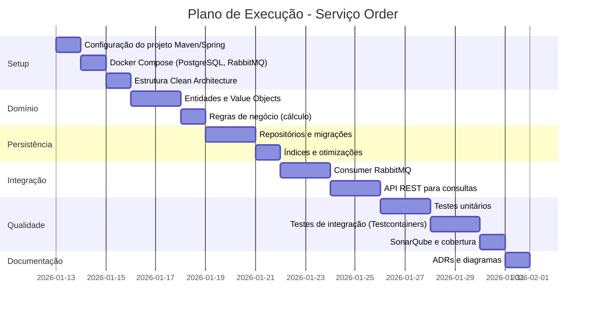
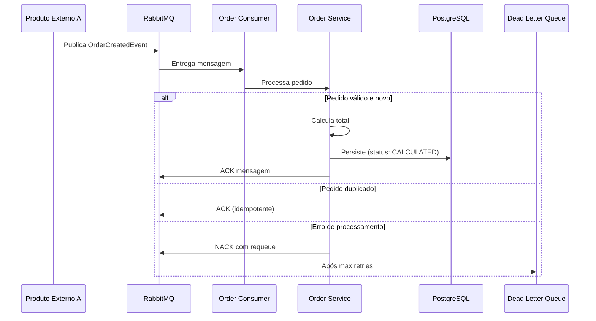
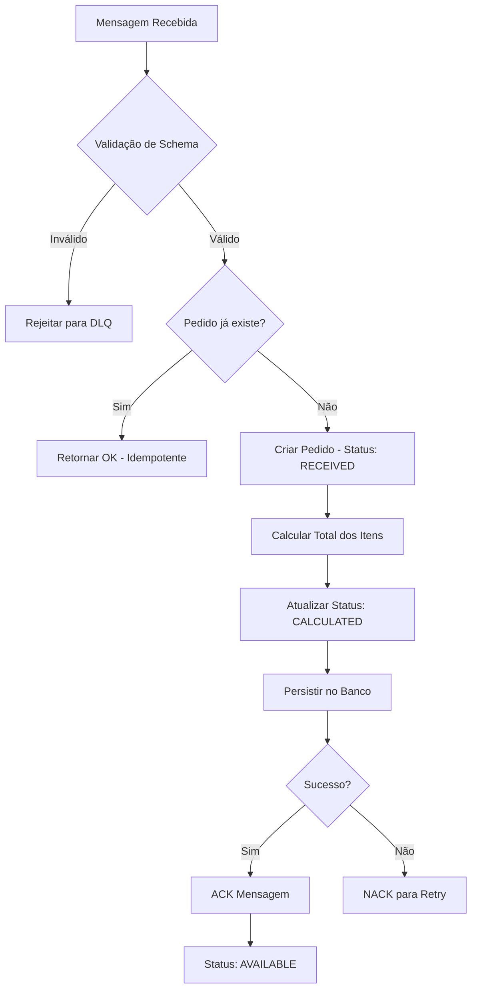
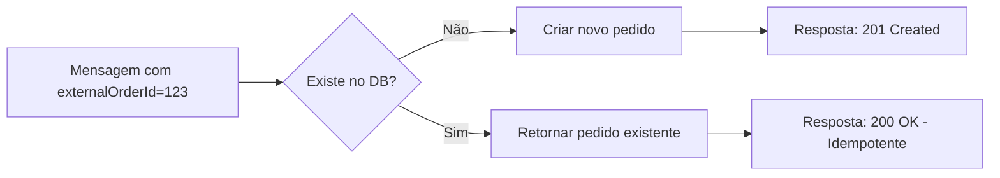

# Pré-Requisitos - Serviço Order

## 1. Contexto do Problema de Negócio

### 1.1 Responsabilidades do Serviço Order

O serviço **order** é responsável por:

- **Receber pedidos** do Produto Externo A via mensageria assíncrona
- **Gerenciar o ciclo de vida** dos pedidos (status, validações, persistência)
- **Calcular o valor total** dos pedidos (soma de `preço × quantidade` de cada item)
- **Disponibilizar consultas** para o Produto Externo B via API REST
- **Garantir idempotência** e prevenção de duplicidade de pedidos

### 1.2 Posição no Ecossistema



---

## 2. Escopo

### 2.1 Escopo Funcional

| Funcionalidade | Descrição |
|----------------|-----------|
| Ingestão de Pedidos | Consumo de mensagens do Produto Externo A via RabbitMQ |
| Validação | Verificação de estrutura, campos obrigatórios e regras de negócio |
| Detecção de Duplicidade | Identificação de pedidos já processados via `externalOrderId` |
| Cálculo de Totais | Soma de `(item.price * item.quantity)` usando `BigDecimal` |
| Persistência | Armazenamento em PostgreSQL com controle de concorrência |
| Consulta de Pedidos | API REST com paginação e filtros para Produto Externo B |
| Gestão de Status | Transição de estados: `RECEIVED → PROCESSING → CALCULATED → AVAILABLE` |

### 2.2 Escopo Não Funcional

| Requisito | Meta | Estratégia |
|-----------|------|------------|
| **Throughput** | 150k-200k pedidos/dia (~2.3 pedidos/segundo média, picos de 10x) | Processamento assíncrono, connection pooling |
| **Disponibilidade** | 99.9% uptime | Stateless design, health checks, retry patterns |
| **Latência de Consulta** | p95 < 200ms | Índices otimizados, caching quando aplicável |
| **Consistência** | Eventual para ingestão, forte para consultas | Optimistic locking, transações ACID |
| **Observabilidade** | Métricas, logs estruturados, tracing | Micrometer, Logback, correlation IDs |

---

## 3. Plano de Execução Técnico

### 3.1 Visão Geral das Fases



### 3.2 Estratégia de Ingestão (Produto Externo A → Order)



**Decisões técnicas:**
- **Consumer Groups**: Múltiplas instâncias consumindo a mesma fila para paralelismo
- **Prefetch Count**: Configurado para balancear throughput vs. uso de memória
- **Manual ACK**: Confirmação apenas após persistência bem-sucedida
- **Dead Letter Queue**: Mensagens que falharam após N tentativas são movidas para análise

### 3.3 Estratégia de Processamento e Cálculo



**Regras de cálculo:**
```
total = Σ (item.unitPrice × item.quantity)
```
- Usar `BigDecimal` com `RoundingMode.HALF_UP` e escala 2
- Validar que `unitPrice > 0` e `quantity > 0`

### 3.4 Estratégia de Disponibilização (Order → Produto Externo B)

**Endpoints REST:**

| Método | Endpoint | Descrição |
|--------|----------|-----------|
| `GET` | `/api/v1/orders` | Lista pedidos com paginação e filtros |
| `GET` | `/api/v1/orders/{id}` | Detalhe de um pedido específico |
| `GET` | `/api/v1/orders/external/{externalOrderId}` | Busca por ID externo |

**Filtros suportados:**
- `status`: Filtrar por status (`AVAILABLE`, `CALCULATED`, etc.)
- `startDate` / `endDate`: Range de datas
- `page` / `size`: Paginação (default: page=0, size=20, max=100)

---

## 4. Premissas Arquiteturais

### 4.1 Premissas de Design

| Premissa | Justificativa |
|----------|---------------|
| **Stateless** | Permite escalabilidade horizontal sem gerenciamento de sessão |
| **Event-Driven Inbound** | Desacopla do Produto A, absorve picos de carga |
| **Sync Outbound** | Consultas do Produto B requerem resposta imediata |
| **Database per Service** | Isolamento de dados, autonomia de deploy |
| **Eventual Consistency** | Aceitável para ingestão; consultas refletem estado atual |

### 4.2 Restrições Técnicas

| Restrição | Impacto |
|-----------|---------|
| Java 17+ com Spring Boot 3.x | Baseline tecnológico |
| PostgreSQL como único datastore | Simplicidade operacional |
| RabbitMQ para mensageria | Já estabelecido no ecossistema |
| Container-first (Docker) | Ambiente local igual a produção |

---

## 5. Considerações de Volumetria e Concorrência

### 5.1 Análise de Carga

```
Pedidos/dia: 200.000
Horas de pico: 8h (assumindo distribuição não uniforme)
Pedidos/hora no pico: ~50.000 (4x média)
Pedidos/segundo no pico: ~14 TPS
Itens por pedido (média): 5
Operações de DB/segundo no pico: ~70 (14 pedidos × 5 itens)
```

### 5.2 Estratégias de Mitigação

| Desafio | Estratégia |
|---------|------------|
| **Picos de ingestão** | RabbitMQ como buffer, consumer groups |
| **Concorrência em escrita** | Optimistic locking (`@Version`), retry em `OptimisticLockException` |
| **Duplicidade** | Índice único em `external_order_id`, check before insert |
| **Lentidão em consultas** | Índices em `status`, `created_at`; paginação obrigatória |
| **Connection exhaustion** | HikariCP com pool sizing adequado (min=5, max=20) |

### 5.3 Idempotência



**Implementação:**
- Coluna `external_order_id` com constraint `UNIQUE`
- Tratamento de `DataIntegrityViolationException` como sucesso idempotente
- Retorno do pedido existente em caso de duplicata

### 5.4 Tolerância a Falhas

| Cenário | Comportamento |
|---------|---------------|
| **RabbitMQ indisponível** | Retry com exponential backoff, circuit breaker |
| **PostgreSQL indisponível** | Mensagem retorna para fila, retry automático |
| **Timeout em consulta** | Resposta 503 com retry-after header |
| **Erro de validação** | Mensagem vai para DLQ, não bloqueia fila principal |

---

## 6. Tecnologias e Versões

| Tecnologia | Versão | Propósito |
|------------|--------|-----------|
| Java | 17+ | Runtime |
| Spring Boot | 3.2.x | Framework |
| Spring Data JPA | 3.2.x | Persistência |
| Spring AMQP | 3.1.x | Mensageria |
| PostgreSQL | 15+ | Banco de dados |
| RabbitMQ | 3.12+ | Message broker |
| Flyway | 9.x | Migrations |
| Testcontainers | 1.19.x | Testes de integração |
| SonarQube | 10.x | Qualidade de código |
| Docker Compose | 2.x | Orquestração local |

---

## 7. Critérios de Aceite do Projeto

- [ ] Ingestão de pedidos via RabbitMQ funcionando
- [ ] Cálculo de total implementado corretamente com `BigDecimal`
- [ ] API REST de consulta com paginação funcionando
- [ ] Detecção de duplicidade implementada
- [ ] Optimistic locking configurado nas entidades
- [ ] Testes unitários com cobertura > 80%
- [ ] Testes de integração com Testcontainers
- [ ] SonarQube passando sem bloqueadores
- [ ] Docker Compose executando todo o ambiente
- [ ] Documentação técnica completa na pasta `docs/`
