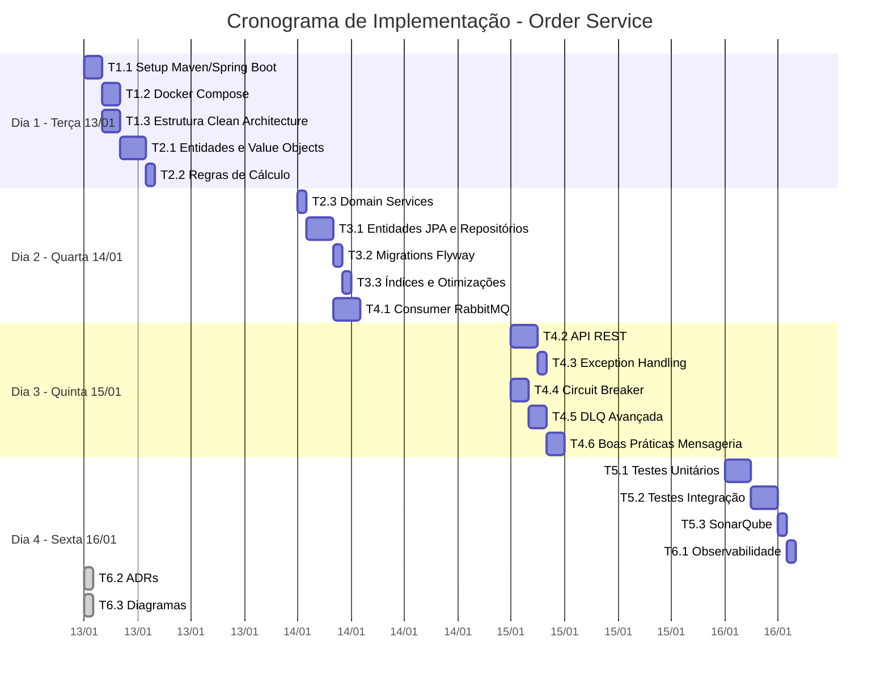
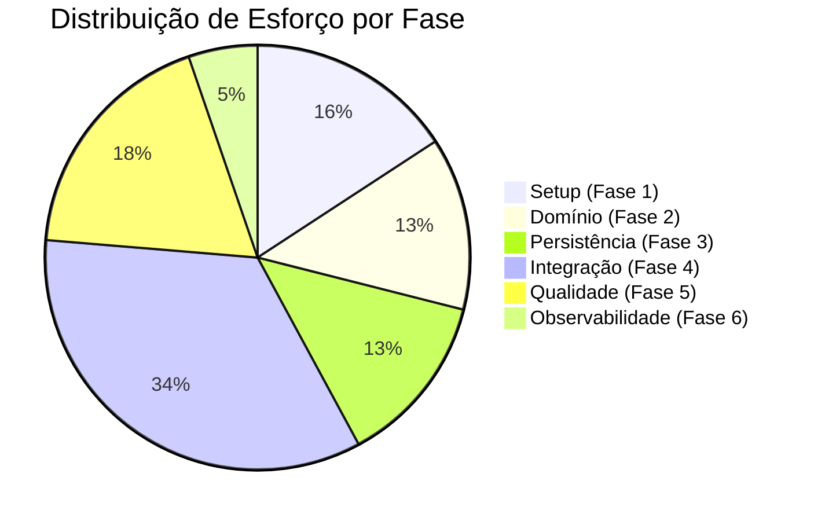
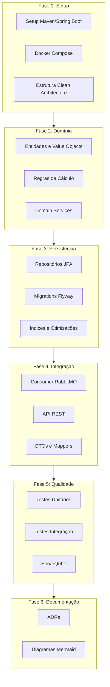
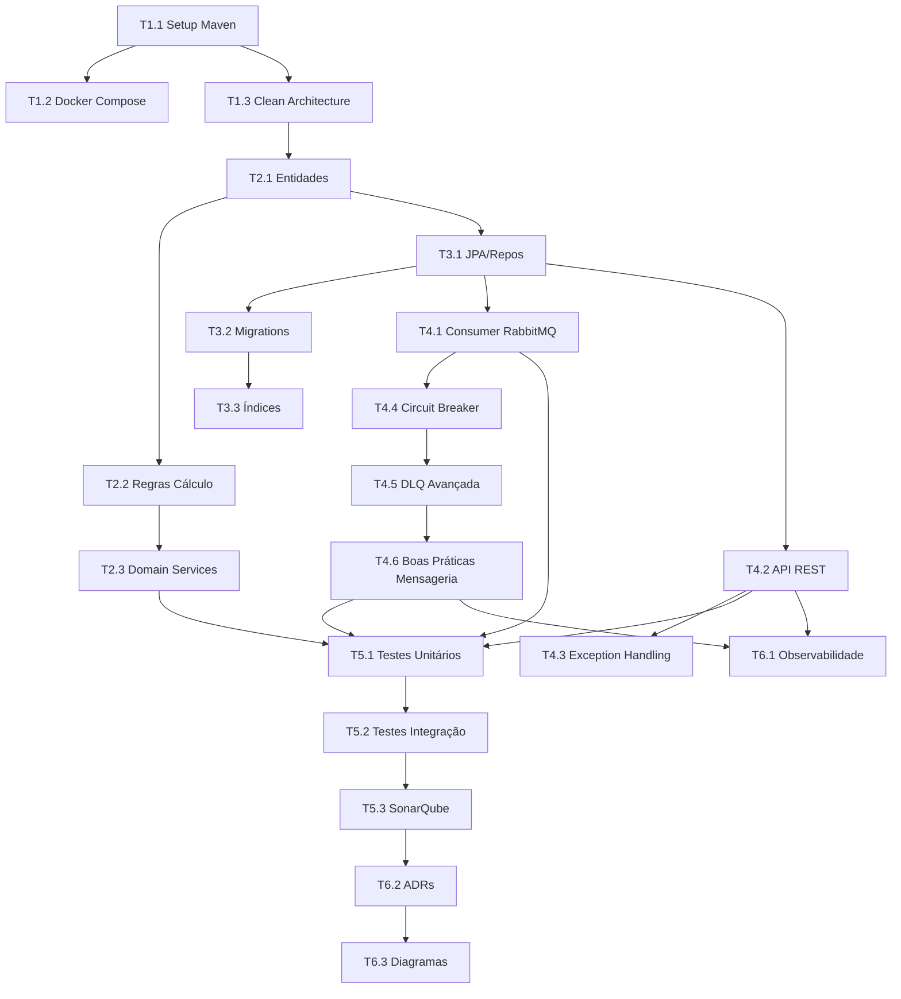

# Task List - Serviço Order

## Visão Geral

Este documento contém a lista detalhada de atividades técnicas para implementação do serviço **order**, organizada por fases com dependências explícitas.

---

## 🗓️ Planejamento de Execução

**Período:** 13/01/2026 (Terça) a 16/01/2026 (Sexta)  
**Deadline:** Sexta-feira, 16/01/2026  
**Total de Dias:** 4 dias úteis  
**Total de Tarefas:** 21 tarefas

### Cronograma por Dia



### Distribuição Detalhada

#### 📅 Terça-feira, 13/01/2026 - Fundação
| Horário | Tarefa | Descrição | Esforço |
|---------|--------|-----------|---------|
| 08:00-10:00 | **T1.1** | Setup Maven/Spring Boot, dependências, profiles | 2h |
| 10:00-12:00 | **T1.2** | Docker Compose (PostgreSQL, RabbitMQ, SonarQube) | 2h |
| 13:00-15:00 | **T1.3** | Estrutura de pacotes Clean Architecture | 2h |
| 15:00-18:00 | **T2.1** | Entidades Order, OrderItem, Value Objects | 3h |
| 18:00-19:00 | **T2.2** | Regras de cálculo BigDecimal | 1h |

**Entregável do dia:** Projeto estruturado com domínio básico funcionando

---

#### 📅 Quarta-feira, 14/01/2026 - Persistência e Mensageria
| Horário | Tarefa | Descrição | Esforço |
|---------|--------|-----------|---------|
| 08:00-09:00 | **T2.3** | Domain Services (cálculo, validação) | 1h |
| 09:00-12:00 | **T3.1** | Entidades JPA, Repositórios, Mappers | 3h |
| 13:00-14:00 | **T3.2** | Migrations Flyway (tables, constraints) | 1h |
| 14:00-15:00 | **T3.3** | Índices e configuração HikariCP | 1h |
| 15:00-18:00 | **T4.1** | Consumer RabbitMQ básico + UseCase | 3h |

**Entregável do dia:** Persistência completa, consumer recebendo mensagens

---

#### 📅 Quinta-feira, 15/01/2026 - Integração Completa
| Horário | Tarefa | Descrição | Esforço |
|---------|--------|-----------|---------|
| 08:00-11:00 | **T4.2** | API REST completa (controller, DTOs) | 3h |
| 11:00-12:00 | **T4.3** | Exception Handling Global | 1h |
| 13:00-15:00 | **T4.4** | Circuit Breaker (Resilience4j) | 2h |
| 15:00-17:00 | **T4.5** | DLQ Avançada com Retry Progressivo | 2h |
| 17:00-19:00 | **T4.6** | Boas Práticas (dedup, confirms, shutdown) | 2h |

**Entregável do dia:** Integração completa com resiliência

---

#### 📅 Sexta-feira, 16/01/2026 - Qualidade e Finalização ⚠️ DEADLINE
| Horário | Tarefa | Descrição | Esforço |
|---------|--------|-----------|---------|
| 08:00-11:00 | **T5.1** | Testes Unitários (80%+ cobertura) | 3h |
| 11:00-14:00 | **T5.2** | Testes Integração (Testcontainers) | 3h |
| 14:00-15:00 | **T5.3** | SonarQube scan e correções | 1h |
| 15:00-16:00 | **T6.1** | Observabilidade (logs, métricas) | 1h |
| 16:00-17:00 | 🔄 Buffer | Correções finais, review | 1h |
| 17:00-18:00 | ✅ Entrega | Validação final, documentação | 1h |

**Entregável do dia:** Projeto completo, testado e documentado

---

### Métricas de Progresso



### Checkpoints Diários

| Dia | Checkpoint | Critério de Sucesso |
|-----|------------|---------------------|
| **13/01** | 🔵 Fundação | `mvn compile` passa, estrutura criada, entidades de domínio |
| **14/01** | 🟢 Persistência | Migrations executam, repository salva/busca, consumer recebe msg |
| **15/01** | 🟡 Integração | API REST funcional, Circuit Breaker, DLQ testada |
| **16/01** | ✅ Completo | Testes passam, SonarQube OK, documentação atualizada |

### Riscos e Mitigações

| Risco | Probabilidade | Impacto | Mitigação |
|-------|---------------|---------|-----------|
| Complexidade DLQ/Circuit Breaker | Alta | Médio | T4.4-T4.6 podem ser simplificados se necessário |
| Cobertura de testes < 80% | Média | Baixo | Focar em domínio e use cases primeiro |
| Problemas com Testcontainers | Média | Médio | Ter fallback para testes com H2 |
| Atrasos acumulados | Média | Alto | Buffer de 2h na sexta para correções |

### Comandos Rápidos por Dia

```bash
# Dia 1 - Setup
mvn archetype:generate  # ou Spring Initializr
docker-compose up -d

# Dia 2 - Persistência
mvn flyway:migrate
mvn spring-boot:run -Dspring.profiles.active=local

# Dia 3 - Integração
curl http://localhost:8080/api/v1/orders
# Testar RabbitMQ Management: http://localhost:15672

# Dia 4 - Qualidade
mvn clean verify
mvn verify jacoco:report
mvn sonar:sonar -Dsonar.host.url=http://localhost:9000
```

---

### Progresso

| Dia | Data | Tarefas Planejadas | Status |
|-----|------|-------------------|--------|
| 1 | 13/01 | T1.1, T1.2, T1.3, T2.1, T2.2 | ⬜ Não iniciado |
| 2 | 14/01 | T2.3, T3.1, T3.2, T3.3, T4.1 | ⬜ Não iniciado |
| 3 | 15/01 | T4.2, T4.3, T4.4, T4.5, T4.6 | ⬜ Não iniciado |
| 4 | 16/01 | T5.1, T5.2, T5.3, T6.1 | ⬜ Não iniciado |

> **Nota:** T6.2 (ADRs) e T6.3 (Diagramas) já estão completos na documentação `docs/`.

---



---

## Fase 1: Setup e Infraestrutura

### T1.1 - Configuração do Projeto Maven/Spring Boot
**Status:** ⬜ Não iniciada  
**Prioridade:** Alta  
**Dependências:** Nenhuma

**Atividades:**
- [ ] Criar projeto Spring Boot 3.2.x com Spring Initializr
- [ ] Configurar `pom.xml` com dependências:
  - `spring-boot-starter-web`
  - `spring-boot-starter-data-jpa`
  - `spring-boot-starter-amqp`
  - `spring-boot-starter-validation`
  - `spring-boot-starter-actuator`
  - `postgresql` driver
  - `flyway-core`
  - `lombok`
  - `mapstruct`
- [ ] Configurar Java 17+ e encoding UTF-8
- [ ] Criar `application.yml` com profiles (local, test, prod)
- [ ] Configurar `.gitignore` adequado

**Arquivos a criar:**
```
pom.xml
src/main/resources/application.yml
src/main/resources/application-local.yml
src/main/resources/application-test.yml
.gitignore
```

---

### T1.2 - Docker Compose para Ambiente Local
**Status:** ⬜ Não iniciada  
**Prioridade:** Alta  
**Dependências:** T1.1

**Atividades:**
- [ ] Criar `docker-compose.yml` com serviços:
  - PostgreSQL 15 (porta 5432)
  - RabbitMQ 3.12 com Management UI (portas 5672, 15672)
  - SonarQube 10 (porta 9000)
- [ ] Configurar volumes para persistência de dados
- [ ] Criar script de inicialização do banco
- [ ] Criar `Dockerfile` para a aplicação
- [ ] Documentar comandos de execução

**Arquivos a criar:**
```
docker-compose.yml
Dockerfile
docker/init-db.sql
docker/rabbitmq/definitions.json
```

---

### T1.3 - Estrutura Clean Architecture
**Status:** ⬜ Não iniciada  
**Prioridade:** Alta  
**Dependências:** T1.1

**Atividades:**
- [ ] Criar estrutura de pacotes seguindo Clean Architecture:

```
src/main/java/com/order/
├── domain/
│   ├── entity/           # Entidades de domínio
│   ├── valueobject/      # Value Objects
│   ├── repository/       # Interfaces de repositório (ports)
│   ├── service/          # Domain Services
│   └── exception/        # Exceções de domínio
├── application/
│   ├── usecase/          # Casos de uso
│   ├── port/
│   │   ├── input/        # Input ports (interfaces)
│   │   └── output/       # Output ports (interfaces)
│   └── dto/              # DTOs de aplicação
├── infrastructure/
│   ├── persistence/
│   │   ├── entity/       # Entidades JPA
│   │   ├── repository/   # Implementações JPA
│   │   └── mapper/       # Mappers Domain <-> JPA
│   ├── messaging/
│   │   ├── consumer/     # Consumers RabbitMQ
│   │   ├── publisher/    # Publishers (se necessário)
│   │   └── config/       # Configurações de mensageria
│   └── config/           # Configurações Spring
└── interfaces/
    ├── rest/
    │   ├── controller/   # Controllers REST
    │   ├── dto/          # Request/Response DTOs
    │   └── mapper/       # Mappers DTO <-> Domain
    └── advice/           # Exception handlers
```

- [ ] Criar classes base e marcadores de pacote
- [ ] Configurar regras de dependência entre camadas (ArchUnit)

---

## Fase 2: Domínio

### T2.1 - Entidades e Value Objects
**Status:** ⬜ Não iniciada  
**Prioridade:** Alta  
**Dependências:** T1.3

**Atividades:**
- [ ] Criar entidade `Order` (domínio):
  - `id: UUID`
  - `externalOrderId: String` (identificador externo)
  - `items: List<OrderItem>`
  - `totalAmount: Money`
  - `status: OrderStatus`
  - `createdAt: Instant`
  - `updatedAt: Instant`
  - `version: Long` (controle de concorrência)

- [ ] Criar entidade `OrderItem` (domínio):
  - `id: UUID`
  - `productId: String`
  - `productName: String`
  - `unitPrice: Money`
  - `quantity: Integer`
  - `subtotal: Money`

- [ ] Criar Value Objects:
  - `Money` (valor + moeda, operações com BigDecimal)
  - `ExternalOrderId` (validação de formato)
  - `ProductId` (validação de formato)

- [ ] Criar enum `OrderStatus`:
  - `RECEIVED`
  - `PROCESSING`
  - `CALCULATED`
  - `AVAILABLE`
  - `FAILED`

**Arquivos a criar:**
```
domain/entity/Order.java
domain/entity/OrderItem.java
domain/valueobject/Money.java
domain/valueobject/ExternalOrderId.java
domain/valueobject/OrderStatus.java
```

---

### T2.2 - Regras de Cálculo
**Status:** ⬜ Não iniciada  
**Prioridade:** Alta  
**Dependências:** T2.1

**Atividades:**
- [ ] Implementar cálculo de subtotal no `OrderItem`:
  ```java
  subtotal = unitPrice.multiply(quantity)
  ```
- [ ] Implementar cálculo de total no `Order`:
  ```java
  totalAmount = items.stream()
      .map(OrderItem::getSubtotal)
      .reduce(Money.ZERO, Money::add)
  ```
- [ ] Validar que:
  - `unitPrice > 0`
  - `quantity > 0`
  - `items.size() >= 1`
- [ ] Usar `BigDecimal` com `RoundingMode.HALF_UP` e scale 2
- [ ] Implementar testes unitários para cada regra

---

### T2.3 - Domain Services
**Status:** ⬜ Não iniciada  
**Prioridade:** Média  
**Dependências:** T2.2

**Atividades:**
- [ ] Criar `OrderCalculationService`:
  - Método `calculateOrderTotal(Order order): Order`
  - Validações de negócio
  - Transição de status `RECEIVED → CALCULATED`
- [ ] Criar `OrderValidationService`:
  - Validar estrutura do pedido
  - Validar regras de negócio específicas

---

## Fase 3: Persistência

### T3.1 - Entidades JPA e Repositórios
**Status:** ⬜ Não iniciada  
**Prioridade:** Alta  
**Dependências:** T2.1

**Atividades:**
- [ ] Criar entidade JPA `OrderEntity`:
  - Mapeamento para tabela `orders`
  - `@Version` para optimistic locking
  - Índice único em `external_order_id`
  - Relacionamento `@OneToMany` com `OrderItemEntity`

- [ ] Criar entidade JPA `OrderItemEntity`:
  - Mapeamento para tabela `order_items`
  - `@ManyToOne` para `OrderEntity`
  - Campos monetários como `BigDecimal` com precision/scale

- [ ] Criar interface `OrderRepository` (domain):
  - `save(Order order): Order`
  - `findById(UUID id): Optional<Order>`
  - `findByExternalOrderId(String externalOrderId): Optional<Order>`
  - `findByStatus(OrderStatus status, Pageable pageable): Page<Order>`
  - `existsByExternalOrderId(String externalOrderId): boolean`

- [ ] Criar implementação `JpaOrderRepository` (infrastructure)

- [ ] Criar mappers Domain ↔ JPA:
  - `OrderEntityMapper`
  - `OrderItemEntityMapper`

**Arquivos a criar:**
```
infrastructure/persistence/entity/OrderEntity.java
infrastructure/persistence/entity/OrderItemEntity.java
infrastructure/persistence/repository/JpaOrderRepository.java
infrastructure/persistence/mapper/OrderEntityMapper.java
domain/repository/OrderRepository.java
```

---

### T3.2 - Migrations Flyway
**Status:** ⬜ Não iniciada  
**Prioridade:** Alta  
**Dependências:** T3.1

**Atividades:**
- [ ] Criar migration `V1__create_orders_table.sql`:
  ```sql
  CREATE TABLE orders (
      id UUID PRIMARY KEY,
      external_order_id VARCHAR(100) NOT NULL UNIQUE,
      total_amount DECIMAL(19,2) NOT NULL,
      currency VARCHAR(3) NOT NULL DEFAULT 'BRL',
      status VARCHAR(20) NOT NULL,
      created_at TIMESTAMP NOT NULL,
      updated_at TIMESTAMP NOT NULL,
      version BIGINT NOT NULL DEFAULT 0
  );
  ```

- [ ] Criar migration `V2__create_order_items_table.sql`:
  ```sql
  CREATE TABLE order_items (
      id UUID PRIMARY KEY,
      order_id UUID NOT NULL REFERENCES orders(id),
      product_id VARCHAR(100) NOT NULL,
      product_name VARCHAR(255) NOT NULL,
      unit_price DECIMAL(19,2) NOT NULL,
      quantity INTEGER NOT NULL,
      subtotal DECIMAL(19,2) NOT NULL,
      created_at TIMESTAMP NOT NULL
  );
  ```

- [ ] Criar migration `V3__create_indexes.sql`

**Arquivos a criar:**
```
src/main/resources/db/migration/V1__create_orders_table.sql
src/main/resources/db/migration/V2__create_order_items_table.sql
src/main/resources/db/migration/V3__create_indexes.sql
```

---

### T3.3 - Índices e Otimizações
**Status:** ⬜ Não iniciada  
**Prioridade:** Média  
**Dependências:** T3.2

**Atividades:**
- [ ] Criar índices para consultas frequentes:
  ```sql
  CREATE INDEX idx_orders_status ON orders(status);
  CREATE INDEX idx_orders_created_at ON orders(created_at);
  CREATE INDEX idx_orders_status_created_at ON orders(status, created_at);
  CREATE INDEX idx_order_items_order_id ON order_items(order_id);
  ```
- [ ] Configurar HikariCP:
  - `minimum-idle: 5`
  - `maximum-pool-size: 20`
  - `connection-timeout: 30000`
- [ ] Avaliar necessidade de particionamento por data (futuro)

---

## Fase 4: Integração

### T4.1 - Consumer RabbitMQ (Produto Externo A)
**Status:** ⬜ Não iniciada  
**Prioridade:** Alta  
**Dependências:** T3.1

**Atividades:**
- [ ] Configurar conexão RabbitMQ em `application.yml`
- [ ] Criar configuração de filas e exchanges:
  - Exchange: `order.exchange` (topic)
  - Queue: `order.created.queue`
  - Dead Letter Queue: `order.created.dlq`
  - Routing Key: `order.created`

- [ ] Criar DTO `OrderCreatedEvent`:
  ```java
  public record OrderCreatedEvent(
      String externalOrderId,
      List<OrderItemEvent> items,
      Instant timestamp
  ) {}
  ```

- [ ] Criar `OrderMessageConsumer`:
  - `@RabbitListener` para `order.created.queue`
  - Manual ACK após processamento
  - Tratamento de exceções
  - Retry com backoff exponencial
  - Envio para DLQ após max retries

- [ ] Criar caso de uso `ProcessOrderUseCase`:
  - Validar evento
  - Verificar duplicidade (idempotência)
  - Converter para domínio
  - Calcular totais
  - Persistir
  - Atualizar status para `AVAILABLE`

**Arquivos a criar:**
```
infrastructure/messaging/config/RabbitMQConfig.java
infrastructure/messaging/consumer/OrderMessageConsumer.java
infrastructure/messaging/dto/OrderCreatedEvent.java
application/usecase/ProcessOrderUseCase.java
```

---

### T4.2 - API REST (Produto Externo B)
**Status:** ⬜ Não iniciada  
**Prioridade:** Alta  
**Dependências:** T3.1

**Atividades:**
- [ ] Criar `OrderController`:
  ```java
  @RestController
  @RequestMapping("/api/v1/orders")
  public class OrderController {
      
      @GetMapping
      Page<OrderResponse> listOrders(
          @RequestParam(required = false) OrderStatus status,
          @RequestParam(required = false) LocalDate startDate,
          @RequestParam(required = false) LocalDate endDate,
          Pageable pageable
      );
      
      @GetMapping("/{id}")
      OrderResponse getOrderById(@PathVariable UUID id);
      
      @GetMapping("/external/{externalOrderId}")
      OrderResponse getOrderByExternalId(@PathVariable String externalOrderId);
  }
  ```

- [ ] Criar DTOs de resposta:
  - `OrderResponse`
  - `OrderItemResponse`
  - `PageResponse<T>`

- [ ] Criar caso de uso `GetOrdersUseCase`

- [ ] Implementar validação de parâmetros

- [ ] Configurar CORS se necessário

- [ ] Documentar com OpenAPI/Swagger (opcional)

**Arquivos a criar:**
```
interfaces/rest/controller/OrderController.java
interfaces/rest/dto/OrderResponse.java
interfaces/rest/dto/OrderItemResponse.java
interfaces/rest/mapper/OrderResponseMapper.java
application/usecase/GetOrdersUseCase.java
```

---

### T4.3 - Exception Handling Global
**Status:** ⬜ Não iniciada  
**Prioridade:** Média  
**Dependências:** T4.2

**Atividades:**
- [ ] Criar `GlobalExceptionHandler` com `@ControllerAdvice`:
  - `OrderNotFoundException` → 404
  - `DuplicateOrderException` → 409
  - `ValidationException` → 400
  - `OptimisticLockException` → 409
  - `Exception` genérica → 500

- [ ] Criar DTO padrão de erro:
  ```java
  public record ErrorResponse(
      String code,
      String message,
      Instant timestamp,
      String path
  ) {}
  ```

- [ ] Criar exceções de domínio customizadas

**Arquivos a criar:**
```
interfaces/advice/GlobalExceptionHandler.java
interfaces/rest/dto/ErrorResponse.java
domain/exception/OrderNotFoundException.java
domain/exception/DuplicateOrderException.java
```

---

### T4.4 - Circuit Breaker para Mensageria
**Status:** ⬜ Não iniciada  
**Prioridade:** Alta  
**Dependências:** T4.1

**Atividades:**
- [ ] Adicionar dependência Resilience4j:
  ```xml
  <dependency>
      <groupId>io.github.resilience4j</groupId>
      <artifactId>resilience4j-spring-boot3</artifactId>
  </dependency>
  ```

- [ ] Configurar Circuit Breaker em `application.yml`:
  - `rabbitMQConsumer`: protege o consumer
  - `orderRepository`: protege acesso ao banco
  - Threshold de falha: 50%
  - Wait duration: 30s

- [ ] Implementar `ResilientOrderMessageConsumer`:
  - Verificar estado do Circuit Breaker antes de processar
  - NACK com requeue quando OPEN
  - Event listeners para logging de transições

- [ ] Criar métricas de Circuit Breaker:
  - `circuit_breaker_state` (gauge)
  - `circuit_breaker_calls_total` (counter)
  - `circuit_breaker_failure_rate` (gauge)

- [ ] Implementar health indicator para Circuit Breaker

**Arquivos a criar:**
```
infrastructure/resilience/CircuitBreakerConfig.java
infrastructure/messaging/consumer/ResilientOrderMessageConsumer.java
infrastructure/resilience/CircuitBreakerHealthIndicator.java
```

---

### T4.5 - DLQ Avançada com Retry Progressivo
**Status:** ⬜ Não iniciada  
**Prioridade:** Alta  
**Dependências:** T4.1, T4.4

**Atividades:**
- [ ] Criar topologia de filas de retry:
  - `order.retry.queue.5s` (TTL: 5 segundos)
  - `order.retry.queue.30s` (TTL: 30 segundos)
  - `order.retry.queue.5min` (TTL: 5 minutos)
  - `order.parking.queue` (TTL: 7 dias)

- [ ] Configurar Dead Letter Exchange:
  - `order.dlx` para roteamento de mensagens falhas
  - Bindings para cada fila de retry

- [ ] Implementar `SmartRetryOrderConsumer`:
  - Rotear para fila de retry apropriada baseado em retry count
  - Headers de tracking: `x-retry-count`, `x-failure-reason`
  - Backoff exponencial via TTL das filas

- [ ] Implementar `DLQProcessor`:
  - Consumer para `order.created.dlq`
  - Extração de metadados de falha
  - Envio de alertas
  - Move para parking queue

- [ ] Implementar `PoisonMessageDetector`:
  - Detectar mensagens em loop infinito
  - Análise do header `x-death`
  - Limite de redelivery count

- [ ] Criar endpoint de reprocessamento:
  - `POST /api/v1/admin/dlq/reprocess/{externalOrderId}`
  - `POST /api/v1/admin/dlq/reprocess-all`

**Arquivos a criar:**
```
infrastructure/messaging/config/AdvancedRabbitMQConfig.java
infrastructure/messaging/consumer/SmartRetryOrderConsumer.java
infrastructure/messaging/consumer/DLQProcessor.java
infrastructure/messaging/PoisonMessageDetector.java
interfaces/rest/controller/AdminController.java
```

---

### T4.6 - Boas Práticas de Mensageria
**Status:** ⬜ Não iniciada  
**Prioridade:** Média  
**Dependências:** T4.5

**Atividades:**
- [ ] Implementar Publisher Confirms:
  - Configurar `publisher-confirm-type: correlated`
  - Callback de confirmação/erro
  - Retry em caso de falha

- [ ] Implementar Message Deduplication:
  - Cache de messageIds processados (Redis ou in-memory)
  - TTL de 24h para deduplicação
  - Check antes do processamento

- [ ] Configurar Backpressure:
  - Prefetch count otimizado
  - Consumer scaling dinâmico
  - Rate limiting com Guava RateLimiter

- [ ] Implementar Priority Queue:
  - Fila com `x-max-priority: 10`
  - Pedidos VIP com prioridade alta
  - Publisher com setPriority

- [ ] Implementar Graceful Shutdown:
  - `@PreDestroy` handler
  - Stop consumers antes de shutdown
  - Aguardar mensagens em processamento

- [ ] Criar métricas de mensageria:
  - `messaging.messages.received`
  - `messaging.messages.processed`
  - `messaging.messages.retried`
  - `messaging.dlq.depth`
  - `messaging.processing.duration`

**Arquivos a criar:**
```
infrastructure/messaging/PublisherConfirmCallback.java
infrastructure/messaging/MessageDeduplicationFilter.java
infrastructure/messaging/config/BackpressureConfig.java
infrastructure/messaging/PriorityMessagePublisher.java
infrastructure/messaging/GracefulShutdownHandler.java
infrastructure/messaging/MessagingMetrics.java
```

---

## Fase 5: Qualidade

### T5.1 - Testes Unitários
**Status:** ⬜ Não iniciada  
**Prioridade:** Alta  
**Dependências:** T2.3, T4.1, T4.2

**Atividades:**
- [ ] Configurar dependências de teste:
  - `spring-boot-starter-test`
  - `mockito-core`
  - `assertj-core`

- [ ] Criar testes para camada de domínio:
  - `OrderTest` - regras de cálculo
  - `OrderItemTest` - cálculo de subtotal
  - `MoneyTest` - operações monetárias
  - `OrderCalculationServiceTest`

- [ ] Criar testes para casos de uso:
  - `ProcessOrderUseCaseTest`
  - `GetOrdersUseCaseTest`

- [ ] Criar testes para controllers (MockMvc):
  - `OrderControllerTest`

- [ ] Meta: cobertura > 80% no domínio e casos de uso

**Arquivos a criar:**
```
src/test/java/com/order/domain/entity/OrderTest.java
src/test/java/com/order/domain/entity/OrderItemTest.java
src/test/java/com/order/domain/valueobject/MoneyTest.java
src/test/java/com/order/application/usecase/ProcessOrderUseCaseTest.java
src/test/java/com/order/interfaces/rest/controller/OrderControllerTest.java
```

---

### T5.2 - Testes de Integração (Testcontainers)
**Status:** ⬜ Não iniciada  
**Prioridade:** Alta  
**Dependências:** T5.1

**Atividades:**
- [ ] Configurar dependências:
  - `testcontainers`
  - `testcontainers-postgresql`
  - `testcontainers-rabbitmq`

- [ ] Criar classe base `IntegrationTestBase`:
  - Inicialização de containers
  - Configuração de propriedades dinâmicas
  - Limpeza de dados entre testes

- [ ] Criar testes de integração:
  - `OrderRepositoryIntegrationTest` - persistência real
  - `OrderMessageConsumerIntegrationTest` - RabbitMQ real
  - `OrderControllerIntegrationTest` - API end-to-end

- [ ] Testar cenários:
  - Fluxo completo: mensagem → processamento → consulta
  - Idempotência: mesma mensagem 2x
  - Concorrência: atualizações simultâneas
  - Falhas: timeout, DLQ

**Arquivos a criar:**
```
src/test/java/com/order/IntegrationTestBase.java
src/test/java/com/order/infrastructure/persistence/OrderRepositoryIntegrationTest.java
src/test/java/com/order/infrastructure/messaging/OrderMessageConsumerIntegrationTest.java
src/test/java/com/order/interfaces/rest/OrderControllerIntegrationTest.java
```

---

### T5.3 - SonarQube e Métricas de Qualidade
**Status:** ⬜ Não iniciada  
**Prioridade:** Média  
**Dependências:** T5.2

**Atividades:**
- [ ] Configurar plugin SonarQube no `pom.xml`
- [ ] Configurar `sonar-project.properties`:
  - Exclusões de cobertura (DTOs, configs)
  - Quality Gate customizado
- [ ] Criar script para execução local:
  ```bash
  ./mvnw clean verify sonar:sonar \
    -Dsonar.host.url=http://localhost:9000 \
    -Dsonar.login=admin \
    -Dsonar.password=admin
  ```
- [ ] Definir Quality Gate:
  - Cobertura mínima: 80%
  - Duplicação máxima: 3%
  - Bugs: 0
  - Vulnerabilidades: 0
  - Code smells: < 10

**Arquivos a criar:**
```
sonar-project.properties
```

---

## Fase 6: Observabilidade e Documentação

### T6.1 - Observabilidade
**Status:** ⬜ Não iniciada  
**Prioridade:** Média  
**Dependências:** T4.1, T4.2

**Atividades:**
- [ ] Configurar Spring Actuator:
  - Health checks (liveness, readiness)
  - Métricas Prometheus
  - Info endpoint

- [ ] Configurar logging estruturado:
  - Logback com JSON format
  - Correlation ID em todas as requisições
  - MDC para contexto de mensageria

- [ ] Criar métricas customizadas:
  - `orders.processed.total` (counter)
  - `orders.processing.duration` (timer)
  - `orders.failed.total` (counter)

**Arquivos a criar:**
```
src/main/resources/logback-spring.xml
infrastructure/config/ObservabilityConfig.java
```

---

### T6.2 - ADRs (Architecture Decision Records)
**Status:** ⬜ Não iniciada  
**Prioridade:** Média  
**Dependências:** Todas as fases anteriores

**Atividades:**
- [ ] Criar ADRs na pasta `docs/adr/`:
  - `ADR-001-clean-architecture.md`
  - `ADR-002-postgresql-choice.md`
  - `ADR-003-rabbitmq-integration.md`
  - `ADR-004-idempotency-strategy.md`
  - `ADR-005-optimistic-locking.md`

---

### T6.3 - Diagramas Mermaid
**Status:** ⬜ Não iniciada  
**Prioridade:** Média  
**Dependências:** T6.2

**Atividades:**
- [ ] Criar diagramas na pasta `docs/`:
  - Diagrama de arquitetura geral
  - Diagrama de sequência do fluxo
  - Diagrama DER do modelo de dados
  - Diagrama de componentes Clean Architecture

---

## Resumo de Dependências



---

## Checklist Geral

| Fase | Tarefas | Status |
|------|---------|--------|
| Setup | T1.1, T1.2, T1.3 | ⬜ |
| Domínio | T2.1, T2.2, T2.3 | ⬜ |
| Persistência | T3.1, T3.2, T3.3 | ⬜ |
| Integração | T4.1, T4.2, T4.3, T4.4, T4.5, T4.6 | ⬜ |
| Qualidade | T5.1, T5.2, T5.3 | ⬜ |
| Documentação | T6.1, T6.2, T6.3 | ⬜ |
