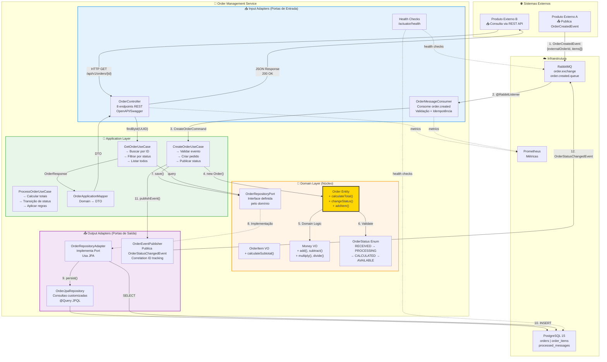
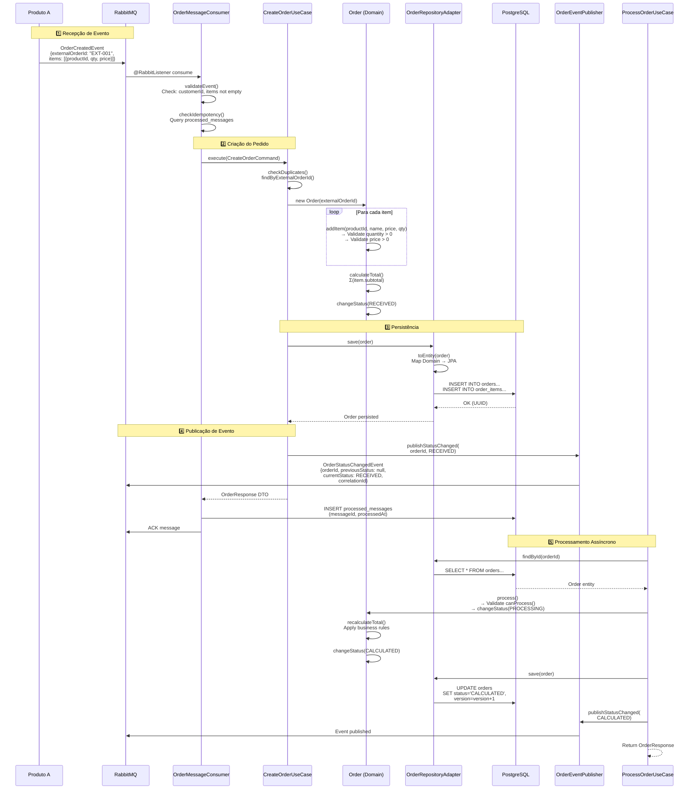
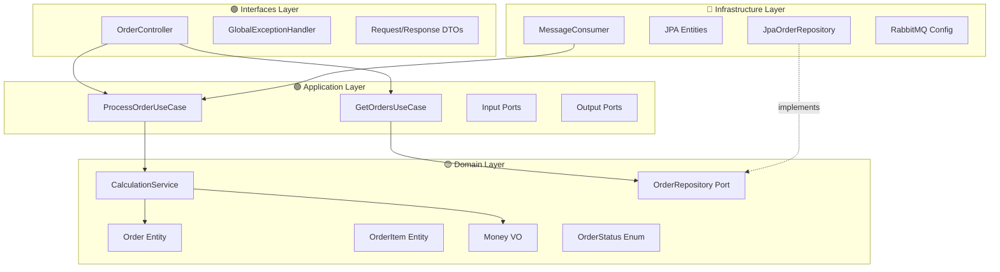
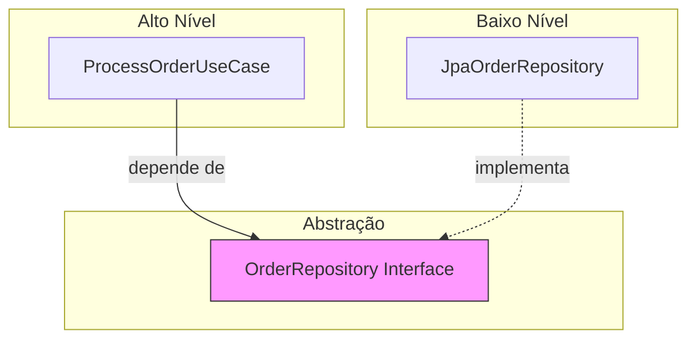
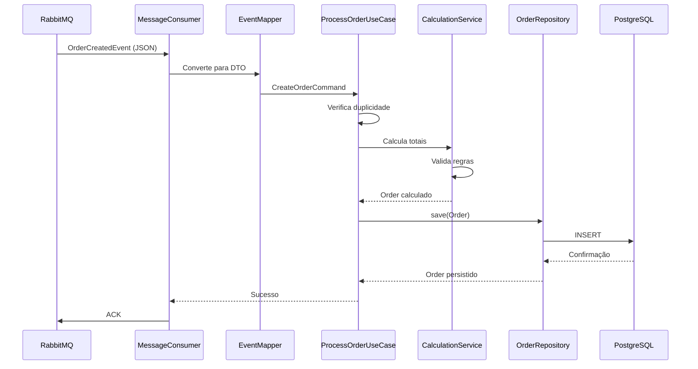
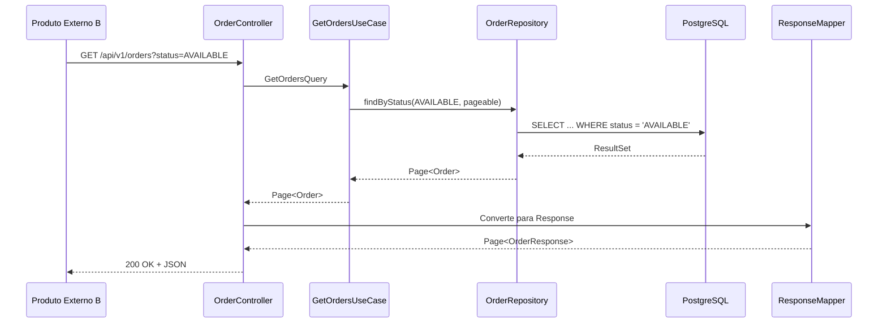
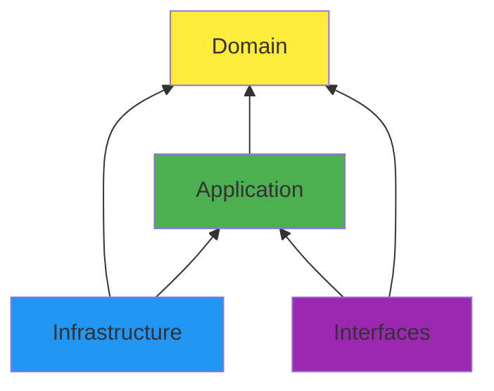

# Arquitetura - Serviço Order

## 1. Visão Geral da Arquitetura

O serviço **order** segue os princípios da **Clean Architecture** (Arquitetura Limpa), garantindo separação de responsabilidades, testabilidade e independência de frameworks.

### 1.1 Diagrama de Arquitetura Geral



### 1.2 Princípios Fundamentais

| Princípio | Aplicação no Projeto | Exemplo Concreto |
|-----------|---------------------|------------------|
| **Dependency Rule** | Dependências apontam para dentro (Domain não conhece Infrastructure) | `Order` (domain) não importa classes de `OrderEntity` (infra) |
| **Separation of Concerns** | Cada camada tem responsabilidade única | REST → Use Case → Domain → Repository (cada com papel claro) |
| **Dependency Inversion** | Domínio define interfaces, infraestrutura implementa | `OrderRepositoryPort` (domain) ← `OrderRepositoryAdapter` (infra) |
| **Single Source of Truth** | Entidades de domínio são a fonte da verdade | `Order.calculateTotal()` é a única fonte de cálculo |
| **Tell, Don't Ask** | Objetos executam ações, não expõem estado | `order.process()` vs `if(order.getStatus()...)` |
| **Screaming Architecture** | Estrutura revela o negócio | Pacotes `order/domain/entity/Order` gritam "sistema de pedidos!" |

### 1.3 Fluxo Completo de Processamento de Pedido



**Pontos Críticos do Fluxo:**

1. **Validação em Camadas**: Consumer valida formato → Use Case valida duplicação → Domain valida regras
2. **Idempotência**: Tabela `processed_messages` previne processamento duplicado
3. **Optimistic Locking**: Campo `version` previne condições de corrida
4. **Event Sourcing Parcial**: Cada mudança de status gera evento rastreável
5. **Correlation ID**: Propaga através de toda a cadeia para rastreabilidade
6. **Transações**: Cada operação de save() é atômica com rollback automático

---

## 2. Clean Architecture - Camadas

### 2.1 Estrutura de Pacotes

```
src/main/java/io/github/douglasdreer/order/
├── domain/                    # 🟡 Núcleo - Regras de negócio
│   ├── entity/                # ✅ Order, OrderItem
│   ├── valueobject/           # ✅ Money, OrderStatus, ExternalOrderId, ProductId
│   ├── service/               # Domain Services (futuro)
│   └── exception/             # ✅ ValidationException, OrderNotFoundException
│
├── application/               # 🟢 Casos de Uso
│   ├── usecase/               # ✅ CreateOrderUseCaseImpl, GetOrderUseCaseImpl, ProcessOrderUseCaseImpl
│   ├── port/
│   │   ├── input/             # ✅ CreateOrderUseCase, GetOrderUseCase, ProcessOrderUseCase
│   │   └── output/            # ✅ OrderRepositoryPort
│   ├── dto/                   # ✅ CreateOrderCommand, OrderResponse
│   └── mapper/                # ✅ OrderApplicationMapper
│
├── adapter/                   # 🔵 Adapters (Hexagonal Architecture)
│   ├── input/
│   │   └── web/
│   │       ├── controller/    # ✅ OrderController (8 endpoints)
│   │       ├── config/        # ✅ OpenApiConfig
│   │       └── exception/     # ✅ GlobalExceptionHandler (RFC 7807)
│   └── output/
│       └── persistence/
│           ├── entity/        # ✅ OrderEntity, OrderItemEntity
│           ├── repository/    # ✅ OrderJpaRepository, OrderRepositoryAdapter
│           └── mapper/        # ✅ OrderPersistenceMapper
│
└── OrderApplication.java      # ✅ Spring Boot Application
```

**Status de Implementação:**
- ✅ **Domain Layer**: Completo
- ✅ **Application Layer**: Completo (22 testes)
- ✅ **Persistence Adapter**: Completo
- ✅ **Web Adapter (REST)**: Completo (14 testes com classes nested)
- ✅ **Messaging Adapter**: Completo (13 testes - 7 consumer + 6 publisher)
- 🌐 **Internacionalização**: PT_BR (comentários, mensagens, logs)

**Métricas de Qualidade:**
- ✅ 128 testes unitários (100% passing)
- ✅ 80%+ de cobertura de código
- ✅ Zero bugs conhecidos
- ✅ Zero vulnerabilidades de segurança
- ✅ Comentários e documentação em português brasileiro

### 2.2 Exemplo Real: Domain Model

```java
/**
 * Entidade Order - Aggregate Root do domínio de pedidos
 * Responsabilidades:
 * - Manter consistência dos itens e valores
 * - Aplicar regras de negócio para transições de status
 * - Calcular totais automaticamente
 */
@Getter
public class Order {
    private UUID id;
    private ExternalOrderId externalOrderId;  // Value Object
    private List<OrderItem> items;
    private Money totalAmount;                // Value Object
    private OrderStatus status;               // Enum com transições
    private LocalDateTime createdAt;
    private LocalDateTime updatedAt;
    private Long version;                     // Optimistic Locking
    
    /**
     * Construtor privado - usa Factory Method
     */
    private Order(ExternalOrderId externalOrderId) {
        this.id = UUID.randomUUID();
        this.externalOrderId = Objects.requireNonNull(externalOrderId);
        this.items = new ArrayList<>();
        this.status = OrderStatus.RECEIVED;
        this.totalAmount = Money.ZERO;
        this.createdAt = LocalDateTime.now();
        this.updatedAt = LocalDateTime.now();
        this.version = 0L;
    }
    
    /**
     * Factory Method - único ponto de criação
     */
    public static Order create(String externalOrderId) {
        return new Order(ExternalOrderId.of(externalOrderId));
    }
    
    /**
     * Adiciona item com validação de regras de negócio
     */
    public void addItem(ProductId productId, String name, 
                        BigDecimal unitPrice, int quantity) {
        validateCanAddItems();
        
        OrderItem item = OrderItem.create(
            productId, name, Money.of(unitPrice), quantity
        );
        
        this.items.add(item);
        recalculateTotal();
        touch();
    }
    
    /**
     * Calcula total - Única fonte da verdade
     */
    private void recalculateTotal() {
        this.totalAmount = items.stream()
            .map(OrderItem::getSubtotal)
            .reduce(Money.ZERO, Money::add);
    }
    
    /**
     * Processa pedido com validação de máquina de estados
     */
    public void process() {
        validateTransition(OrderStatus.PROCESSING);
        changeStatus(OrderStatus.PROCESSING);
        
        // Aplica regras de negócio
        recalculateTotal();
        
        changeStatus(OrderStatus.CALCULATED);
    }
    
    /**
     * Marca como disponível para consulta externa
     */
    public void markAsAvailable() {
        if (this.status != OrderStatus.CALCULATED) {
            throw new IllegalStateException(
                "Pedido deve estar CALCULATED para ser marcado como AVAILABLE"
            );
        }
        changeStatus(OrderStatus.AVAILABLE);
    }
    
    /**
     * Máquina de estados - valida transições permitidas
     */
    private void validateTransition(OrderStatus newStatus) {
        if (!this.status.canTransitionTo(newStatus)) {
            throw new IllegalStateException(
                String.format(
                    "Transição inválida: %s -> %s",
                    this.status, newStatus
                )
            );
        }
    }
    
    private void changeStatus(OrderStatus newStatus) {
        this.status = newStatus;
        touch();
    }
    
    private void touch() {
        this.updatedAt = LocalDateTime.now();
    }
    
    private void validateCanAddItems() {
        if (this.status != OrderStatus.RECEIVED) {
            throw new IllegalStateException(
                "Não é possível adicionar itens após status RECEIVED"
            );
        }
    }
}

/**
 * Value Object Money - Imutável e com operações aritméticas
 */
@Value
public class Money {
    public static final Money ZERO = new Money(BigDecimal.ZERO);
    public static final String DEFAULT_CURRENCY = "BRL";
    
    BigDecimal amount;
    String currency;
    
    private Money(BigDecimal amount) {
        this(amount, DEFAULT_CURRENCY);
    }
    
    private Money(BigDecimal amount, String currency) {
        if (amount == null) {
            throw new InvalidMoneyException("Valor não pode ser nulo");
        }
        if (amount.compareTo(BigDecimal.ZERO) < 0) {
            throw new InvalidMoneyException("Valor não pode ser negativo");
        }
        this.amount = amount.setScale(2, RoundingMode.HALF_UP);
        this.currency = currency;
    }
    
    public static Money of(BigDecimal amount) {
        return new Money(amount);
    }
    
    public Money add(Money other) {
        validateCurrency(other);
        return new Money(this.amount.add(other.amount), this.currency);
    }
    
    public Money multiply(int multiplier) {
        return new Money(
            this.amount.multiply(BigDecimal.valueOf(multiplier))
        );
    }
    
    // ... outras operações
}
```

**Benefícios deste Design:**
1. **Encapsulamento Total**: Ninguém pode criar `Order` em estado inválido
2. **Imutabilidade em VOs**: `Money` nunca muda, sempre cria novo
3. **Máquina de Estados Implícita**: Transições válidas garantidas
4. **Single Source of Truth**: `calculateTotal()` é a única fonte
5. **Tell, Don't Ask**: `order.process()` vs `if(order.getStatus()...)`
6. **Rich Domain Model**: Lógica no domínio, não em services



---

## 3. Aplicação dos Princípios SOLID

### 3.1 Single Responsibility Principle (SRP)

Cada classe tem uma única razão para mudar:

```java
// ✅ Correto - Cada classe com responsabilidade única
public class Order {
    // Apenas lógica de domínio do pedido
    public Money calculateTotal() { ... }
}

public class OrderCalculationService {
    // Apenas orquestração do cálculo
    public Order processCalculation(Order order) { ... }
}

public class JpaOrderRepository {
    // Apenas persistência
    public Order save(Order order) { ... }
}
```

### 3.2 Open/Closed Principle (OCP)

Aberto para extensão, fechado para modificação:

```java
// ✅ Correto - Extensível via Strategy
public interface OrderValidationStrategy {
    ValidationResult validate(Order order);
}

public class BusinessRulesValidator implements OrderValidationStrategy { ... }
public class FraudCheckValidator implements OrderValidationStrategy { ... }

// Novas validações não modificam código existente
public class NewCustomValidator implements OrderValidationStrategy { ... }
```

### 3.3 Liskov Substitution Principle (LSP)

Subtipos devem ser substituíveis por seus tipos base:

```java
// ✅ Correto - Interface define contrato
public interface OrderRepository {
    Order save(Order order);
    Optional<Order> findById(UUID id);
}

// Qualquer implementação pode ser usada
public class JpaOrderRepository implements OrderRepository { ... }
public class InMemoryOrderRepository implements OrderRepository { ... } // Para testes
```

### 3.4 Interface Segregation Principle (ISP)

Interfaces específicas e coesas:

```java
// ✅ Correto - Interfaces segregadas
public interface OrderReader {
    Optional<Order> findById(UUID id);
    Page<Order> findByStatus(OrderStatus status, Pageable pageable);
}

public interface OrderWriter {
    Order save(Order order);
    void delete(UUID id);
}

// Repositório implementa ambas quando necessário
public class JpaOrderRepository implements OrderReader, OrderWriter { ... }
```

### 3.5 Dependency Inversion Principle (DIP)

Dependência de abstrações, não de implementações:



```java
// ✅ Correto - Caso de uso depende de abstração
public class ProcessOrderUseCase {
    private final OrderRepository orderRepository; // Interface do domínio
    
    public ProcessOrderUseCase(OrderRepository orderRepository) {
        this.orderRepository = orderRepository;
    }
}
```

---

## 4. Fluxo de Dados

### 4.1 Fluxo de Ingestão (Produto A → Order)



### 4.2 Fluxo de Consulta (Order → Produto B)



---

## 5. Decisões Arquiteturais (ADRs)

### ADR-001: Adoção de Clean Architecture

**Status:** Aceito  
**Data:** 2026-01-13

**Contexto:**  
O serviço order precisa ser testável, manutenível e independente de frameworks específicos.

**Decisão:**  
Adotar Clean Architecture com 4 camadas: Domain, Application, Infrastructure, Interfaces.

**Consequências:**
- (+) Domínio testável sem dependências externas
- (+) Facilidade de trocar implementações (ex: banco de dados)
- (+) Regras de negócio centralizadas e protegidas
- (-) Mais código boilerplate (mappers, interfaces)
- (-) Curva de aprendizado para desenvolvedores novos

---

### ADR-002: PostgreSQL como Banco de Dados

**Status:** Aceito  
**Data:** 2026-01-13

**Contexto:**  
Necessidade de persistência confiável para alta volumetria com transações ACID.

**Decisão:**  
Usar PostgreSQL 15+ como banco de dados relacional.

**Justificativas:**
- Suporte a transações ACID
- Excelente performance para cargas de trabalho mistas (OLTP)
- Recursos avançados: índices parciais, JSONB, particionamento
- Comunidade ativa e maturidade

**Consequências:**
- (+) Consistência garantida
- (+) Recursos avançados de indexação
- (-) Necessidade de tuning para alta volumetria

---

### ADR-003: RabbitMQ para Integração com Produto A

**Status:** Aceito  
**Data:** 2026-01-13

**Contexto:**  
Ingestão de 150k-200k pedidos/dia requer desacoplamento e absorção de picos.

**Decisão:**  
Usar RabbitMQ como broker de mensagens para comunicação assíncrona.

**Justificativas:**
- Desacoplamento temporal entre sistemas
- Buffer para absorver picos de carga
- Garantia de entrega com confirmações
- Dead Letter Queues para tratamento de falhas

**Alternativas consideradas:**
- Kafka: mais complexo, overkill para o volume atual
- REST síncrono: não absorve picos, acoplamento temporal

---

### ADR-004: Estratégia de Idempotência

**Status:** Aceito  
**Data:** 2026-01-13

**Contexto:**  
Mensagens podem ser entregues mais de uma vez; duplicidade deve ser tratada.

**Decisão:**  
Implementar idempotência via `external_order_id` único no banco de dados.

**Implementação:**
```sql
ALTER TABLE orders ADD CONSTRAINT uk_external_order_id UNIQUE (external_order_id);
```

```java
public Order processOrder(CreateOrderCommand command) {
    return orderRepository.findByExternalOrderId(command.externalOrderId())
        .orElseGet(() -> createAndSaveNewOrder(command));
}
```

**Consequências:**
- (+) Duplicatas tratadas automaticamente
- (+) Simples de implementar
- (-) Constraint violation em concorrência (tratado com retry)

---

### ADR-005: Optimistic Locking para Concorrência

**Status:** Aceito  
**Data:** 2026-01-13

**Contexto:**  
Atualizações concorrentes podem causar perda de dados.

**Decisão:**  
Usar Optimistic Locking com campo `@Version` nas entidades JPA.

**Implementação:**
```java
@Entity
public class OrderEntity {
    @Version
    private Long version;
}
```

**Tratamento de conflito:**
```java
@Retryable(value = OptimisticLockException.class, maxAttempts = 3)
public Order updateOrder(Order order) {
    return orderRepository.save(order);
}
```

---

### ADR-006: Circuit Breaker para Resiliência

**Status:** Aceito  
**Data:** 2026-01-13

**Contexto:**  
Falhas em dependências externas (banco de dados, RabbitMQ) podem causar cascata de erros, consumo excessivo de recursos e degradação do serviço.

**Decisão:**  
Implementar Circuit Breaker usando Resilience4j no consumer de mensagens e acesso ao repositório.

**Configuração:**
```yaml
resilience4j.circuitbreaker.instances.rabbitMQConsumer:
  slidingWindowSize: 10
  failureRateThreshold: 50
  waitDurationInOpenState: 30s
  permittedNumberOfCallsInHalfOpenState: 3
```

**Estados:**
- **CLOSED**: Operação normal, falhas são contabilizadas
- **OPEN**: Rejeita chamadas imediatamente (30s), mensagens voltam para fila
- **HALF_OPEN**: Permite algumas chamadas de teste

**Consequências:**
- (+) Protege contra falhas em cascata
- (+) Permite recuperação automática do sistema
- (+) Evita sobrecarga do banco de dados em degradação
- (-) Complexidade adicional no consumer
- (-) Mensagens ficam na fila durante OPEN state

---

### ADR-007: DLQ com Retry Progressivo

**Status:** Aceito  
**Data:** 2026-01-13

**Contexto:**  
Mensagens que falham precisam de estratégia de retry inteligente, separando erros transientes de erros permanentes.

**Decisão:**  
Implementar sistema de retry progressivo com filas separadas e TTL:

```
Retry 1 → order.retry.queue.5s   (TTL: 5 segundos)
Retry 2 → order.retry.queue.30s  (TTL: 30 segundos)
Retry 3 → order.retry.queue.5min (TTL: 5 minutos)
Final   → order.created.dlq      (análise manual)
```

**Estratégia por tipo de erro:**
| Tipo de Erro | Comportamento |
|--------------|---------------|
| Transiente (DB timeout, network) | Retry progressivo |
| Validação (dados inválidos) | DLQ direto |
| Duplicidade | ACK (idempotente) |
| Poison message | DLQ + alerta |

**Consequências:**
- (+) Erros transientes se recuperam automaticamente
- (+) Não bloqueia fila principal
- (+) Permite análise de erros permanentes
- (-) Mais filas para gerenciar
- (-) Complexidade na configuração do RabbitMQ

---

## 6. Padrões de Design Utilizados

| Padrão | Uso no Projeto |
|--------|---------------|
| **Repository** | Abstração de acesso a dados (`OrderRepository`) |
| **Factory** | Criação de entidades complexas (`OrderFactory`) |
| **Strategy** | Validações extensíveis (`OrderValidationStrategy`) |
| **Mapper** | Conversão entre camadas (`OrderEntityMapper`) |
| **Use Case** | Orquestração de lógica de aplicação |
| **Value Object** | Objetos imutáveis (`Money`, `ExternalOrderId`) |
| **Domain Event** | Comunicação entre agregados (se necessário) |

---

## 7. Regras de Dependência



**Regras:**
1. **Domain** não depende de nenhuma outra camada
2. **Application** depende apenas de Domain
3. **Infrastructure** implementa interfaces definidas em Domain/Application
4. **Interfaces** usa Application para orquestração

**Validação com ArchUnit:**
```java
@ArchTest
static final ArchRule domain_should_not_depend_on_other_layers =
    noClasses()
        .that().resideInAPackage("..domain..")
        .should().dependOnClassesThat()
        .resideInAnyPackage("..application..", "..infrastructure..", "..interfaces..");
```
