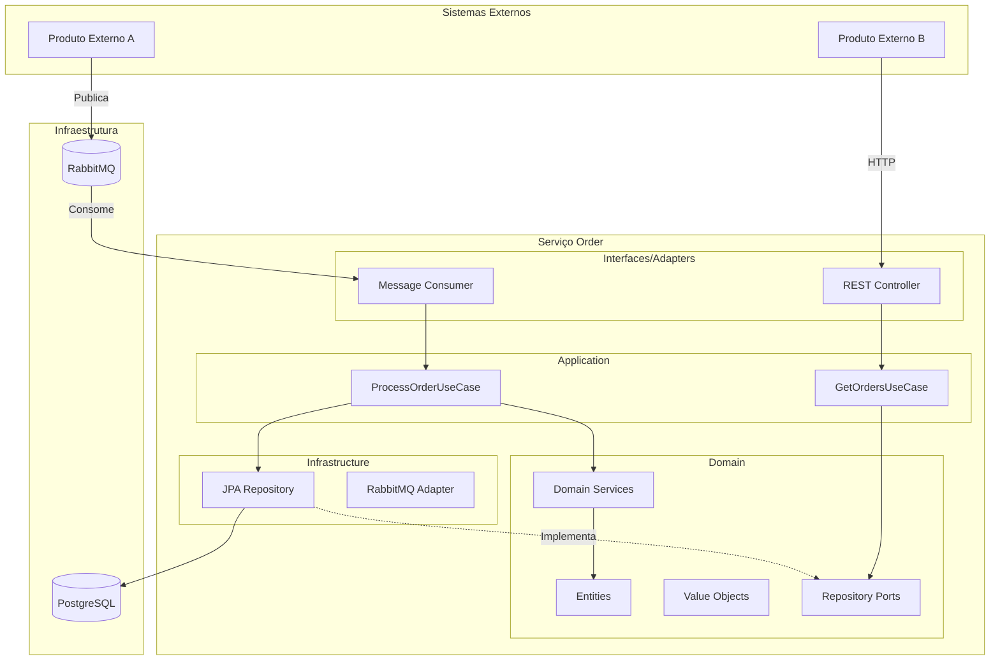
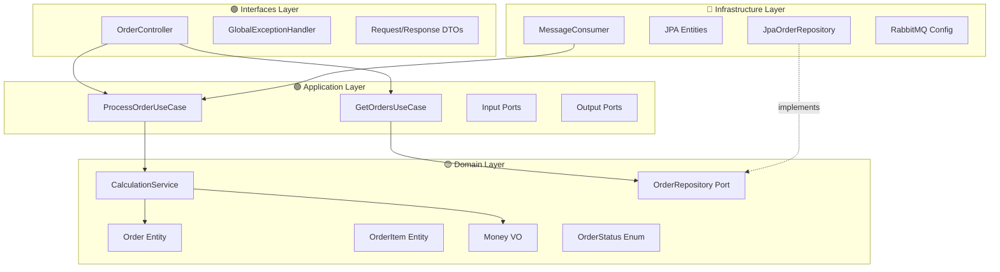
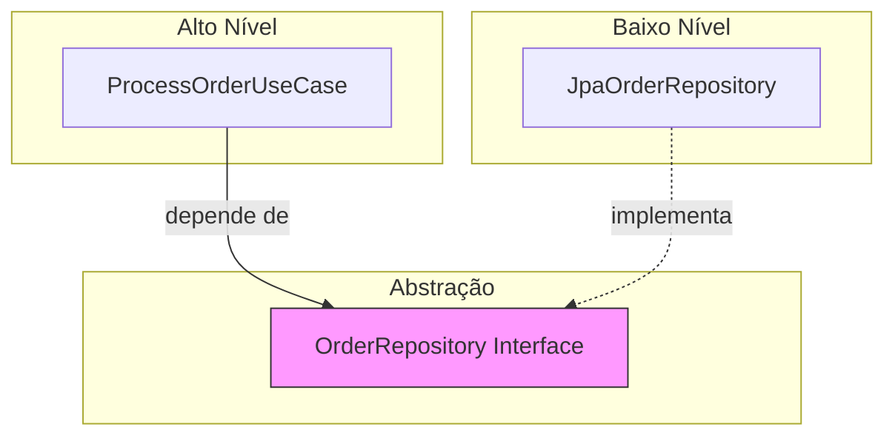
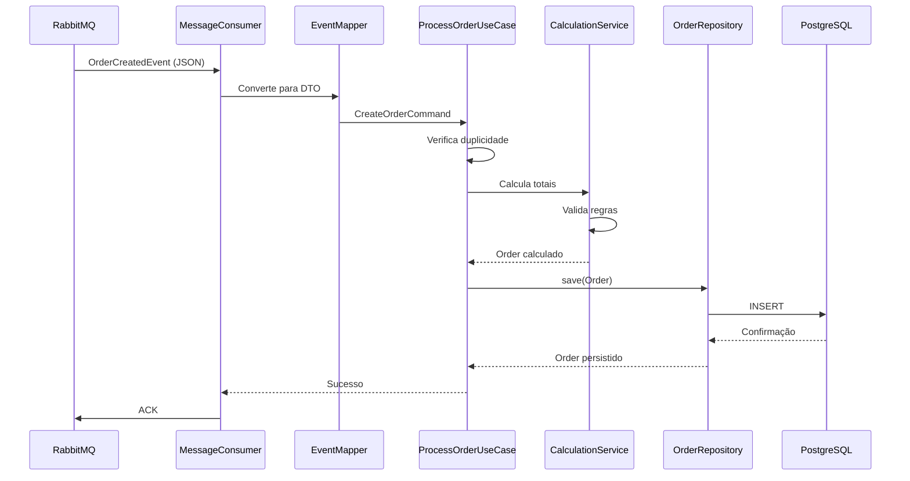
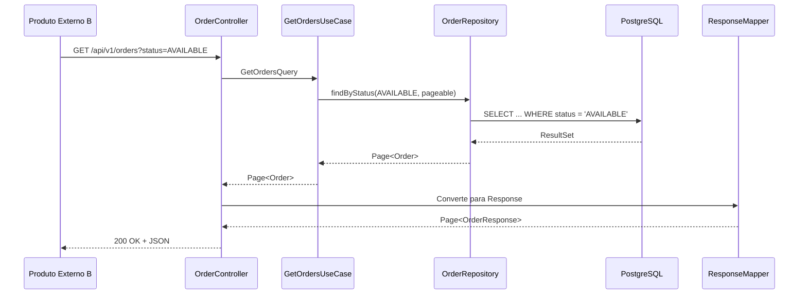
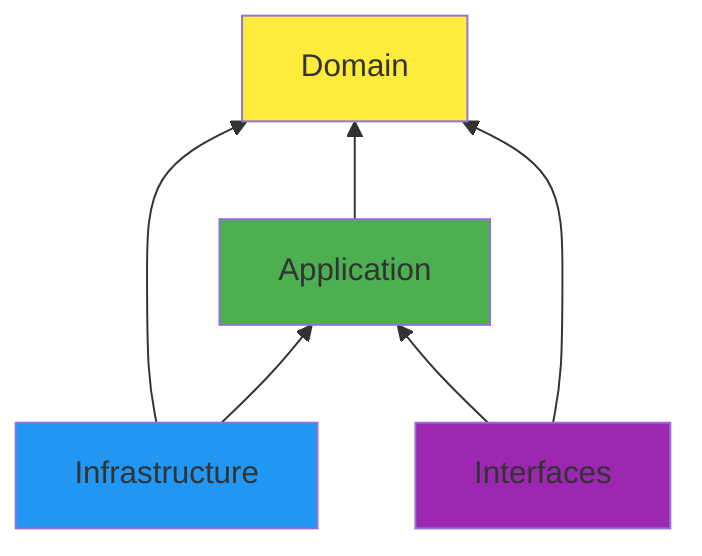

# Arquitetura - Serviço Order

## 1. Visão Geral da Arquitetura

O serviço **order** segue os princípios da **Clean Architecture** (Arquitetura Limpa), garantindo separação de responsabilidades, testabilidade e independência de frameworks.

### 1.1 Diagrama de Arquitetura Geral


```mermaid
flowchart TB
    subgraph External["Sistemas Externos"]
        EA[Produto Externo A]
        EB[Produto Externo B]
    end
    
    subgraph Infrastructure["Infraestrutura"]
        RMQ[(RabbitMQ)]
        PG[(PostgreSQL)]
    end
    
    subgraph OrderService["Serviço Order"]
        subgraph Interfaces["Interfaces/Adapters"]
            REST[REST Controller]
            Consumer[Message Consumer]
        end
        
        subgraph Application["Application"]
            UC1[ProcessOrderUseCase]
            UC2[GetOrdersUseCase]
        end
        
        subgraph Domain["Domain"]
            ENT[Entities]
            VO[Value Objects]
            DS[Domain Services]
            RP[Repository Ports]
        end
        
        subgraph Infra["Infrastructure"]
            JPA[JPA Repository]
            MSG[RabbitMQ Adapter]
        end
    end
    
    EA -->|Publica| RMQ
    RMQ -->|Consome| Consumer
    Consumer --> UC1
    UC1 --> DS
    DS --> ENT
    UC1 --> JPA
    JPA --> PG
    
    EB -->|HTTP| REST
    REST --> UC2
    UC2 --> RP
    JPA -.->|Implementa| RP
```

### 1.2 Princípios Fundamentais

| Princípio | Aplicação no Projeto |
|-----------|---------------------|
| **Dependency Rule** | Dependências apontam para dentro (Domain não conhece Infrastructure) |
| **Separation of Concerns** | Cada camada tem responsabilidade única |
| **Dependency Inversion** | Domínio define interfaces, infraestrutura implementa |
| **Single Source of Truth** | Entidades de domínio são a fonte da verdade |

---

## 2. Clean Architecture - Camadas

### 2.1 Estrutura de Pacotes

```
src/main/java/com/order/
├── domain/                    # 🟡 Núcleo - Regras de negócio
│   ├── entity/                # Entidades de domínio
│   ├── valueobject/           # Value Objects imutáveis
│   ├── service/               # Domain Services
│   ├── repository/            # Portas de saída (interfaces)
│   └── exception/             # Exceções de domínio
│
├── application/               # 🟢 Casos de Uso
│   ├── usecase/               # Implementação dos casos de uso
│   ├── port/
│   │   ├── input/             # Portas de entrada (interfaces)
│   │   └── output/            # Portas de saída adicionais
│   └── dto/                   # DTOs internos da aplicação
│
├── infrastructure/            # 🔵 Frameworks e Drivers
│   ├── persistence/
│   │   ├── entity/            # Entidades JPA
│   │   ├── repository/        # Implementações JPA
│   │   └── mapper/            # Mappers Domain ↔ JPA
│   ├── messaging/
│   │   ├── consumer/          # Consumers RabbitMQ
│   │   ├── publisher/         # Publishers (se necessário)
│   │   └── config/            # Configurações de filas
│   └── config/                # Configurações Spring
│
└── interfaces/                # 🟣 Interface Adapters
    ├── rest/
    │   ├── controller/        # Controllers REST
    │   ├── dto/               # Request/Response DTOs
    │   └── mapper/            # Mappers DTO ↔ Domain
    └── advice/                # Global Exception Handlers
```

### 2.2 Diagrama de Componentes


```mermaid
flowchart TB
    subgraph Interfaces["🟣 Interfaces Layer"]
        direction TB
        RC[OrderController]
        EH[GlobalExceptionHandler]
        RD[Request/Response DTOs]
    end
    
    subgraph Application["🟢 Application Layer"]
        direction TB
        PO[ProcessOrderUseCase]
        GO[GetOrdersUseCase]
        IP[Input Ports]
        OP[Output Ports]
    end
    
    subgraph Domain["🟡 Domain Layer"]
        direction TB
        OE[Order Entity]
        OI[OrderItem Entity]
        MO[Money VO]
        OS[OrderStatus Enum]
        CS[CalculationService]
        OR[OrderRepository Port]
    end
    
    subgraph Infrastructure["🔵 Infrastructure Layer"]
        direction TB
        JR[JpaOrderRepository]
        JE[JPA Entities]
        MC[MessageConsumer]
        RC2[RabbitMQ Config]
    end
    
    RC --> PO
    RC --> GO
    PO --> CS
    GO --> OR
    CS --> OE
    CS --> MO
    JR -.->|implements| OR
    MC --> PO
```

---

## 3. Aplicação dos Princípios SOLID

### 3.1 Single Responsibility Principle (SRP)

Cada classe tem uma única razão para mudar:

```java
// ✅ Correto - Cada classe com responsabilidade única
public class Order {
    // Apenas lógica de domínio do pedido
    public Money calculateTotal() { ... }
}

public class OrderCalculationService {
    // Apenas orquestração do cálculo
    public Order processCalculation(Order order) { ... }
}

public class JpaOrderRepository {
    // Apenas persistência
    public Order save(Order order) { ... }
}
```

### 3.2 Open/Closed Principle (OCP)

Aberto para extensão, fechado para modificação:

```java
// ✅ Correto - Extensível via Strategy
public interface OrderValidationStrategy {
    ValidationResult validate(Order order);
}

public class BusinessRulesValidator implements OrderValidationStrategy { ... }
public class FraudCheckValidator implements OrderValidationStrategy { ... }

// Novas validações não modificam código existente
public class NewCustomValidator implements OrderValidationStrategy { ... }
```

### 3.3 Liskov Substitution Principle (LSP)

Subtipos devem ser substituíveis por seus tipos base:

```java
// ✅ Correto - Interface define contrato
public interface OrderRepository {
    Order save(Order order);
    Optional<Order> findById(UUID id);
}

// Qualquer implementação pode ser usada
public class JpaOrderRepository implements OrderRepository { ... }
public class InMemoryOrderRepository implements OrderRepository { ... } // Para testes
```

### 3.4 Interface Segregation Principle (ISP)

Interfaces específicas e coesas:

```java
// ✅ Correto - Interfaces segregadas
public interface OrderReader {
    Optional<Order> findById(UUID id);
    Page<Order> findByStatus(OrderStatus status, Pageable pageable);
}

public interface OrderWriter {
    Order save(Order order);
    void delete(UUID id);
}

// Repositório implementa ambas quando necessário
public class JpaOrderRepository implements OrderReader, OrderWriter { ... }
```

### 3.5 Dependency Inversion Principle (DIP)

Dependência de abstrações, não de implementações:


```mermaid
flowchart TB
    subgraph "Alto Nível"
        UC[ProcessOrderUseCase]
    end
    
    subgraph "Abstração"
        OR[OrderRepository Interface]
    end
    
    subgraph "Baixo Nível"
        JPA[JpaOrderRepository]
    end
    
    UC -->|depende de| OR
    JPA -.->|implementa| OR
    
    style OR fill:#f9f,stroke:#333
```

```java
// ✅ Correto - Caso de uso depende de abstração
public class ProcessOrderUseCase {
    private final OrderRepository orderRepository; // Interface do domínio
    
    public ProcessOrderUseCase(OrderRepository orderRepository) {
        this.orderRepository = orderRepository;
    }
}
```

---

## 4. Fluxo de Dados

### 4.1 Fluxo de Ingestão (Produto A → Order)


```mermaid
sequenceDiagram
    participant Q as RabbitMQ
    participant C as MessageConsumer
    participant M as EventMapper
    participant UC as ProcessOrderUseCase
    participant DS as CalculationService
    participant R as OrderRepository
    participant DB as PostgreSQL
    
    Q->>C: OrderCreatedEvent (JSON)
    C->>M: Converte para DTO
    M->>UC: CreateOrderCommand
    UC->>UC: Verifica duplicidade
    UC->>DS: Calcula totais
    DS->>DS: Valida regras
    DS-->>UC: Order calculado
    UC->>R: save(Order)
    R->>DB: INSERT
    DB-->>R: Confirmação
    R-->>UC: Order persistido
    UC-->>C: Sucesso
    C->>Q: ACK
```

### 4.2 Fluxo de Consulta (Order → Produto B)


```mermaid
sequenceDiagram
    participant B as Produto Externo B
    participant C as OrderController
    participant UC as GetOrdersUseCase
    participant R as OrderRepository
    participant DB as PostgreSQL
    participant M as ResponseMapper
    
    B->>C: GET /api/v1/orders?status=AVAILABLE
    C->>UC: GetOrdersQuery
    UC->>R: findByStatus(AVAILABLE, pageable)
    R->>DB: SELECT ... WHERE status = 'AVAILABLE'
    DB-->>R: ResultSet
    R-->>UC: Page<Order>
    UC-->>C: Page<Order>
    C->>M: Converte para Response
    M-->>C: Page<OrderResponse>
    C-->>B: 200 OK + JSON
```

---

## 5. Decisões Arquiteturais (ADRs)

### ADR-001: Adoção de Clean Architecture

**Status:** Aceito  
**Data:** 2026-01-13

**Contexto:**  
O serviço order precisa ser testável, manutenível e independente de frameworks específicos.

**Decisão:**  
Adotar Clean Architecture com 4 camadas: Domain, Application, Infrastructure, Interfaces.

**Consequências:**
- (+) Domínio testável sem dependências externas
- (+) Facilidade de trocar implementações (ex: banco de dados)
- (+) Regras de negócio centralizadas e protegidas
- (-) Mais código boilerplate (mappers, interfaces)
- (-) Curva de aprendizado para desenvolvedores novos

---

### ADR-002: PostgreSQL como Banco de Dados

**Status:** Aceito  
**Data:** 2026-01-13

**Contexto:**  
Necessidade de persistência confiável para alta volumetria com transações ACID.

**Decisão:**  
Usar PostgreSQL 15+ como banco de dados relacional.

**Justificativas:**
- Suporte a transações ACID
- Excelente performance para cargas de trabalho mistas (OLTP)
- Recursos avançados: índices parciais, JSONB, particionamento
- Comunidade ativa e maturidade

**Consequências:**
- (+) Consistência garantida
- (+) Recursos avançados de indexação
- (-) Necessidade de tuning para alta volumetria

---

### ADR-003: RabbitMQ para Integração com Produto A

**Status:** Aceito  
**Data:** 2026-01-13

**Contexto:**  
Ingestão de 150k-200k pedidos/dia requer desacoplamento e absorção de picos.

**Decisão:**  
Usar RabbitMQ como broker de mensagens para comunicação assíncrona.

**Justificativas:**
- Desacoplamento temporal entre sistemas
- Buffer para absorver picos de carga
- Garantia de entrega com confirmações
- Dead Letter Queues para tratamento de falhas

**Alternativas consideradas:**
- Kafka: mais complexo, overkill para o volume atual
- REST síncrono: não absorve picos, acoplamento temporal

---

### ADR-004: Estratégia de Idempotência

**Status:** Aceito  
**Data:** 2026-01-13

**Contexto:**  
Mensagens podem ser entregues mais de uma vez; duplicidade deve ser tratada.

**Decisão:**  
Implementar idempotência via `external_order_id` único no banco de dados.

**Implementação:**
```sql
ALTER TABLE orders ADD CONSTRAINT uk_external_order_id UNIQUE (external_order_id);
```

```java
public Order processOrder(CreateOrderCommand command) {
    return orderRepository.findByExternalOrderId(command.externalOrderId())
        .orElseGet(() -> createAndSaveNewOrder(command));
}
```

**Consequências:**
- (+) Duplicatas tratadas automaticamente
- (+) Simples de implementar
- (-) Constraint violation em concorrência (tratado com retry)

---

### ADR-005: Optimistic Locking para Concorrência

**Status:** Aceito  
**Data:** 2026-01-13

**Contexto:**  
Atualizações concorrentes podem causar perda de dados.

**Decisão:**  
Usar Optimistic Locking com campo `@Version` nas entidades JPA.

**Implementação:**
```java
@Entity
public class OrderEntity {
    @Version
    private Long version;
}
```

**Tratamento de conflito:**
```java
@Retryable(value = OptimisticLockException.class, maxAttempts = 3)
public Order updateOrder(Order order) {
    return orderRepository.save(order);
}
```

---

### ADR-006: Circuit Breaker para Resiliência

**Status:** Aceito  
**Data:** 2026-01-13

**Contexto:**  
Falhas em dependências externas (banco de dados, RabbitMQ) podem causar cascata de erros, consumo excessivo de recursos e degradação do serviço.

**Decisão:**  
Implementar Circuit Breaker usando Resilience4j no consumer de mensagens e acesso ao repositório.

**Configuração:**
```yaml
resilience4j.circuitbreaker.instances.rabbitMQConsumer:
  slidingWindowSize: 10
  failureRateThreshold: 50
  waitDurationInOpenState: 30s
  permittedNumberOfCallsInHalfOpenState: 3
```

**Estados:**
- **CLOSED**: Operação normal, falhas são contabilizadas
- **OPEN**: Rejeita chamadas imediatamente (30s), mensagens voltam para fila
- **HALF_OPEN**: Permite algumas chamadas de teste

**Consequências:**
- (+) Protege contra falhas em cascata
- (+) Permite recuperação automática do sistema
- (+) Evita sobrecarga do banco de dados em degradação
- (-) Complexidade adicional no consumer
- (-) Mensagens ficam na fila durante OPEN state

---

### ADR-007: DLQ com Retry Progressivo

**Status:** Aceito  
**Data:** 2026-01-13

**Contexto:**  
Mensagens que falham precisam de estratégia de retry inteligente, separando erros transientes de erros permanentes.

**Decisão:**  
Implementar sistema de retry progressivo com filas separadas e TTL:

```
Retry 1 → order.retry.queue.5s   (TTL: 5 segundos)
Retry 2 → order.retry.queue.30s  (TTL: 30 segundos)
Retry 3 → order.retry.queue.5min (TTL: 5 minutos)
Final   → order.created.dlq      (análise manual)
```

**Estratégia por tipo de erro:**
| Tipo de Erro | Comportamento |
|--------------|---------------|
| Transiente (DB timeout, network) | Retry progressivo |
| Validação (dados inválidos) | DLQ direto |
| Duplicidade | ACK (idempotente) |
| Poison message | DLQ + alerta |

**Consequências:**
- (+) Erros transientes se recuperam automaticamente
- (+) Não bloqueia fila principal
- (+) Permite análise de erros permanentes
- (-) Mais filas para gerenciar
- (-) Complexidade na configuração do RabbitMQ

---

## 6. Padrões de Design Utilizados

| Padrão | Uso no Projeto |
|--------|---------------|
| **Repository** | Abstração de acesso a dados (`OrderRepository`) |
| **Factory** | Criação de entidades complexas (`OrderFactory`) |
| **Strategy** | Validações extensíveis (`OrderValidationStrategy`) |
| **Mapper** | Conversão entre camadas (`OrderEntityMapper`) |
| **Use Case** | Orquestração de lógica de aplicação |
| **Value Object** | Objetos imutáveis (`Money`, `ExternalOrderId`) |
| **Domain Event** | Comunicação entre agregados (se necessário) |

---

## 7. Regras de Dependência


```mermaid
flowchart BT
    D[Domain] 
    A[Application] --> D
    I[Infrastructure] --> D
    I --> A
    INT[Interfaces] --> A
    INT --> D
    
    style D fill:#ffeb3b
    style A fill:#4caf50
    style I fill:#2196f3
    style INT fill:#9c27b0
```

**Regras:**
1. **Domain** não depende de nenhuma outra camada
2. **Application** depende apenas de Domain
3. **Infrastructure** implementa interfaces definidas em Domain/Application
4. **Interfaces** usa Application para orquestração

**Validação com ArchUnit:**
```java
@ArchTest
static final ArchRule domain_should_not_depend_on_other_layers =
    noClasses()
        .that().resideInAPackage("..domain..")
        .should().dependOnClassesThat()
        .resideInAnyPackage("..application..", "..infrastructure..", "..interfaces..");
```
