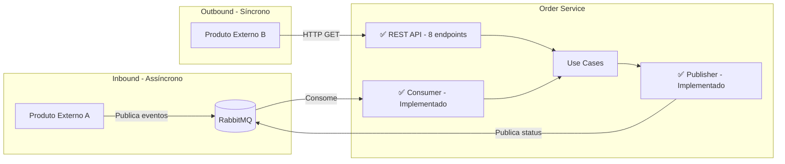
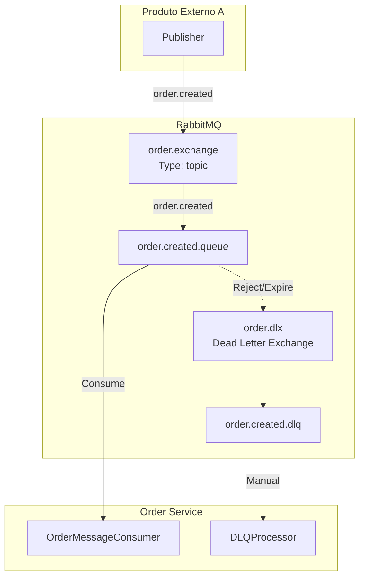
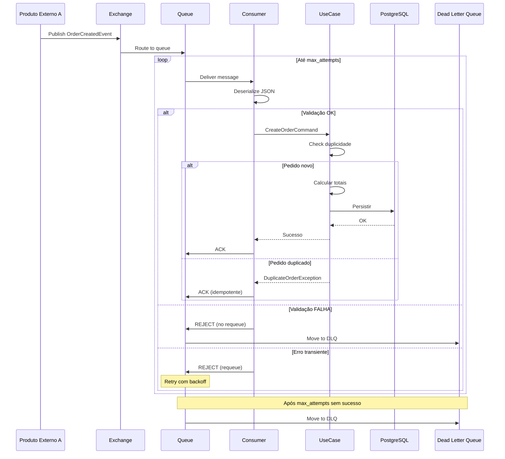
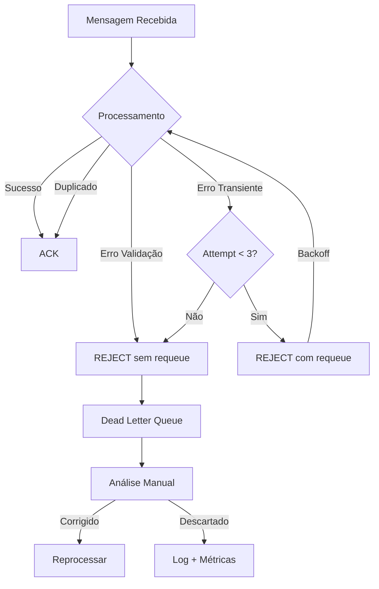
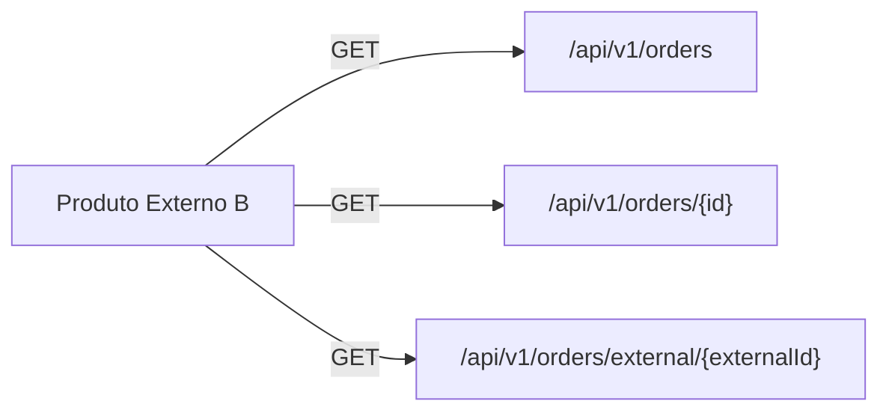
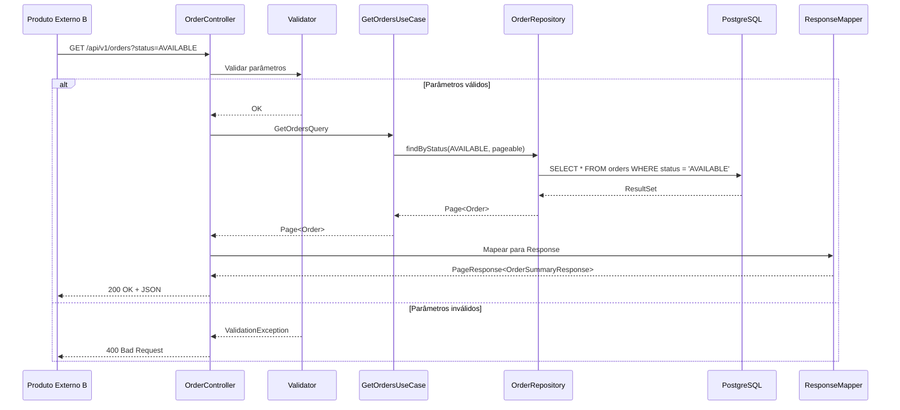
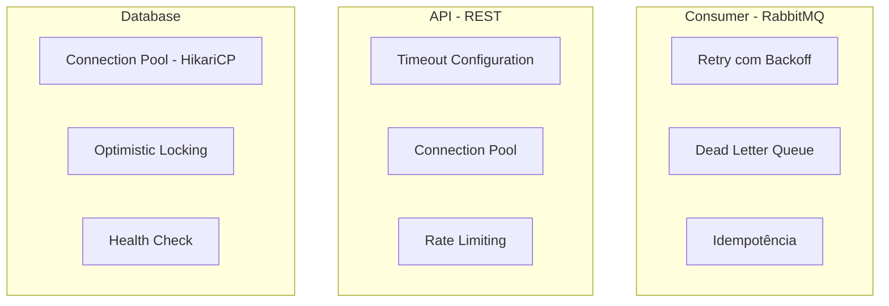
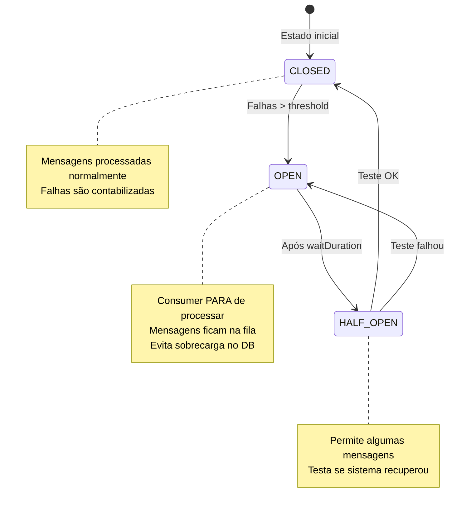
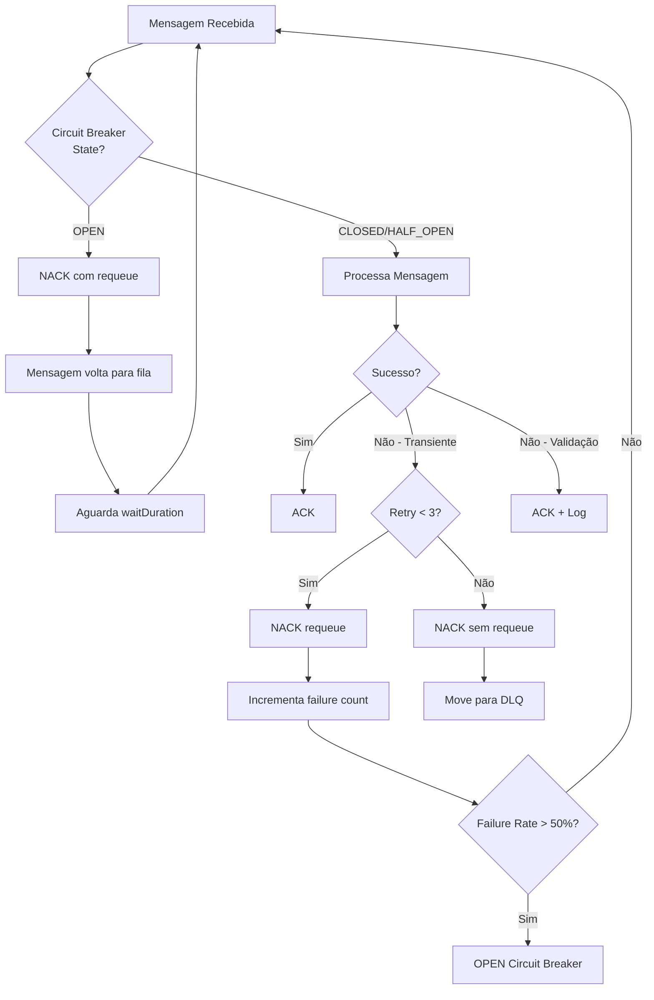
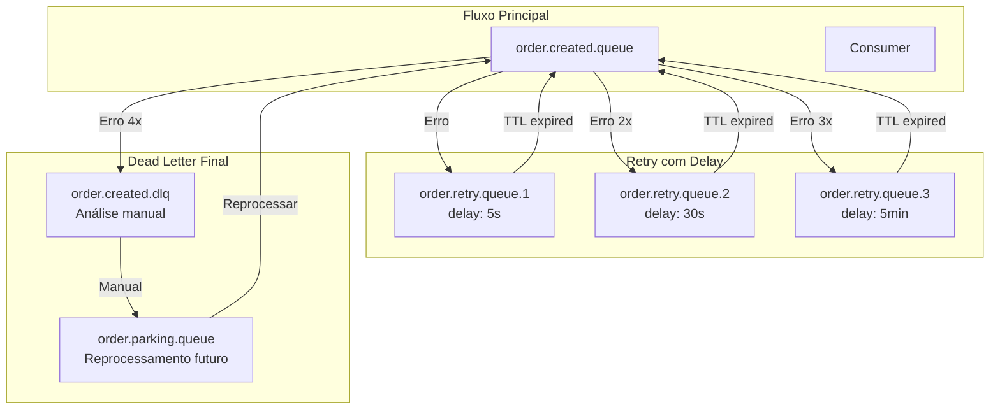

# Integração e Mensageria - Serviço Order

## 1. Visão Geral das Integrações

O serviço **order** atua como intermediário entre dois sistemas externos:



| Integração | Direção | Protocolo | Padrão | Status |
|------------|---------|-----------|--------|--------|
| Produto Externo A | Inbound | AMQP (RabbitMQ) | Event-Driven | ✅ Implementado |
| Produto Externo B | Outbound | REST/HTTP | Request-Response | ✅ Implementado |
| Order Events | Outbound | AMQP (RabbitMQ) | Event Publishing | ✅ Implementado |

### Componentes de Mensageria

| Componente | Tipo | Descrição | Status |
|------------|------|-----------|--------|
| **OrderMessageConsumer** | Inbound | Consome eventos de criação de pedidos | ✅ 7 testes |
| **OrderEventPublisher** | Outbound | Publica eventos de mudança de status | ✅ 6 testes |
| **OrderCreatedEvent** | DTO | Evento de criação (entrada) | ✅ PT_BR |
| **OrderStatusChangedEvent** | DTO | Evento de status (saída) | ✅ PT_BR |

### Tratamento de Erros e Resiliência

- ✅ **Validação de eventos** antes do processamento
- ✅ **Encapsulamento de exceções** em MessageProcessingException
- ✅ **Logs estruturados** em português com correlation ID
- ✅ **Idempotência** via tabela processed_messages
- ✅ **Dead Letter Queue** para mensagens com falha

---

## 1.1 REST API (Produto Externo B)

### Endpoints Disponíveis

| Método | Endpoint | Descrição | Status Code |
|--------|----------|-----------|-------------|
| POST | `/api/v1/orders` | Criar novo pedido | 201 |
| GET | `/api/v1/orders/{id}` | Buscar pedido por ID | 200, 404 |
| GET | `/api/v1/orders/external/{externalOrderId}` | Buscar por ID externo | 200, 404 |
| GET | `/api/v1/orders/status/{status}` | Listar por status | 200 |
| GET | `/api/v1/orders` | Listar todos | 200 |
| POST | `/api/v1/orders/{id}/process` | Processar pedido | 200, 404, 422 |
| PATCH | `/api/v1/orders/{id}/available` | Marcar disponível | 200, 404, 422 |
| PATCH | `/api/v1/orders/{id}/failed` | Marcar como falha | 200, 404 |

### Documentação Interativa

- **Swagger UI**: http://localhost:8080/swagger-ui.html
- **OpenAPI Spec**: http://localhost:8080/v3/api-docs

### Tratamento de Erros (RFC 7807)

Todos os erros seguem o padrão Problem Detail com mensagens em PT_BR:

```json
{
  "type": "about:blank",
  "title": "Erro de Validação",
  "status": 400,
  "detail": "Dados inválidos",
  "instance": "/api/v1/orders"
}
```

| Exception | Status | Title (PT_BR) | Mensagem Exemplo |
|-----------|--------|---------------|------------------|
| ValidationException | 400 | Erro de Validação | Dados inválidos |
| OrderNotFoundException | 404 | Pedido Não Encontrado | Pedido não encontrado com ID: {id} |
| DuplicateOrderException | 409 | Pedido Duplicado | Pedido já existe com External ID: {id} |
| IllegalStateException | 422 | Transição de Estado Inválida | Estado inválido |
| MessageProcessingException | 500 | Erro de Processamento | Falha ao processar evento |

---

## 2. Integração com Produto Externo A (RabbitMQ)

### 2.1 Topologia de Filas



### 2.2 Configuração das Filas

```yaml
# application.yml
spring:
  rabbitmq:
    host: ${RABBITMQ_HOST:localhost}
    port: ${RABBITMQ_PORT:5672}
    username: ${RABBITMQ_USER:guest}
    password: ${RABBITMQ_PASSWORD:guest}
    listener:
      simple:
        acknowledge-mode: manual
        prefetch: 10
        retry:
          enabled: true
          initial-interval: 1000ms
          max-attempts: 3
          multiplier: 2.0
```

### 2.3 Definição de Exchange e Queue

```java
@Configuration
public class RabbitMQConfig {
    
    public static final String EXCHANGE_NAME = "order.exchange";
    public static final String QUEUE_NAME = "order.created.queue";
    public static final String DLQ_NAME = "order.created.dlq";
    public static final String ROUTING_KEY = "order.created";
    
    @Bean
    public TopicExchange orderExchange() {
        return new TopicExchange(EXCHANGE_NAME);
    }
    
    @Bean
    public Queue orderCreatedQueue() {
        return QueueBuilder.durable(QUEUE_NAME)
            .withArgument("x-dead-letter-exchange", "order.dlx")
            .withArgument("x-dead-letter-routing-key", "order.created.dlq")
            .build();
    }
    
    @Bean
    public Queue deadLetterQueue() {
        return QueueBuilder.durable(DLQ_NAME).build();
    }
    
    @Bean
    public Binding binding(Queue orderCreatedQueue, TopicExchange orderExchange) {
        return BindingBuilder
            .bind(orderCreatedQueue)
            .to(orderExchange)
            .with(ROUTING_KEY);
    }
}
```

### 2.4 Contrato do Evento

```json
{
  "$schema": "http://json-schema.org/draft-07/schema#",
  "title": "OrderCreatedEvent",
  "type": "object",
  "required": ["externalOrderId", "items", "timestamp"],
  "properties": {
    "externalOrderId": {
      "type": "string",
      "description": "Identificador único do pedido no sistema de origem",
      "pattern": "^[A-Z0-9-]{1,100}$"
    },
    "items": {
      "type": "array",
      "minItems": 1,
      "items": {
        "type": "object",
        "required": ["productId", "productName", "unitPrice", "quantity"],
        "properties": {
          "productId": { "type": "string" },
          "productName": { "type": "string" },
          "unitPrice": { "type": "number", "minimum": 0.01 },
          "quantity": { "type": "integer", "minimum": 1 }
        }
      }
    },
    "timestamp": {
      "type": "string",
      "format": "date-time"
    }
  }
}
```

**Exemplo de mensagem:**
```json
{
  "externalOrderId": "ORD-2026-001234",
  "items": [
    {
      "productId": "PROD-001",
      "productName": "Produto A",
      "unitPrice": 50.00,
      "quantity": 2
    },
    {
      "productId": "PROD-002",
      "productName": "Produto B",
      "unitPrice": 30.00,
      "quantity": 3
    }
  ],
  "timestamp": "2026-01-13T10:30:00Z"
}
```

### 2.5 Consumer Implementation

```java
@Component
@RequiredArgsConstructor
@Slf4j
public class OrderMessageConsumer {
    
    private final ProcessOrderUseCase processOrderUseCase;
    private final ObjectMapper objectMapper;
    
    @RabbitListener(queues = RabbitMQConfig.QUEUE_NAME)
    public void consume(Message message, Channel channel) {
        long deliveryTag = message.getMessageProperties().getDeliveryTag();
        String correlationId = getOrGenerateCorrelationId(message);
        
        try (MDC.MDCCloseable ignored = MDC.putCloseable("correlationId", correlationId)) {
            log.info("Processando mensagem: deliveryTag={}", deliveryTag);
            
            OrderCreatedEvent event = deserialize(message.getBody());
            CreateOrderCommand command = toCommand(event);
            
            processOrderUseCase.execute(command);
            
            channel.basicAck(deliveryTag, false);
            log.info("Mensagem processada com sucesso: externalOrderId={}", 
                     event.externalOrderId());
            
        } catch (DuplicateOrderException e) {
            // Idempotência - ACK para não reprocessar
            safeAck(channel, deliveryTag);
            log.info("Pedido duplicado ignorado: {}", e.getMessage());
            
        } catch (ValidationException e) {
            // Erro de validação - envia para DLQ
            safeReject(channel, deliveryTag, false);
            log.warn("Erro de validação, enviando para DLQ: {}", e.getMessage());
            
        } catch (Exception e) {
            // Erro transiente - requeue para retry
            safeReject(channel, deliveryTag, true);
            log.error("Erro no processamento, reenfileirando", e);
        }
    }
}
```

### 2.6 Diagrama de Sequência - Fluxo de Mensagem



### 2.7 Estratégia de Retry e DLQ



**Configuração de Retry:**

| Parâmetro | Valor | Descrição |
|-----------|-------|-----------|
| `max-attempts` | 3 | Número máximo de tentativas |
| `initial-interval` | 1s | Intervalo inicial entre retries |
| `multiplier` | 2.0 | Fator de multiplicação (backoff exponencial) |
| `max-interval` | 10s | Intervalo máximo entre retries |

---

## 3. Integração com Produto Externo B (REST API)

### 3.1 Endpoints Disponíveis



### 3.2 Especificação da API

#### Listar Pedidos
```
GET /api/v1/orders
```

**Query Parameters:**

| Parâmetro | Tipo | Obrigatório | Descrição |
|-----------|------|-------------|-----------|
| `status` | String | Não | Filtro por status (`AVAILABLE`, `CALCULATED`) |
| `startDate` | LocalDate | Não | Data inicial (formato: `YYYY-MM-DD`) |
| `endDate` | LocalDate | Não | Data final (formato: `YYYY-MM-DD`) |
| `page` | Integer | Não | Número da página (default: 0) |
| `size` | Integer | Não | Tamanho da página (default: 20, max: 100) |
| `sort` | String | Não | Ordenação (ex: `createdAt,desc`) |

**Response (200 OK):**
```json
{
  "content": [
    {
      "id": "550e8400-e29b-41d4-a716-446655440000",
      "externalOrderId": "ORD-2026-001234",
      "status": "AVAILABLE",
      "totalAmount": {
        "value": 190.00,
        "currency": "BRL"
      },
      "itemCount": 2,
      "createdAt": "2026-01-13T10:30:00Z",
      "updatedAt": "2026-01-13T10:30:05Z"
    }
  ],
  "page": {
    "number": 0,
    "size": 20,
    "totalElements": 150,
    "totalPages": 8
  }
}
```

#### Buscar Pedido por ID
```
GET /api/v1/orders/{id}
```

**Response (200 OK):**
```json
{
  "id": "550e8400-e29b-41d4-a716-446655440000",
  "externalOrderId": "ORD-2026-001234",
  "status": "AVAILABLE",
  "totalAmount": {
    "value": 190.00,
    "currency": "BRL"
  },
  "items": [
    {
      "id": "660e8400-e29b-41d4-a716-446655440001",
      "productId": "PROD-001",
      "productName": "Produto A",
      "unitPrice": {
        "value": 50.00,
        "currency": "BRL"
      },
      "quantity": 2,
      "subtotal": {
        "value": 100.00,
        "currency": "BRL"
      }
    },
    {
      "id": "660e8400-e29b-41d4-a716-446655440002",
      "productId": "PROD-002",
      "productName": "Produto B",
      "unitPrice": {
        "value": 30.00,
        "currency": "BRL"
      },
      "quantity": 3,
      "subtotal": {
        "value": 90.00,
        "currency": "BRL"
      }
    }
  ],
  "createdAt": "2026-01-13T10:30:00Z",
  "updatedAt": "2026-01-13T10:30:05Z"
}
```

### 3.3 Códigos de Resposta HTTP

| Código | Significado | Quando usar |
|--------|-------------|-------------|
| `200 OK` | Sucesso | Requisição processada com sucesso |
| `400 Bad Request` | Erro de validação | Parâmetros inválidos |
| `404 Not Found` | Recurso não encontrado | Pedido não existe |
| `500 Internal Server Error` | Erro interno | Falha inesperada no servidor |
| `503 Service Unavailable` | Serviço indisponível | Banco de dados fora |

### 3.4 Controller Implementation

```java
@RestController
@RequestMapping("/api/v1/orders")
@RequiredArgsConstructor
@Validated
public class OrderController {
    
    private final GetOrdersUseCase getOrdersUseCase;
    private final OrderResponseMapper mapper;
    
    @GetMapping
    public ResponseEntity<PageResponse<OrderSummaryResponse>> listOrders(
            @RequestParam(required = false) OrderStatus status,
            @RequestParam(required = false) @DateTimeFormat(iso = ISO.DATE) LocalDate startDate,
            @RequestParam(required = false) @DateTimeFormat(iso = ISO.DATE) LocalDate endDate,
            @PageableDefault(size = 20, sort = "createdAt", direction = DESC) Pageable pageable) {
        
        GetOrdersQuery query = new GetOrdersQuery(status, startDate, endDate, pageable);
        Page<Order> orders = getOrdersUseCase.execute(query);
        
        return ResponseEntity.ok(mapper.toPageResponse(orders));
    }
    
    @GetMapping("/{id}")
    public ResponseEntity<OrderDetailResponse> getOrderById(
            @PathVariable @NotNull UUID id) {
        
        Order order = getOrdersUseCase.findById(id)
            .orElseThrow(() -> new OrderNotFoundException(id));
        
        return ResponseEntity.ok(mapper.toDetailResponse(order));
    }
    
    @GetMapping("/external/{externalOrderId}")
    public ResponseEntity<OrderDetailResponse> getOrderByExternalId(
            @PathVariable @NotBlank String externalOrderId) {
        
        Order order = getOrdersUseCase.findByExternalOrderId(externalOrderId)
            .orElseThrow(() -> new OrderNotFoundException(externalOrderId));
        
        return ResponseEntity.ok(mapper.toDetailResponse(order));
    }
}
```

### 3.5 Diagrama de Sequência - Consulta



---

## 4. Resiliência e Tolerância a Falhas

### 4.1 Padrões Implementados



### 4.2 Tratamento de Falhas por Cenário

| Cenário | Comportamento | Recuperação |
|---------|---------------|-------------|
| **RabbitMQ fora** | Mensagens acumulam na origem | Auto-reconexão quando disponível |
| **PostgreSQL fora** | Mensagem vai para retry/DLQ | Reprocessamento após recovery |
| **Timeout de conexão** | Rollback da transação | Retry automático |
| **Deadlock** | Rollback e retry | Backoff exponencial |
| **Dados inválidos** | Mensagem para DLQ | Análise manual |

### 4.3 Health Checks

```java
@Component
public class RabbitMQHealthIndicator implements HealthIndicator {
    
    private final RabbitTemplate rabbitTemplate;
    
    @Override
    public Health health() {
        try {
            rabbitTemplate.execute(channel -> {
                channel.queueDeclarePassive(RabbitMQConfig.QUEUE_NAME);
                return null;
            });
            return Health.up()
                .withDetail("queue", RabbitMQConfig.QUEUE_NAME)
                .build();
        } catch (Exception e) {
            return Health.down()
                .withException(e)
                .build();
        }
    }
}
```

---

## 5. Simulação dos Sistemas Externos

Para desenvolvimento e testes locais, os sistemas externos são simulados:

### 5.1 Simulador do Produto Externo A

Script para publicar mensagens de teste:

```java
@Component
@Profile("local")
public class OrderEventSimulator {
    
    private final RabbitTemplate rabbitTemplate;
    
    @Scheduled(fixedRate = 5000) // 1 pedido a cada 5 segundos
    public void simulateOrder() {
        OrderCreatedEvent event = generateRandomOrder();
        rabbitTemplate.convertAndSend(
            RabbitMQConfig.EXCHANGE_NAME,
            RabbitMQConfig.ROUTING_KEY,
            event
        );
    }
}
```

### 5.2 Teste Manual via CLI

```bash
# Publicar mensagem de teste
docker exec -it rabbitmq rabbitmqadmin publish \
  exchange=order.exchange \
  routing_key=order.created \
  payload='{"externalOrderId":"TEST-001","items":[{"productId":"P1","productName":"Teste","unitPrice":10.0,"quantity":1}],"timestamp":"2026-01-13T10:00:00Z"}'
```

### 5.3 Consulta via cURL (Simulando Produto B)

```bash
# Listar pedidos disponíveis
curl -X GET "http://localhost:8080/api/v1/orders?status=AVAILABLE&size=10" \
  -H "Accept: application/json"

# Buscar pedido específico
curl -X GET "http://localhost:8080/api/v1/orders/external/TEST-001" \
  -H "Accept: application/json"
```

---

## 6. Circuit Breaker para Mensageria

### 6.1 Visão Geral

O Circuit Breaker protege o sistema contra falhas em cascata quando o RabbitMQ ou o banco de dados estão degradados.



### 6.2 Configuração Resilience4j

```yaml
# application.yml
resilience4j:
  circuitbreaker:
    instances:
      rabbitMQConsumer:
        registerHealthIndicator: true
        slidingWindowType: COUNT_BASED
        slidingWindowSize: 10
        minimumNumberOfCalls: 5
        permittedNumberOfCallsInHalfOpenState: 3
        automaticTransitionFromOpenToHalfOpenEnabled: true
        waitDurationInOpenState: 30s
        failureRateThreshold: 50
        slowCallRateThreshold: 80
        slowCallDurationThreshold: 5s
        recordExceptions:
          - org.springframework.dao.DataAccessException
          - java.sql.SQLException
          - org.springframework.amqp.AmqpException
        ignoreExceptions:
          - com.order.domain.exception.DuplicateOrderException
          - com.order.domain.exception.ValidationException
      
      orderRepository:
        registerHealthIndicator: true
        slidingWindowSize: 10
        failureRateThreshold: 50
        waitDurationInOpenState: 60s
```

### 6.3 Implementação no Consumer

```java
@Component
@RequiredArgsConstructor
@Slf4j
public class ResilientOrderMessageConsumer {
    
    private final ProcessOrderUseCase processOrderUseCase;
    private final CircuitBreakerRegistry circuitBreakerRegistry;
    private final OrderMetrics metrics;
    
    private CircuitBreaker circuitBreaker;
    
    @PostConstruct
    public void init() {
        circuitBreaker = circuitBreakerRegistry.circuitBreaker("rabbitMQConsumer");
        
        // Event listeners para observabilidade
        circuitBreaker.getEventPublisher()
            .onStateTransition(event -> {
                log.warn("Circuit Breaker transição: {} -> {}", 
                    event.getStateTransition().getFromState(),
                    event.getStateTransition().getToState());
                metrics.recordCircuitBreakerStateChange(
                    event.getStateTransition().getToState().name());
            })
            .onFailureRateExceeded(event -> {
                log.error("Circuit Breaker: taxa de falha excedida: {}%", 
                    event.getFailureRate());
            });
    }
    
    @RabbitListener(queues = RabbitMQConfig.QUEUE_NAME)
    public void consume(Message message, Channel channel) throws IOException {
        long deliveryTag = message.getMessageProperties().getDeliveryTag();
        
        // Verifica estado do Circuit Breaker ANTES de processar
        if (circuitBreaker.getState() == CircuitBreaker.State.OPEN) {
            log.warn("Circuit Breaker OPEN - rejeitando mensagem para requeue");
            channel.basicNack(deliveryTag, false, true);
            return;
        }
        
        try {
            // Executa com proteção do Circuit Breaker
            circuitBreaker.executeRunnable(() -> {
                processMessage(message);
            });
            
            channel.basicAck(deliveryTag, false);
            
        } catch (CallNotPermittedException e) {
            // Circuit Breaker aberto durante processamento
            log.warn("Circuit Breaker não permitiu chamada - requeue");
            channel.basicNack(deliveryTag, false, true);
            
        } catch (DuplicateOrderException | ValidationException e) {
            // Exceções de negócio - não afetam o circuit breaker
            channel.basicAck(deliveryTag, false);
            
        } catch (Exception e) {
            handleProcessingError(message, channel, deliveryTag, e);
        }
    }
    
    private void handleProcessingError(Message message, Channel channel, 
                                        long deliveryTag, Exception e) throws IOException {
        int retryCount = getRetryCount(message);
        
        if (retryCount < 3) {
            log.warn("Erro no processamento (tentativa {}), reenfileirando: {}", 
                retryCount + 1, e.getMessage());
            channel.basicNack(deliveryTag, false, true);
        } else {
            log.error("Máximo de tentativas excedido, enviando para DLQ", e);
            channel.basicNack(deliveryTag, false, false); // vai para DLQ
        }
    }
}
```

### 6.4 Diagrama de Fluxo com Circuit Breaker



---

## 7. Dead Letter Queue (DLQ) Avançada

### 7.1 Arquitetura de DLQ com Retry Automático



### 7.2 Configuração de Retry Queues com TTL

```java
@Configuration
public class AdvancedRabbitMQConfig {
    
    // Exchanges
    public static final String MAIN_EXCHANGE = "order.exchange";
    public static final String RETRY_EXCHANGE = "order.retry.exchange";
    public static final String DLX_EXCHANGE = "order.dlx";
    
    // Queues
    public static final String MAIN_QUEUE = "order.created.queue";
    public static final String RETRY_QUEUE_1 = "order.retry.queue.5s";
    public static final String RETRY_QUEUE_2 = "order.retry.queue.30s";
    public static final String RETRY_QUEUE_3 = "order.retry.queue.5min";
    public static final String DLQ = "order.created.dlq";
    public static final String PARKING_QUEUE = "order.parking.queue";
    
    // === RETRY QUEUE 1 - 5 segundos ===
    @Bean
    public Queue retryQueue1() {
        return QueueBuilder.durable(RETRY_QUEUE_1)
            .withArgument("x-dead-letter-exchange", MAIN_EXCHANGE)
            .withArgument("x-dead-letter-routing-key", "order.created")
            .withArgument("x-message-ttl", 5000) // 5 segundos
            .build();
    }
    
    // === RETRY QUEUE 2 - 30 segundos ===
    @Bean
    public Queue retryQueue2() {
        return QueueBuilder.durable(RETRY_QUEUE_2)
            .withArgument("x-dead-letter-exchange", MAIN_EXCHANGE)
            .withArgument("x-dead-letter-routing-key", "order.created")
            .withArgument("x-message-ttl", 30000) // 30 segundos
            .build();
    }
    
    // === RETRY QUEUE 3 - 5 minutos ===
    @Bean
    public Queue retryQueue3() {
        return QueueBuilder.durable(RETRY_QUEUE_3)
            .withArgument("x-dead-letter-exchange", MAIN_EXCHANGE)
            .withArgument("x-dead-letter-routing-key", "order.created")
            .withArgument("x-message-ttl", 300000) // 5 minutos
            .build();
    }
    
    // === MAIN QUEUE com DLQ configurada ===
    @Bean
    public Queue mainQueue() {
        return QueueBuilder.durable(MAIN_QUEUE)
            .withArgument("x-dead-letter-exchange", DLX_EXCHANGE)
            .withArgument("x-dead-letter-routing-key", "order.dlq")
            .build();
    }
    
    // === PARKING QUEUE para reprocessamento manual ===
    @Bean
    public Queue parkingQueue() {
        return QueueBuilder.durable(PARKING_QUEUE)
            .withArgument("x-message-ttl", 604800000) // 7 dias
            .build();
    }
}
```

### 7.3 Consumer com Retry Inteligente

```java
@Component
@RequiredArgsConstructor
@Slf4j
public class SmartRetryOrderConsumer {
    
    private final RabbitTemplate rabbitTemplate;
    private final ProcessOrderUseCase processOrderUseCase;
    
    private static final String RETRY_COUNT_HEADER = "x-retry-count";
    private static final String ORIGINAL_EXCHANGE_HEADER = "x-original-exchange";
    private static final String FAILURE_REASON_HEADER = "x-failure-reason";
    
    @RabbitListener(queues = AdvancedRabbitMQConfig.MAIN_QUEUE)
    public void consume(Message message, Channel channel) throws IOException {
        long deliveryTag = message.getMessageProperties().getDeliveryTag();
        int retryCount = getRetryCount(message);
        
        try {
            processOrderUseCase.execute(toCommand(message));
            channel.basicAck(deliveryTag, false);
            
        } catch (TransientException e) {
            handleTransientError(message, channel, deliveryTag, retryCount, e);
            
        } catch (ValidationException e) {
            // Erros de validação vão direto para DLQ (não adianta retry)
            sendToDLQ(message, channel, deliveryTag, e);
            
        } catch (Exception e) {
            handleUnexpectedError(message, channel, deliveryTag, retryCount, e);
        }
    }
    
    private void handleTransientError(Message message, Channel channel, 
            long deliveryTag, int retryCount, Exception e) throws IOException {
        
        String targetQueue = getRetryQueueForAttempt(retryCount);
        
        if (targetQueue != null) {
            // Envia para fila de retry apropriada
            sendToRetryQueue(message, targetQueue, retryCount, e.getMessage());
            channel.basicAck(deliveryTag, false);
            
            log.warn("Erro transiente (tentativa {}), enviando para {}: {}", 
                retryCount + 1, targetQueue, e.getMessage());
        } else {
            // Excedeu todas as tentativas - vai para DLQ
            sendToDLQ(message, channel, deliveryTag, e);
        }
    }
    
    private String getRetryQueueForAttempt(int retryCount) {
        return switch (retryCount) {
            case 0 -> AdvancedRabbitMQConfig.RETRY_QUEUE_1;  // 5s
            case 1 -> AdvancedRabbitMQConfig.RETRY_QUEUE_2;  // 30s
            case 2 -> AdvancedRabbitMQConfig.RETRY_QUEUE_3;  // 5min
            default -> null; // vai para DLQ
        };
    }
    
    private void sendToRetryQueue(Message message, String queueName, 
                                   int retryCount, String reason) {
        MessageProperties props = message.getMessageProperties();
        props.setHeader(RETRY_COUNT_HEADER, retryCount + 1);
        props.setHeader(FAILURE_REASON_HEADER, reason);
        props.setHeader(ORIGINAL_EXCHANGE_HEADER, AdvancedRabbitMQConfig.MAIN_EXCHANGE);
        
        rabbitTemplate.send(queueName, message);
    }
    
    private void sendToDLQ(Message message, Channel channel, 
                          long deliveryTag, Exception e) throws IOException {
        // Adiciona metadados para análise
        message.getMessageProperties().setHeader("x-final-failure-reason", e.getMessage());
        message.getMessageProperties().setHeader("x-final-failure-time", Instant.now().toString());
        message.getMessageProperties().setHeader("x-exception-type", e.getClass().getName());
        
        channel.basicNack(deliveryTag, false, false); // Move para DLQ via DLX
        
        log.error("Mensagem enviada para DLQ após esgotar retries: {}", e.getMessage());
    }
    
    private int getRetryCount(Message message) {
        Object count = message.getMessageProperties().getHeader(RETRY_COUNT_HEADER);
        return count != null ? (Integer) count : 0;
    }
}
```

### 7.4 DLQ Processor com Reprocessamento

```java
@Component
@RequiredArgsConstructor
@Slf4j
public class DLQProcessor {
    
    private final RabbitTemplate rabbitTemplate;
    private final OrderMetrics metrics;
    private final AlertService alertService;
    
    @RabbitListener(queues = AdvancedRabbitMQConfig.DLQ)
    public void processDLQ(Message message) {
        String externalOrderId = extractExternalOrderId(message);
        String failureReason = getHeader(message, "x-final-failure-reason");
        String exceptionType = getHeader(message, "x-exception-type");
        
        log.error("Mensagem na DLQ - externalOrderId: {}, reason: {}, exception: {}",
            externalOrderId, failureReason, exceptionType);
        
        // Métricas
        metrics.recordDLQMessage(exceptionType);
        
        // Alerta
        alertService.sendDLQAlert(DLQAlertEvent.builder()
            .externalOrderId(externalOrderId)
            .failureReason(failureReason)
            .exceptionType(exceptionType)
            .timestamp(Instant.now())
            .messageBody(new String(message.getBody()))
            .build());
        
        // Move para parking queue para análise futura
        moveToParking(message);
    }
    
    private void moveToParking(Message message) {
        message.getMessageProperties().setHeader("x-parked-at", Instant.now().toString());
        rabbitTemplate.send(AdvancedRabbitMQConfig.PARKING_QUEUE, message);
    }
    
    /**
     * Endpoint para reprocessar mensagens da parking queue
     */
    public void reprocessFromParking(String externalOrderId) {
        // Busca mensagem na parking queue e reenvia para main queue
        // Implementação com RabbitAdmin para busca específica
    }
    
    /**
     * Reprocessa todas as mensagens da parking queue
     */
    @Scheduled(cron = "0 0 3 * * *") // 3h da manhã
    public void scheduledReprocess() {
        log.info("Iniciando reprocessamento agendado da parking queue");
        // Move mensagens de volta para a fila principal
    }
}
```

---

## 8. Boas Práticas de Mensageria

### 8.1 Configurações Otimizadas

```yaml
# application.yml
spring:
  rabbitmq:
    # === Conexão ===
    connection-timeout: 30s
    channel-rpc-timeout: 30s
    
    # === Publisher Confirms (garantia de entrega) ===
    publisher-confirm-type: correlated
    publisher-returns: true
    
    # === Consumer ===
    listener:
      simple:
        acknowledge-mode: manual          # Controle total do ACK
        prefetch: 10                       # Mensagens por consumer
        concurrency: 2                     # Consumers paralelos
        max-concurrency: 5                 # Máximo em picos
        default-requeue-rejected: false    # Não requeue automático
        missing-queues-fatal: false        # Não falha se fila não existe
        retry:
          enabled: true
          initial-interval: 1000ms
          max-interval: 10000ms
          max-attempts: 3
          multiplier: 2.0
    
    # === Template ===
    template:
      mandatory: true                      # Garante routing
      retry:
        enabled: true
        initial-interval: 1000ms
        max-attempts: 3
```

### 8.2 Message Deduplication

```java
@Component
@RequiredArgsConstructor
public class MessageDeduplicationFilter {
    
    private final RedisTemplate<String, String> redisTemplate;
    
    private static final String DEDUP_PREFIX = "order:msg:";
    private static final Duration DEDUP_TTL = Duration.ofHours(24);
    
    /**
     * Verifica se mensagem já foi processada (baseado no messageId)
     */
    public boolean isDuplicate(Message message) {
        String messageId = message.getMessageProperties().getMessageId();
        if (messageId == null) {
            return false;
        }
        
        String key = DEDUP_PREFIX + messageId;
        Boolean wasNew = redisTemplate.opsForValue()
            .setIfAbsent(key, "processed", DEDUP_TTL);
        
        return !Boolean.TRUE.equals(wasNew);
    }
    
    /**
     * Marca mensagem como processada
     */
    public void markAsProcessed(String messageId) {
        String key = DEDUP_PREFIX + messageId;
        redisTemplate.opsForValue().set(key, "processed", DEDUP_TTL);
    }
}
```

### 8.3 Poison Message Detection

```java
@Component
@Slf4j
public class PoisonMessageDetector {
    
    private static final int MAX_REDELIVERY_COUNT = 5;
    private static final String REDELIVERY_HEADER = "x-redelivered-count";
    
    /**
     * Detecta mensagens que estão causando loop infinito
     */
    public boolean isPoisonMessage(Message message) {
        // Verifica header de redelivery
        Object redeliveryCount = message.getMessageProperties()
            .getHeader(REDELIVERY_HEADER);
        
        if (redeliveryCount != null && (Integer) redeliveryCount >= MAX_REDELIVERY_COUNT) {
            log.warn("Poison message detectada após {} redeliveries: {}",
                redeliveryCount, message.getMessageProperties().getMessageId());
            return true;
        }
        
        // Verifica x-death header (mortes anteriores)
        List<Map<String, Object>> xDeath = getXDeathHeader(message);
        if (xDeath != null) {
            long totalDeaths = xDeath.stream()
                .mapToLong(death -> (Long) death.getOrDefault("count", 0L))
                .sum();
            
            if (totalDeaths >= MAX_REDELIVERY_COUNT) {
                log.warn("Poison message detectada após {} mortes", totalDeaths);
                return true;
            }
        }
        
        return false;
    }
    
    @SuppressWarnings("unchecked")
    private List<Map<String, Object>> getXDeathHeader(Message message) {
        return (List<Map<String, Object>>) message.getMessageProperties()
            .getHeaders().get("x-death");
    }
}
```

### 8.4 Backpressure e Rate Limiting

```java
@Configuration
public class BackpressureConfig {
    
    @Bean
    public SimpleRabbitListenerContainerFactory rabbitListenerContainerFactory(
            ConnectionFactory connectionFactory,
            RateLimiter rateLimiter) {
        
        SimpleRabbitListenerContainerFactory factory = 
            new SimpleRabbitListenerContainerFactory();
        factory.setConnectionFactory(connectionFactory);
        
        // Configuração de backpressure
        factory.setPrefetchCount(10);           // Máximo de mensagens não-acked
        factory.setConcurrentConsumers(2);       // Consumers iniciais
        factory.setMaxConcurrentConsumers(5);    // Máximo em pico
        factory.setConsecutiveActiveTrigger(5);  // Aumenta consumers após 5 msgs seguidas
        factory.setConsecutiveIdleTrigger(3);    // Reduz consumers após 3 idle
        
        // Advice para rate limiting
        factory.setAdviceChain(new RateLimitingAdvice(rateLimiter));
        
        return factory;
    }
    
    @Bean
    public RateLimiter rateLimiter() {
        return RateLimiter.create(100); // 100 mensagens por segundo
    }
}

@Component
@RequiredArgsConstructor
public class RateLimitingAdvice implements MethodInterceptor {
    
    private final RateLimiter rateLimiter;
    
    @Override
    public Object invoke(MethodInvocation invocation) throws Throwable {
        rateLimiter.acquire(); // Bloqueia se taxa excedida
        return invocation.proceed();
    }
}
```

### 8.5 Message Priority

```java
@Configuration
public class PriorityQueueConfig {
    
    @Bean
    public Queue priorityQueue() {
        return QueueBuilder.durable("order.priority.queue")
            .withArgument("x-max-priority", 10) // Prioridade 0-10
            .build();
    }
}

@Service
public class PriorityMessagePublisher {
    
    private final RabbitTemplate rabbitTemplate;
    
    public void publishWithPriority(OrderCreatedEvent event, int priority) {
        rabbitTemplate.convertAndSend(
            "order.exchange",
            "order.created",
            event,
            message -> {
                message.getMessageProperties().setPriority(priority);
                return message;
            }
        );
    }
    
    // Pedidos VIP têm prioridade alta
    public void publishVIPOrder(OrderCreatedEvent event) {
        publishWithPriority(event, 10);
    }
    
    // Pedidos normais têm prioridade padrão
    public void publishNormalOrder(OrderCreatedEvent event) {
        publishWithPriority(event, 5);
    }
}
```

### 8.6 Graceful Shutdown

```java
@Component
@RequiredArgsConstructor
@Slf4j
public class GracefulShutdownHandler {
    
    private final RabbitListenerEndpointRegistry listenerRegistry;
    private final ApplicationContext applicationContext;
    
    @PreDestroy
    public void onShutdown() {
        log.info("Iniciando graceful shutdown dos consumers...");
        
        // Para de aceitar novas mensagens
        listenerRegistry.getListenerContainers().forEach(container -> {
            log.info("Parando container: {}", container.getListenerId());
            container.stop();
        });
        
        // Aguarda processamento das mensagens em andamento
        try {
            Thread.sleep(10000); // 10 segundos para finalizar
        } catch (InterruptedException e) {
            Thread.currentThread().interrupt();
        }
        
        log.info("Graceful shutdown concluído");
    }
}
```

### 8.7 Tabela de Boas Práticas

| Prática | Descrição | Configuração |
|---------|-----------|--------------|
| **Manual ACK** | Confirmar apenas após persistência | `acknowledge-mode: manual` |
| **Prefetch** | Limitar mensagens em memória | `prefetch: 10` |
| **Publisher Confirms** | Garantir entrega ao broker | `publisher-confirm-type: correlated` |
| **DLQ** | Isolar mensagens problemáticas | `x-dead-letter-exchange` |
| **Retry com Backoff** | Evitar sobrecarga em falhas | TTL queues progressivo |
| **Idempotência** | Evitar reprocessamento | Check por `externalOrderId` |
| **Circuit Breaker** | Proteger contra falhas cascata | Resilience4j |
| **Rate Limiting** | Controlar throughput | Guava RateLimiter |
| **Graceful Shutdown** | Não perder mensagens | `@PreDestroy` handler |
| **Message Priority** | Processar VIPs primeiro | `x-max-priority` |

---

## 9. Monitoramento de Mensageria

### 9.1 Métricas Essenciais

```java
@Component
@RequiredArgsConstructor
public class MessagingMetrics {
    
    private final MeterRegistry meterRegistry;
    
    // Contadores
    private Counter messagesReceived;
    private Counter messagesProcessed;
    private Counter messagesFailed;
    private Counter messagesRetried;
    private Counter dlqMessages;
    
    // Gauges
    private AtomicLong queueDepth = new AtomicLong(0);
    private AtomicLong dlqDepth = new AtomicLong(0);
    
    // Timers
    private Timer processingTime;
    
    @PostConstruct
    public void init() {
        messagesReceived = Counter.builder("messaging.messages.received")
            .description("Total de mensagens recebidas")
            .register(meterRegistry);
        
        messagesProcessed = Counter.builder("messaging.messages.processed")
            .tag("status", "success")
            .register(meterRegistry);
        
        messagesFailed = Counter.builder("messaging.messages.processed")
            .tag("status", "failed")
            .register(meterRegistry);
        
        messagesRetried = Counter.builder("messaging.messages.retried")
            .register(meterRegistry);
        
        dlqMessages = Counter.builder("messaging.dlq.messages")
            .register(meterRegistry);
        
        Gauge.builder("messaging.queue.depth", queueDepth, AtomicLong::get)
            .description("Mensagens na fila principal")
            .register(meterRegistry);
        
        Gauge.builder("messaging.dlq.depth", dlqDepth, AtomicLong::get)
            .description("Mensagens na DLQ")
            .register(meterRegistry);
        
        processingTime = Timer.builder("messaging.processing.duration")
            .publishPercentiles(0.5, 0.95, 0.99)
            .register(meterRegistry);
    }
}
```

### 9.2 Dashboard Queries (Prometheus)

```promql
# Taxa de mensagens processadas por minuto
rate(messaging_messages_processed_total[1m]) * 60

# Taxa de erro
rate(messaging_messages_processed_total{status="failed"}[5m]) / 
rate(messaging_messages_received_total[5m]) * 100

# Profundidade da DLQ
messaging_dlq_depth

# Latência p95 de processamento
histogram_quantile(0.95, rate(messaging_processing_duration_seconds_bucket[5m]))

# Taxa de retry
rate(messaging_messages_retried_total[5m])

# Alertas sugeridos
# - DLQ depth > 100
# - Error rate > 5%
# - Processing latency p95 > 1s
# - Circuit breaker OPEN
```
