# Observabilidade e Resiliência - Serviço Order

## 1. Visão Geral

A estratégia de observabilidade do serviço **order** segue os três pilares:

```mermaid
flowchart TB
    subgraph "Três Pilares da Observabilidade"
        L[Logs<br/>O que aconteceu?]
        M[Métricas<br/>Quanto aconteceu?]
        T[Traces<br/>Onde aconteceu?]
    end
    
    L --> A[Análise de Incidentes]
    M --> A
    T --> A
    
    A --> D[Decisões Informadas]
```



---

## 2. Logs Estruturados

### 2.1 Configuração Logback

```xml
<!-- src/main/resources/logback-spring.xml -->
<?xml version="1.0" encoding="UTF-8"?>
<configuration>
    
    <springProperty scope="context" name="appName" source="spring.application.name"/>
    <springProperty scope="context" name="appVersion" source="spring.application.version"/>
    
    <!-- Console para desenvolvimento -->
    <springProfile name="local">
        <appender name="CONSOLE" class="ch.qos.logback.core.ConsoleAppender">
            <encoder>
                <pattern>%d{HH:mm:ss.SSS} [%thread] %-5level %logger{36} - %msg%n</pattern>
            </encoder>
        </appender>
    </springProfile>
    
    <!-- JSON para produção -->
    <springProfile name="!local">
        <appender name="JSON" class="ch.qos.logback.core.ConsoleAppender">
            <encoder class="net.logstash.logback.encoder.LogstashEncoder">
                <customFields>
                    {"app":"${appName}","version":"${appVersion}"}</customFields>
                <includeMdcKeyName>correlationId</includeMdcKeyName>
                <includeMdcKeyName>externalOrderId</includeMdcKeyName>
                <includeMdcKeyName>userId</includeMdcKeyName>
            </encoder>
        </appender>
    </springProfile>
    
    <root level="INFO">
        <springProfile name="local">
            <appender-ref ref="CONSOLE"/>
        </springProfile>
        <springProfile name="!local">
            <appender-ref ref="JSON"/>
        </springProfile>
    </root>
    
    <!-- Níveis específicos -->
    <logger name="com.order" level="DEBUG"/>
    <logger name="org.springframework.amqp" level="INFO"/>
    <logger name="org.hibernate.SQL" level="DEBUG"/>
</configuration>
```

### 2.2 Correlation ID Filter

```java
@Component
@Order(Ordered.HIGHEST_PRECEDENCE)
public class CorrelationIdFilter extends OncePerRequestFilter {
    
    public static final String CORRELATION_ID_HEADER = "X-Correlation-ID";
    public static final String CORRELATION_ID_MDC = "correlationId";
    
    @Override
    protected void doFilterInternal(
            HttpServletRequest request,
            HttpServletResponse response,
            FilterChain filterChain) throws ServletException, IOException {
        
        String correlationId = extractOrGenerate(request);
        
        try {
            MDC.put(CORRELATION_ID_MDC, correlationId);
            response.setHeader(CORRELATION_ID_HEADER, correlationId);
            filterChain.doFilter(request, response);
        } finally {
            MDC.remove(CORRELATION_ID_MDC);
        }
    }
    
    private String extractOrGenerate(HttpServletRequest request) {
        String correlationId = request.getHeader(CORRELATION_ID_HEADER);
        return StringUtils.hasText(correlationId) 
            ? correlationId 
            : UUID.randomUUID().toString();
    }
}
```

### 2.3 Exemplo de Log Estruturado

```json
{
  "timestamp": "2026-01-13T10:30:00.123Z",
  "level": "INFO",
  "logger": "com.order.application.usecase.ProcessOrderUseCase",
  "message": "Pedido processado com sucesso",
  "app": "order-service",
  "version": "1.0.0",
  "correlationId": "550e8400-e29b-41d4-a716-446655440000",
  "externalOrderId": "ORD-2026-001234",
  "orderStatus": "AVAILABLE",
  "totalAmount": 190.00,
  "processingTimeMs": 45
}
```

---

## 3. Métricas (Micrometer + Prometheus)

### 3.1 Configuração Completa

```yaml
# application.yml - Configuração avançada de métricas
management:
  endpoints:
    web:
      base-path: /actuator
      exposure:
        include: health,info,prometheus,metrics,env,configprops
        exclude: shutdown
  
  endpoint:
    health:
      show-details: always
      show-components: always
      probes:
        enabled: true  # Kubernetes liveness/readiness
      group:
        readiness:
          include: db,rabbit,diskSpace
        liveness:
          include: ping
    
    metrics:
      enabled: true
    
    prometheus:
      enabled: true
  
  # Configuração de métricas
  metrics:
    tags:
      application: ${spring.application.name}
      environment: ${spring.profiles.active}
      instance: ${HOSTNAME:localhost}
    
    enable:
      jvm: true
      process: true
      system: true
      logback: true
      http: true
    
    distribution:
      percentiles-histogram:
        http.server.requests: true
      percentiles:
        http.server.requests: 0.5,0.95,0.99
      slo:
        http.server.requests: 10ms,50ms,100ms,200ms,500ms,1s,2s
    
    web:
      server:
        request:
          autotime:
            enabled: true
            percentiles: 0.5,0.95,0.99

# Info endpoint
info:
  app:
    name: ${spring.application.name}
    description: Order Management Service
    version: ${project.version}
    java:
      version: ${java.version}
    spring:
      version: ${spring-boot.version}
```

### 3.2 Métricas Customizadas - Código Real

```java
/**
 * Service para tracking de métricas de negócio
 */
@Service
@Slf4j
public class OrderMetricsService {
    
    private final MeterRegistry meterRegistry;
    private final Counter ordersCreatedCounter;
    private final Counter ordersProcessedCounter;
    private final Counter ordersFailedCounter;
    private final Timer orderProcessingTimer;
    private final DistributionSummary orderValueSummary;
    private final Gauge activeOrdersGauge;
    
    @Autowired
    public OrderMetricsService(MeterRegistry meterRegistry, 
                               OrderRepositoryPort orderRepository) {
        this.meterRegistry = meterRegistry;
        
        // Counter: Total de pedidos criados
        this.ordersCreatedCounter = Counter.builder("orders.created")
                .description("Total de pedidos criados")
                .tag("type", "business")
                .register(meterRegistry);
        
        // Counter: Pedidos processados com sucesso
        this.ordersProcessedCounter = Counter.builder("orders.processed")
                .description("Total de pedidos processados")
                .tag("type", "business")
                .register(meterRegistry);
        
        // Counter: Pedidos com falha
        this.ordersFailedCounter = Counter.builder("orders.failed")
                .description("Total de pedidos com falha")
                .tag("type", "business")
                .register(meterRegistry);
        
        // Timer: Tempo de processamento
        this.orderProcessingTimer = Timer.builder("orders.processing.time")
                .description("Tempo de processamento de pedidos")
                .tag("type", "performance")
                .sla(Duration.ofMillis(100), 
                     Duration.ofMillis(500),
                     Duration.ofSeconds(1))
                .minimumExpectedValue(Duration.ofMillis(10))
                .maximumExpectedValue(Duration.ofSeconds(5))
                .register(meterRegistry);
        
        // Distribution Summary: Valor dos pedidos
        this.orderValueSummary = DistributionSummary
                .builder("orders.value")
                .description("Distribuição de valores de pedidos")
                .baseUnit("BRL")
                .tag("type", "business")
                .scale(1.0)
                .minimumExpectedValue(1.0)
                .maximumExpectedValue(10000.0)
                .register(meterRegistry);
        
        // Gauge: Pedidos ativos (dinâmico)
        this.activeOrdersGauge = Gauge.builder("orders.active", 
                () -> orderRepository.countByStatus(OrderStatus.PROCESSING))
                .description("Número de pedidos em processamento")
                .tag("status", "processing")
                .register(meterRegistry);
    }
    
    /**
     * Registra criação de pedido
     */
    public void recordOrderCreated(Order order) {
        ordersCreatedCounter.increment();
        orderValueSummary.record(order.getTotalAmount().getAmount().doubleValue());
        
        // Métrica por status
        meterRegistry.counter("orders.by.status", 
                "status", order.getStatus().name())
                .increment();
        
        log.debug("📊 Métrica: Pedido criado - ID: {}, Valor: {}", 
                order.getId(), order.getTotalAmount());
    }
    
    /**
     * Registra processamento com timer
     */
    public <T> T recordProcessing(Supplier<T> operation) {
        return orderProcessingTimer.record(() -> {
            try {
                T result = operation.get();
                ordersProcessedCounter.increment();
                return result;
            } catch (Exception e) {
                ordersFailedCounter.increment();
                throw e;
            }
        });
    }
    
    /**
     * Registra erro com tags customizadas
     */
    public void recordError(String errorType, Exception e) {
        Counter.builder("orders.errors")
                .description("Erros no processamento de pedidos")
                .tag("error_type", errorType)
                .tag("exception", e.getClass().getSimpleName())
                .register(meterRegistry)
                .increment();
    }
}

/**
 * Uso no Use Case
 */
@Service
@RequiredArgsConstructor
public class ProcessOrderUseCaseImpl implements ProcessOrderUseCase {
    
    private final OrderRepositoryPort orderRepository;
    private final OrderMetricsService metricsService;
    
    @Override
    public OrderResponse process(UUID orderId) {
        // Usa timer automático
        return metricsService.recordProcessing(() -> {
            Order order = orderRepository.findById(orderId)
                    .orElseThrow(() -> new OrderNotFoundException(orderId));
            
            order.process();
            Order savedOrder = orderRepository.save(order);
            
            return OrderApplicationMapper.toResponse(savedOrder);
        });
    }
}
```

### 3.3 Dashboard Prometheus - Queries PromQL

```promql
# Taxa de criação de pedidos (por minuto)
rate(orders_created_total[1m])

# Taxa de sucesso de processamento
rate(orders_processed_total[5m]) / rate(orders_created_total[5m])

# Percentil 95 de tempo de processamento
histogram_quantile(0.95, 
  rate(orders_processing_time_seconds_bucket[5m])
)

# Pedidos em processamento (gauge)
orders_active{status="processing"}

# Média de valor de pedidos (últimos 5 min)
avg_over_time(orders_value_sum[5m]) / avg_over_time(orders_value_count[5m])

# Taxa de erro
rate(orders_errors_total[5m])

# Latência P50, P95, P99
histogram_quantile(0.50, rate(http_server_requests_seconds_bucket[5m]))
histogram_quantile(0.95, rate(http_server_requests_seconds_bucket[5m]))
histogram_quantile(0.99, rate(http_server_requests_seconds_bucket[5m]))

# Throughput de API (requests/sec)
sum(rate(http_server_requests_seconds_count[1m])) by (uri, method)

# Taxa de erro HTTP (4xx e 5xx)
sum(rate(http_server_requests_seconds_count{status=~"4..|5.."}[5m])) 
  / 
sum(rate(http_server_requests_seconds_count[5m]))

# Uso de memória JVM
jvm_memory_used_bytes{area="heap"} / jvm_memory_max_bytes{area="heap"}

# Threads ativas
jvm_threads_live_threads

# Garbage Collection rate
rate(jvm_gc_pause_seconds_count[5m])

# Connection pool (HikariCP)
hikaricp_connections_active / hikaricp_connections_max

# RabbitMQ - Mensagens consumidas
rate(rabbitmq_consumed_total[1m])

# RabbitMQ - Mensagens rejeitadas
rate(rabbitmq_rejected_total[1m])
```

### 3.4 Alertas Prometheus (prometheus-alerts.yml)

```yaml
groups:
  - name: order-service-alerts
    interval: 30s
    rules:
      # Alta taxa de erro
      - alert: HighErrorRate
        expr: |
          rate(orders_errors_total[5m]) > 10
        for: 5m
        labels:
          severity: critical
          service: order-service
        annotations:
          summary: "Taxa de erro elevada no Order Service"
          description: "Taxa de erro: {{ $value }} erros/s nos últimos 5 min"
      
      # Latência alta (P95 > 1s)
      - alert: HighLatency
        expr: |
          histogram_quantile(0.95, 
            rate(orders_processing_time_seconds_bucket[5m])
          ) > 1
        for: 5m
        labels:
          severity: warning
          service: order-service
        annotations:
          summary: "Latência P95 acima de 1 segundo"
          description: "P95: {{ $value }}s"
      
      # Memory usage alto
      - alert: HighMemoryUsage
        expr: |
          jvm_memory_used_bytes{area="heap"} 
            / 
          jvm_memory_max_bytes{area="heap"} > 0.9
        for: 5m
        labels:
          severity: warning
          service: order-service
        annotations:
          summary: "Uso de memória heap acima de 90%"
          description: "Heap usage: {{ $value | humanizePercentage }}"
      
      # Database connection pool esgotado
      - alert: DatabasePoolExhausted
        expr: |
          hikaricp_connections_active 
            / 
          hikaricp_connections_max > 0.9
        for: 2m
        labels:
          severity: critical
          service: order-service
        annotations:
          summary: "Pool de conexões PostgreSQL quase esgotado"
          description: "Uso: {{ $value | humanizePercentage }}"
      
      # RabbitMQ - Dead Letter Queue crescendo
      - alert: DLQGrowing
        expr: |
          rabbitmq_queue_messages{queue="order.created.dlq"} > 100
        for: 10m
        labels:
          severity: warning
          service: order-service
        annotations:
          summary: "Dead Letter Queue acumulando mensagens"
          description: "DLQ size: {{ $value }} mensagens"
      
      # Service down
      - alert: ServiceDown
        expr: |
          up{job="order-service"} == 0
        for: 1m
        labels:
          severity: critical
          service: order-service
        annotations:
          summary: "Order Service está DOWN"
          description: "Serviço não responde há mais de 1 minuto"
```
        http.server.requests: true
      sla:
        http.server.requests: 50ms, 100ms, 200ms, 500ms
```

### 3.2 Métricas Customizadas

```java
@Component
@RequiredArgsConstructor
public class OrderMetrics {
    
    private final MeterRegistry meterRegistry;
    
    // Contadores
    private Counter ordersProcessedCounter;
    private Counter ordersFailedCounter;
    private Counter ordersDuplicateCounter;
    
    // Timers
    private Timer orderProcessingTimer;
    
    // Gauges
    private AtomicLong pendingOrdersGauge = new AtomicLong(0);
    
    @PostConstruct
    public void init() {
        ordersProcessedCounter = Counter.builder("orders.processed.total")
            .description("Total de pedidos processados com sucesso")
            .tag("status", "success")
            .register(meterRegistry);
        
        ordersFailedCounter = Counter.builder("orders.processed.total")
            .description("Total de pedidos que falharam")
            .tag("status", "failed")
            .register(meterRegistry);
        
        ordersDuplicateCounter = Counter.builder("orders.duplicate.total")
            .description("Total de pedidos duplicados ignorados")
            .register(meterRegistry);
        
        orderProcessingTimer = Timer.builder("orders.processing.duration")
            .description("Tempo de processamento de pedidos")
            .publishPercentiles(0.5, 0.95, 0.99)
            .register(meterRegistry);
        
        Gauge.builder("orders.pending.count", pendingOrdersGauge, AtomicLong::get)
            .description("Pedidos aguardando processamento")
            .register(meterRegistry);
    }
    
    public void recordOrderProcessed(long durationMs) {
        ordersProcessedCounter.increment();
        orderProcessingTimer.record(Duration.ofMillis(durationMs));
    }
    
    public void recordOrderFailed() {
        ordersFailedCounter.increment();
    }
    
    public void recordDuplicateOrder() {
        ordersDuplicateCounter.increment();
    }
    
    public void updatePendingOrders(long count) {
        pendingOrdersGauge.set(count);
    }
}
```

### 3.3 Uso nas Classes de Serviço

```java
@Service
@RequiredArgsConstructor
@Slf4j
public class ProcessOrderUseCase {
    
    private final OrderRepository orderRepository;
    private final OrderMetrics metrics;
    
    public Order execute(CreateOrderCommand command) {
        long startTime = System.currentTimeMillis();
        
        try {
            Order order = processOrder(command);
            
            long duration = System.currentTimeMillis() - startTime;
            metrics.recordOrderProcessed(duration);
            
            log.info("Pedido processado: externalOrderId={}, duration={}ms",
                command.externalOrderId(), duration);
            
            return order;
            
        } catch (DuplicateOrderException e) {
            metrics.recordDuplicateOrder();
            throw e;
            
        } catch (Exception e) {
            metrics.recordOrderFailed();
            throw e;
        }
    }
}
```

### 3.4 Métricas Expostas

```
# HELP orders_processed_total Total de pedidos processados
# TYPE orders_processed_total counter
orders_processed_total{status="success"} 15234
orders_processed_total{status="failed"} 12

# HELP orders_processing_duration_seconds Tempo de processamento
# TYPE orders_processing_duration_seconds histogram
orders_processing_duration_seconds_bucket{le="0.05"} 12000
orders_processing_duration_seconds_bucket{le="0.1"} 14500
orders_processing_duration_seconds_bucket{le="0.2"} 15100
orders_processing_duration_seconds_bucket{le="+Inf"} 15234
orders_processing_duration_seconds_sum 450.123
orders_processing_duration_seconds_count 15234

# HELP orders_pending_count Pedidos aguardando
# TYPE orders_pending_count gauge
orders_pending_count 45
```

---

## 4. Health Checks

### 4.1 Configuração

```yaml
management:
  endpoint:
    health:
      show-details: always
      group:
        liveness:
          include: livenessState
        readiness:
          include: readinessState,db,rabbit
```

### 4.2 Health Check Customizado

```java
@Component
public class RabbitMQHealthIndicator implements HealthIndicator {
    
    private final RabbitTemplate rabbitTemplate;
    
    @Override
    public Health health() {
        try {
            rabbitTemplate.execute(channel -> {
                channel.queueDeclarePassive(RabbitMQConfig.QUEUE_NAME);
                return null;
            });
            
            return Health.up()
                .withDetail("queue", RabbitMQConfig.QUEUE_NAME)
                .withDetail("status", "connected")
                .build();
                
        } catch (AmqpException e) {
            return Health.down()
                .withDetail("error", e.getMessage())
                .build();
        }
    }
}
```

### 4.3 Endpoints de Health

```bash
# Liveness - Aplicação está viva?
GET /actuator/health/liveness
{
  "status": "UP"
}

# Readiness - Aplicação está pronta para receber tráfego?
GET /actuator/health/readiness
{
  "status": "UP",
  "components": {
    "db": {
      "status": "UP",
      "details": {
        "database": "PostgreSQL",
        "validationQuery": "isValid()"
      }
    },
    "rabbit": {
      "status": "UP",
      "details": {
        "queue": "order.created.queue",
        "status": "connected"
      }
    }
  }
}
```

---

## 5. Resiliência

### 5.1 Padrões Implementados

```mermaid
flowchart TB
    subgraph "Padrões de Resiliência"
        R[Retry<br/>Tentativas automáticas]
        CB[Circuit Breaker<br/>Falha rápida]
        TO[Timeout<br/>Limite de tempo]
        BH[Bulkhead<br/>Isolamento]
        FB[Fallback<br/>Plano B]
    end
```



### 5.2 Retry com Backoff Exponencial

```java
@Configuration
@EnableRetry
public class RetryConfig {
    
    @Bean
    public RetryTemplate retryTemplate() {
        return RetryTemplate.builder()
            .maxAttempts(3)
            .exponentialBackoff(1000, 2, 10000)
            .retryOn(TransientDataAccessException.class)
            .retryOn(OptimisticLockingFailureException.class)
            .build();
    }
}

// Uso com anotação
@Service
public class OrderService {
    
    @Retryable(
        value = {TransientDataAccessException.class},
        maxAttempts = 3,
        backoff = @Backoff(delay = 1000, multiplier = 2)
    )
    public Order save(Order order) {
        return orderRepository.save(order);
    }
    
    @Recover
    public Order recoverSave(TransientDataAccessException e, Order order) {
        log.error("Falha ao salvar após retries: {}", e.getMessage());
        throw new OrderPersistenceException("Falha na persistência", e);
    }
}
```

### 5.3 Circuit Breaker (Resilience4j)

```yaml
# application.yml
resilience4j:
  circuitbreaker:
    instances:
      orderRepository:
        registerHealthIndicator: true
        slidingWindowSize: 10
        minimumNumberOfCalls: 5
        permittedNumberOfCallsInHalfOpenState: 3
        waitDurationInOpenState: 30s
        failureRateThreshold: 50
        eventConsumerBufferSize: 10
```

```java
@Service
@RequiredArgsConstructor
public class ResilientOrderService {
    
    private final OrderRepository orderRepository;
    
    @CircuitBreaker(name = "orderRepository", fallbackMethod = "fallbackFindById")
    public Optional<Order> findById(UUID id) {
        return orderRepository.findById(id);
    }
    
    private Optional<Order> fallbackFindById(UUID id, Exception e) {
        log.warn("Circuit breaker ativado para findById: {}", e.getMessage());
        throw new ServiceUnavailableException("Serviço temporariamente indisponível");
    }
}
```

### 5.4 Diagrama de Estados do Circuit Breaker


### 5.5 Timeout Configuration

```java
@Configuration
public class TimeoutConfig {
    
    @Bean
    public RestTemplate restTemplate() {
        return new RestTemplateBuilder()
            .setConnectTimeout(Duration.ofSeconds(5))
            .setReadTimeout(Duration.ofSeconds(10))
            .build();
    }
}
```

---

## 6. Dead Letter Queue (DLQ)

### 6.1 Fluxo de Tratamento de Erros

```mermaid
flowchart TD
    A[Mensagem na Fila] --> B{Processamento}
    B -->|Sucesso| C[ACK]
    B -->|Erro Transiente| D{Retries < 3?}
    D -->|Sim| E[Retry com Backoff]
    E --> B
    D -->|Não| F[Move para DLQ]
    B -->|Erro de Validação| F
    F --> G[DLQ Consumer]
    G --> H{Análise}
    H -->|Corrigível| I[Reprocessar]
    H -->|Descartável| J[Log + Métricas]
```



### 6.2 Processamento da DLQ

```java
@Component
@Slf4j
public class DeadLetterQueueProcessor {
    
    @RabbitListener(queues = RabbitMQConfig.DLQ_NAME)
    public void processDLQ(Message message) {
        String correlationId = getCorrelationId(message);
        String reason = getDeathReason(message);
        
        log.error("Mensagem na DLQ: correlationId={}, reason={}, body={}",
            correlationId, reason, new String(message.getBody()));
        
        // Incrementa métrica
        dlqMetrics.increment();
        
        // Pode enviar alerta
        alertService.sendDLQAlert(correlationId, reason);
    }
    
    private String getDeathReason(Message message) {
        List<Map<String, Object>> xDeath = 
            (List<Map<String, Object>>) message.getMessageProperties()
                .getHeaders().get("x-death");
        
        if (xDeath != null && !xDeath.isEmpty()) {
            return (String) xDeath.get(0).get("reason");
        }
        return "unknown";
    }
}
```

---

## 7. Alertas e Notificações

### 7.1 Condições de Alerta

| Condição | Severidade | Ação |
|----------|------------|------|
| Taxa de erro > 5% | Warning | Notificação Slack |
| Taxa de erro > 10% | Critical | PagerDuty |
| Latência p95 > 500ms | Warning | Notificação Slack |
| DLQ > 100 mensagens | Critical | PagerDuty + Email |
| Circuit Breaker OPEN | Critical | PagerDuty |
| DB Connection Pool > 80% | Warning | Notificação Slack |

### 7.2 Regras Prometheus/Alertmanager

```yaml
# prometheus-rules.yml
groups:
  - name: order-service
    rules:
      - alert: HighErrorRate
        expr: |
          rate(orders_processed_total{status="failed"}[5m]) / 
          rate(orders_processed_total[5m]) > 0.05
        for: 2m
        labels:
          severity: warning
        annotations:
          summary: "Taxa de erro alta no Order Service"
          description: "Taxa de erro acima de 5% nos últimos 5 minutos"
      
      - alert: HighLatency
        expr: |
          histogram_quantile(0.95, 
            rate(orders_processing_duration_seconds_bucket[5m])
          ) > 0.5
        for: 5m
        labels:
          severity: warning
        annotations:
          summary: "Latência alta no processamento de pedidos"
          description: "p95 acima de 500ms nos últimos 5 minutos"
      
      - alert: DLQBacklog
        expr: rabbitmq_queue_messages{queue="order.created.dlq"} > 100
        for: 5m
        labels:
          severity: critical
        annotations:
          summary: "Muitas mensagens na DLQ"
          description: "Mais de 100 mensagens na Dead Letter Queue"
```

---

## 8. Dashboard Grafana

### 8.1 Painéis Recomendados

```mermaid
flowchart TB
    subgraph "Dashboard Order Service"
        subgraph "Overview"
            P1[Orders/min]
            P2[Error Rate %]
            P3[Latência p95]
        end
        
        subgraph "Detalhes"
            P4[Status Distribution]
            P5[Processing Time Histogram]
            P6[DLQ Count]
        end
        
        subgraph "Infraestrutura"
            P7[DB Connections]
            P8[RabbitMQ Queue Size]
            P9[JVM Memory]
        end
    end
```



### 8.2 Queries PromQL

```promql
# Orders por minuto
rate(orders_processed_total[1m]) * 60

# Taxa de erro
rate(orders_processed_total{status="failed"}[5m]) / 
rate(orders_processed_total[5m]) * 100

# Latência p95
histogram_quantile(0.95, 
  rate(orders_processing_duration_seconds_bucket[5m]))

# Conexões ativas do DB
hikaricp_connections_active{pool="OrderServicePool"}

# Mensagens na fila
rabbitmq_queue_messages{queue="order.created.queue"}
```

---

## 9. Docker Compose para Observabilidade

```yaml
# docker-compose-observability.yml
version: '3.8'

services:
  prometheus:
    image: prom/prometheus:v2.47.0
    ports:
      - "9090:9090"
    volumes:
      - ./prometheus/prometheus.yml:/etc/prometheus/prometheus.yml
      - ./prometheus/rules:/etc/prometheus/rules
    command:
      - '--config.file=/etc/prometheus/prometheus.yml'
      - '--storage.tsdb.path=/prometheus'
      - '--web.enable-lifecycle'
  
  grafana:
    image: grafana/grafana:10.2.0
    ports:
      - "3000:3000"
    environment:
      - GF_SECURITY_ADMIN_PASSWORD=admin
    volumes:
      - ./grafana/provisioning:/etc/grafana/provisioning
      - grafana-data:/var/lib/grafana
    depends_on:
      - prometheus
  
  alertmanager:
    image: prom/alertmanager:v0.26.0
    ports:
      - "9093:9093"
    volumes:
      - ./alertmanager/alertmanager.yml:/etc/alertmanager/alertmanager.yml

volumes:
  grafana-data:
```

---

## 10. Checklist de Observabilidade

- [ ] Logs estruturados em JSON (produção)
- [ ] Correlation ID em todas as requisições
- [ ] Métricas customizadas de negócio
- [ ] Health checks de liveness e readiness
- [ ] Métricas de infraestrutura (HikariCP, JVM, RabbitMQ)
- [ ] Alertas configurados para cenários críticos
- [ ] Dashboard Grafana com visão geral
- [ ] Dead Letter Queue monitorada
- [ ] Circuit breaker com fallback
- [ ] Retry com backoff exponencial
