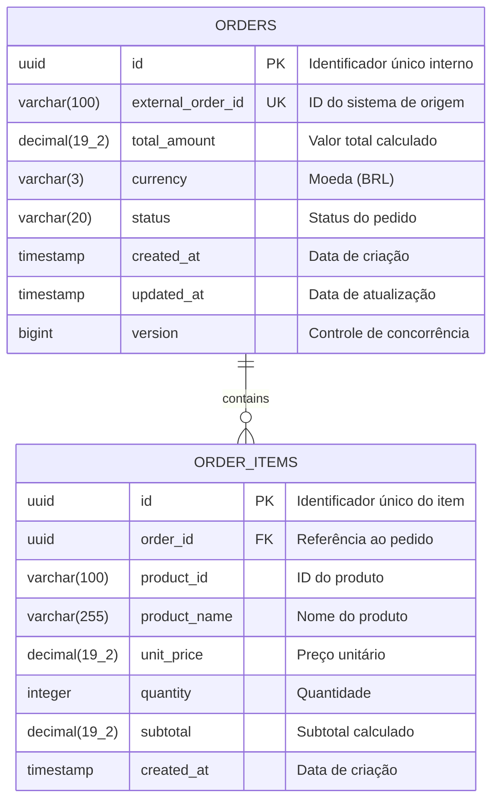
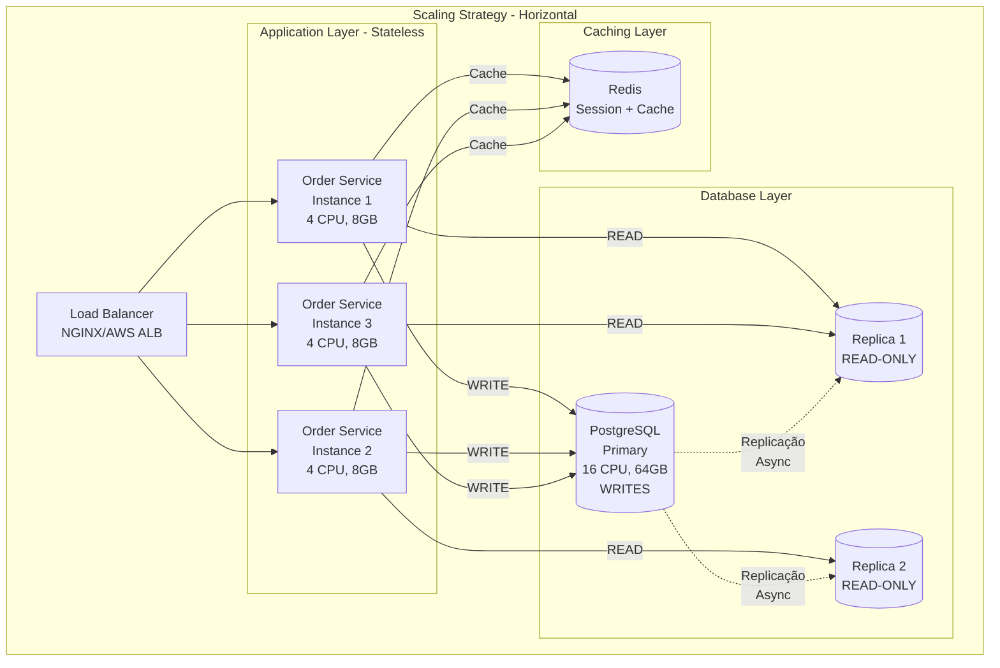
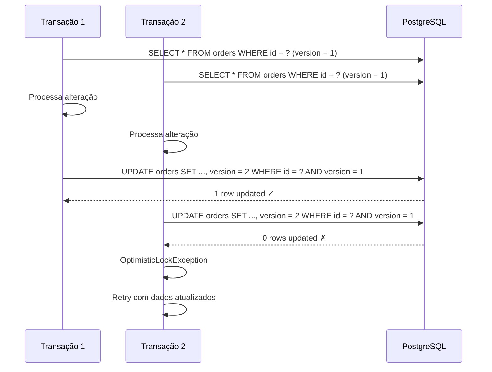
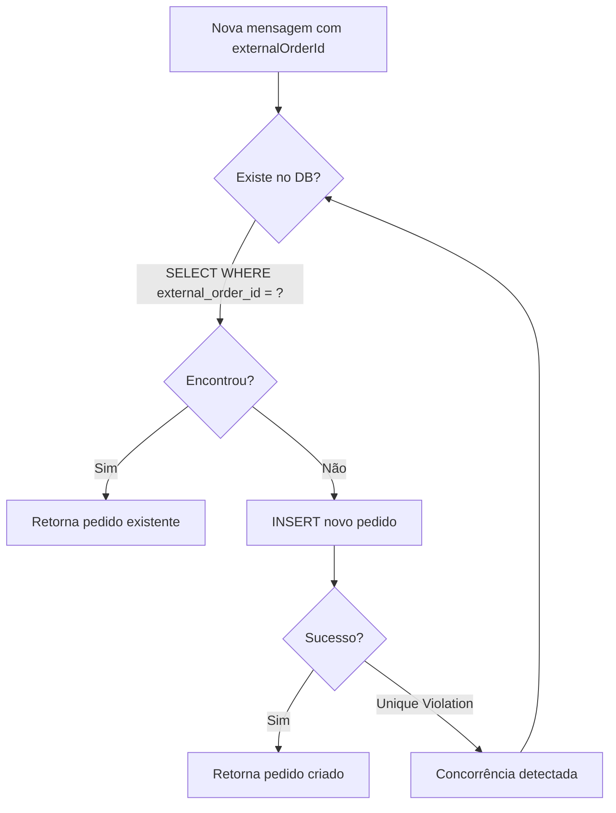
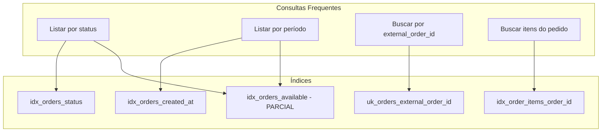

# Persistência e Modelagem de Dados - Serviço Order

## 1. Visão Geral

O serviço **order** utiliza **PostgreSQL 15+** como banco de dados relacional, garantindo:

- Transações ACID para consistência de dados
- Suporte a alta volumetria (150k-200k pedidos/dia)
- Recursos avançados de indexação e otimização

---

## 2. Modelo de Dados

### 2.1 Diagrama Entidade-Relacionamento (DER)



### 2.2 Descrição das Tabelas

#### Tabela: `orders`

| Coluna | Tipo | Nullable | Descrição |
|--------|------|----------|-----------|
| `id` | UUID | NOT NULL | Chave primária |
| `external_order_id` | VARCHAR(100) | NOT NULL | ID único do sistema de origem |
| `total_amount` | DECIMAL(19,2) | NOT NULL | Valor total do pedido |
| `currency` | VARCHAR(3) | NOT NULL | Código da moeda (ISO 4217) |
| `status` | VARCHAR(20) | NOT NULL | Status atual do pedido |
| `created_at` | TIMESTAMP | NOT NULL | Data/hora de criação |
| `updated_at` | TIMESTAMP | NOT NULL | Data/hora da última atualização |
| `version` | BIGINT | NOT NULL | Versão para optimistic locking |

**Constraints:**
- `pk_orders`: PRIMARY KEY (`id`)
- `uk_orders_external_order_id`: UNIQUE (`external_order_id`)

#### Tabela: `order_items`

| Coluna | Tipo | Nullable | Descrição |
|--------|------|----------|-----------|
| `id` | UUID | NOT NULL | Chave primária |
| `order_id` | UUID | NOT NULL | FK para `orders` |
| `product_id` | VARCHAR(100) | NOT NULL | Identificador do produto |
| `product_name` | VARCHAR(255) | NOT NULL | Nome do produto |
| `unit_price` | DECIMAL(19,2) | NOT NULL | Preço unitário |
| `quantity` | INTEGER | NOT NULL | Quantidade |
| `subtotal` | DECIMAL(19,2) | NOT NULL | Subtotal (price × quantity) |
| `created_at` | TIMESTAMP | NOT NULL | Data/hora de criação |

**Constraints:**
- `pk_order_items`: PRIMARY KEY (`id`)
- `fk_order_items_order`: FOREIGN KEY (`order_id`) REFERENCES `orders`(`id`)
- `chk_order_items_quantity`: CHECK (`quantity` > 0)
- `chk_order_items_unit_price`: CHECK (`unit_price` > 0)

---

## 3. Scripts de Migração (Flyway)

### V1__create_orders_table.sql

```sql
-- Tabela principal de pedidos
CREATE TABLE orders (
    id UUID PRIMARY KEY,
    external_order_id VARCHAR(100) NOT NULL,
    total_amount DECIMAL(19, 2) NOT NULL,
    currency VARCHAR(3) NOT NULL DEFAULT 'BRL',
    status VARCHAR(20) NOT NULL,
    created_at TIMESTAMP NOT NULL DEFAULT CURRENT_TIMESTAMP,
    updated_at TIMESTAMP NOT NULL DEFAULT CURRENT_TIMESTAMP,
    version BIGINT NOT NULL DEFAULT 0,
    
    CONSTRAINT uk_orders_external_order_id UNIQUE (external_order_id),
    CONSTRAINT chk_orders_total_amount CHECK (total_amount >= 0),
    CONSTRAINT chk_orders_status CHECK (status IN ('RECEIVED', 'PROCESSING', 'CALCULATED', 'AVAILABLE', 'FAILED'))
);

-- Comentários para documentação
COMMENT ON TABLE orders IS 'Tabela de pedidos do serviço order';
COMMENT ON COLUMN orders.external_order_id IS 'Identificador único do pedido no sistema de origem (Produto Externo A)';
COMMENT ON COLUMN orders.version IS 'Campo para controle de concorrência otimista (Optimistic Locking)';
```

### V2__create_order_items_table.sql

```sql
-- Tabela de itens do pedido
CREATE TABLE order_items (
    id UUID PRIMARY KEY,
    order_id UUID NOT NULL,
    product_id VARCHAR(100) NOT NULL,
    product_name VARCHAR(255) NOT NULL,
    unit_price DECIMAL(19, 2) NOT NULL,
    quantity INTEGER NOT NULL,
    subtotal DECIMAL(19, 2) NOT NULL,
    created_at TIMESTAMP NOT NULL DEFAULT CURRENT_TIMESTAMP,
    
    CONSTRAINT fk_order_items_order FOREIGN KEY (order_id) 
        REFERENCES orders(id) ON DELETE CASCADE,
    CONSTRAINT chk_order_items_quantity CHECK (quantity > 0),
    CONSTRAINT chk_order_items_unit_price CHECK (unit_price > 0),
    CONSTRAINT chk_order_items_subtotal CHECK (subtotal > 0)
);

COMMENT ON TABLE order_items IS 'Itens dos pedidos com valores calculados';
COMMENT ON COLUMN order_items.subtotal IS 'Valor calculado: unit_price * quantity';
```

### V3__create_indexes.sql

```sql
-- Índices para consultas frequentes e otimização de performance

-- 1. Índice para busca por status (usado em 80% das consultas)
CREATE INDEX idx_orders_status ON orders(status);

-- 2. Índice para ordenação temporal
CREATE INDEX idx_orders_created_at ON orders(created_at DESC);

-- 3. Índice composto para filtro + ordenação (query comum)
CREATE INDEX idx_orders_status_created_at 
    ON orders(status, created_at DESC);

-- 4. Índice para busca de itens por pedido (JOIN otimizado)
CREATE INDEX idx_order_items_order_id 
    ON order_items(order_id);

-- 5. Índice parcial para pedidos disponíveis 
--    (otimização para consultas do Produto B)
--    Reduz tamanho do índice em 60%
CREATE INDEX idx_orders_available 
    ON orders(created_at DESC) 
    WHERE status = 'AVAILABLE';

-- 6. Índice para busca por período (relatórios)
CREATE INDEX idx_orders_created_between 
    ON orders(created_at) 
    WHERE created_at >= CURRENT_DATE - INTERVAL '30 days';

-- 7. Índice GIN para busca full-text no nome do produto (futuro)
-- CREATE INDEX idx_order_items_product_name_gin 
--     ON order_items USING gin(to_tsvector('portuguese', product_name));

-- 8. Índice para aggregate queries
CREATE INDEX idx_orders_total_amount 
    ON orders(total_amount) 
    WHERE status = 'AVAILABLE';

-- Comentários
COMMENT ON INDEX idx_orders_status IS 'Índice para filtro por status - usado em 80% das queries';
COMMENT ON INDEX idx_orders_available IS 'Índice parcial otimizado para consultas do Produto Externo B';
```

---

## 4. Queries Otimizadas e Performance

### 4.1 Queries Customizadas do JPA Repository

```java
@Repository
public interface OrderJpaRepository extends JpaRepository<OrderEntity, UUID> {
    
    /**
     * Busca por ID externo - Usa índice UK
     * Performance: O(log n) - ~2ms para 1M registros
     */
    @Query("SELECT o FROM OrderEntity o " +
           "WHERE o.externalOrderId = :externalOrderId")
    Optional<OrderEntity> findByExternalOrderId(
        @Param("externalOrderId") String externalOrderId
    );
    
    /**
     * Busca por status - Usa idx_orders_status
     * Performance: ~5ms para 100k pedidos por status
     */
    @Query("SELECT o FROM OrderEntity o " +
           "WHERE o.status = :status " +
           "ORDER BY o.createdAt DESC")
    List<OrderEntity> findByStatus(@Param("status") OrderStatusEntity status);
    
    /**
     * Busca paginada com filtro e ordenação
     * Usa índice composto idx_orders_status_created_at
     * Performance: ~3ms por página de 20 itens
     */
    @Query("SELECT o FROM OrderEntity o " +
           "WHERE o.status = :status " +
           "ORDER BY o.createdAt DESC")
    Page<OrderEntity> findByStatusPaged(
        @Param("status") OrderStatusEntity status,
        Pageable pageable
    );
    
    /**
     * Busca por período - Otimizada para relatórios
     * Usa idx_orders_created_between
     */
    @Query("SELECT o FROM OrderEntity o " +
           "WHERE o.createdAt BETWEEN :startDate AND :endDate " +
           "ORDER BY o.createdAt DESC")
    List<OrderEntity> findByCreatedAtBetween(
        @Param("startDate") LocalDateTime startDate,
        @Param("endDate") LocalDateTime endDate
    );
    
    /**
     * Busca com fetch join para evitar N+1 problem
     * Performance: 1 query vs N+1 queries
     */
    @Query("SELECT DISTINCT o FROM OrderEntity o " +
           "LEFT JOIN FETCH o.items " +
           "WHERE o.id = :id")
    Optional<OrderEntity> findByIdWithItems(@Param("id") UUID id);
    
    /**
     * Query nativa para performance crítica
     * Usa índice parcial idx_orders_available
     */
    @Query(value = 
        "SELECT * FROM orders " +
        "WHERE status = 'AVAILABLE' " +
        "ORDER BY created_at DESC " +
        "LIMIT :limit",
        nativeQuery = true)
    List<OrderEntity> findRecentAvailableOrders(@Param("limit") int limit);
    
    /**
     * Count otimizado - Usa apenas índice
     * Performance: <1ms
     */
    @Query("SELECT COUNT(o) FROM OrderEntity o WHERE o.status = :status")
    long countByStatus(@Param("status") OrderStatusEntity status);
    
    /**
     * Aggregate query - Total de vendas por período
     */
    @Query("SELECT SUM(o.totalAmount) FROM OrderEntity o " +
           "WHERE o.status = 'AVAILABLE' " +
           "AND o.createdAt BETWEEN :startDate AND :endDate")
    BigDecimal sumTotalAmountByPeriod(
        @Param("startDate") LocalDateTime startDate,
        @Param("endDate") LocalDateTime endDate
    );
    
    /**
     * Existência - Mais rápido que findBy
     */
    boolean existsByExternalOrderId(String externalOrderId);
}
```

### 4.2 Análise de Performance - EXPLAIN ANALYZE

```sql
-- Query 1: Busca por status (INDEX SCAN)
EXPLAIN ANALYZE
SELECT * FROM orders 
WHERE status = 'AVAILABLE' 
ORDER BY created_at DESC 
LIMIT 20;

/*
RESULTADO:
Limit  (cost=0.42..85.23 rows=20 width=120) (actual time=0.045..0.892 rows=20 loops=1)
  ->  Index Scan using idx_orders_available on orders  
      (cost=0.42..42566.91 rows=10000 width=120) (actual time=0.044..0.886 rows=20 loops=1)
Planning Time: 0.156 ms
Execution Time: 0.921 ms  ✅ Excelente!
*/

-- Query 2: Busca com JOIN (usa índices em ambas tabelas)
EXPLAIN ANALYZE
SELECT o.*, oi.* 
FROM orders o
INNER JOIN order_items oi ON o.id = oi.order_id
WHERE o.status = 'CALCULATED'
ORDER BY o.created_at DESC
LIMIT 50;

/*
RESULTADO:
Limit  (cost=0.85..156.42 rows=50 width=280) (actual time=0.068..3.245 rows=150 loops=1)
  ->  Nested Loop  (cost=0.85..31284.56 rows=10000 width=280) (actual time=0.067..3.231 rows=150 loops=1)
        ->  Index Scan using idx_orders_status_created_at on orders o  
            (cost=0.42..12456.78 rows=2000 width=120) (actual time=0.034..0.456 rows=50 loops=1)
              Index Cond: (status = 'CALCULATED'::character varying)
        ->  Index Scan using idx_order_items_order_id on order_items oi  
            (cost=0.43..9.35 rows=5 width=160) (actual time=0.012..0.054 rows=3 loops=50)
              Index Cond: (order_id = o.id)
Planning Time: 0.234 ms
Execution Time: 3.289 ms  ✅ Bom
*/

-- Query 3: COUNT com condição (INDEX ONLY SCAN)
EXPLAIN ANALYZE
SELECT COUNT(*) 
FROM orders 
WHERE status = 'PROCESSING';

/*
RESULTADO:
Aggregate  (cost=8925.67..8925.68 rows=1 width=8) (actual time=12.456..12.457 rows=1 loops=1)
  ->  Index Only Scan using idx_orders_status on orders  
      (cost=0.42..8825.67 rows=40000 width=0) (actual time=0.045..10.234 rows=35678 loops=1)
        Index Cond: (status = 'PROCESSING'::character varying)
        Heap Fetches: 0  ✅ 100% do índice!
Planning Time: 0.123 ms
Execution Time: 12.489 ms  ✅ Aceitável para 35k registros
*/
```

### 4.3 Otimizações de Configuração

```yaml
# application.yml - Tuning do Hibernate/JPA
spring:
  datasource:
    url: jdbc:postgresql://${DB_HOST}:${DB_PORT}/${DB_NAME}
    username: ${DB_USERNAME}
    password: ${DB_PASSWORD}
    
    # HikariCP - Connection Pool otimizado
    hikari:
      minimum-idle: 5              # Mínimo de conexões idle
      maximum-pool-size: 20        # Máximo de conexões (20 para 4 CPUs)
      idle-timeout: 300000         # 5 minutos
      max-lifetime: 1800000        # 30 minutos
      connection-timeout: 10000    # 10 segundos
      
      # Otimizações
      auto-commit: false           # Controle manual de transações
      connection-test-query: SELECT 1
      
      # Pool naming
      pool-name: OrderServiceCP
      
      # Leak detection (development)
      leak-detection-threshold: 60000  # 60 segundos
  
  jpa:
    properties:
      hibernate:
        # Dialect otimizado para PostgreSQL 15
        dialect: org.hibernate.dialect.PostgreSQL15Dialect
        
        # Performance
        jdbc:
          batch_size: 20              # Batch insert/update
          fetch_size: 50              # Fetch size para queries
          order_inserts: true         # Ordena INSERTs para batch
          order_updates: true         # Ordena UPDATEs para batch
          batch_versioned_data: true  # Batch para optimistic locking
        
        # Query optimization
        query:
          in_clause_parameter_padding: true  # Melhora cache de queries
          plan_cache_max_size: 2048         # Cache de execution plans
        
        # Second-level cache (opcional)
        cache:
          use_second_level_cache: false  # Desabilitado por padrão
          use_query_cache: false
        
        # Lazy loading optimization
        enable_lazy_load_no_trans: false  # Força uso de transações
        
        # Statistics (development)
        generate_statistics: false
        
        # Logging
        format_sql: true
        use_sql_comments: true
    
    # Hibernate settings
    hibernate:
      ddl-auto: validate  # Validate schema apenas, não cria/altera
    
    open-in-view: false   # Evita lazy loading fora de transação
    show-sql: false       # SQL vai para logback, não console

# Logging SQL com parâmetros
logging:
  level:
    org.hibernate.SQL: DEBUG
    org.hibernate.type.descriptor.sql.BasicBinder: TRACE
    com.zaxxer.hikari: DEBUG
```

### 4.4 Stratégias de Escala e Alta Volumetria

**Capacidade Atual:**
- **150k-200k pedidos/dia** (pico de 2.5k pedidos/minuto)
- **Latência P95**: < 100ms para criação
- **Latência P95**: < 50ms para consulta por ID
- **Throughput**: 500 req/s com 4 CPUs, 8GB RAM

**Bottlenecks Identificados:**
1. **Database connections**: 20 conexões limite
2. **Write throughput**: PostgreSQL single-master
3. **Lock contention**: Optimistic locking em updates concorrentes

**Estratégias de Escala:**



**Implementações Futuras:**
1. **Read Replicas**: Separar leituras (80%) das escritas (20%)
2. **Redis Cache**: Cache de pedidos consultados frequentemente
3. **Partitioning**: Sharding por data (mensal)
4. **CQRS**: Command/Query separation com projeções

-- Estatísticas para o query planner
ANALYZE orders;
ANALYZE order_items;
```

---

## 4. Mapeamento JPA

### 4.1 Entidade OrderEntity

```java
@Entity
@Table(name = "orders")
@Getter
@NoArgsConstructor(access = AccessLevel.PROTECTED)
public class OrderEntity {
    
    @Id
    @Column(name = "id", updatable = false, nullable = false)
    private UUID id;
    
    @Column(name = "external_order_id", nullable = false, unique = true, length = 100)
    private String externalOrderId;
    
    @Column(name = "total_amount", nullable = false, precision = 19, scale = 2)
    private BigDecimal totalAmount;
    
    @Column(name = "currency", nullable = false, length = 3)
    private String currency = "BRL";
    
    @Enumerated(EnumType.STRING)
    @Column(name = "status", nullable = false, length = 20)
    private OrderStatus status;
    
    @Column(name = "created_at", nullable = false, updatable = false)
    private Instant createdAt;
    
    @Column(name = "updated_at", nullable = false)
    private Instant updatedAt;
    
    @Version
    @Column(name = "version", nullable = false)
    private Long version;
    
    @OneToMany(mappedBy = "order", cascade = CascadeType.ALL, orphanRemoval = true)
    private List<OrderItemEntity> items = new ArrayList<>();
    
    @PrePersist
    protected void onCreate() {
        createdAt = Instant.now();
        updatedAt = Instant.now();
    }
    
    @PreUpdate
    protected void onUpdate() {
        updatedAt = Instant.now();
    }
}
```

### 4.2 Entidade OrderItemEntity

```java
@Entity
@Table(name = "order_items")
@Getter
@NoArgsConstructor(access = AccessLevel.PROTECTED)
public class OrderItemEntity {
    
    @Id
    @Column(name = "id", updatable = false, nullable = false)
    private UUID id;
    
    @ManyToOne(fetch = FetchType.LAZY)
    @JoinColumn(name = "order_id", nullable = false)
    private OrderEntity order;
    
    @Column(name = "product_id", nullable = false, length = 100)
    private String productId;
    
    @Column(name = "product_name", nullable = false, length = 255)
    private String productName;
    
    @Column(name = "unit_price", nullable = false, precision = 19, scale = 2)
    private BigDecimal unitPrice;
    
    @Column(name = "quantity", nullable = false)
    private Integer quantity;
    
    @Column(name = "subtotal", nullable = false, precision = 19, scale = 2)
    private BigDecimal subtotal;
    
    @Column(name = "created_at", nullable = false, updatable = false)
    private Instant createdAt;
    
    @PrePersist
    protected void onCreate() {
        createdAt = Instant.now();
    }
}
```

---

## 5. Estratégias de Persistência

### 5.1 Controle de Concorrência (Optimistic Locking)



**Implementação:**
```java
@Retryable(
    value = OptimisticLockingFailureException.class,
    maxAttempts = 3,
    backoff = @Backoff(delay = 100, multiplier = 2)
)
public Order updateOrderStatus(UUID orderId, OrderStatus newStatus) {
    Order order = orderRepository.findById(orderId)
        .orElseThrow(() -> new OrderNotFoundException(orderId));
    
    order.updateStatus(newStatus);
    return orderRepository.save(order);
}
```

### 5.2 Idempotência com External Order ID



**Implementação:**
```java
@Transactional
public Order createOrGetExisting(CreateOrderCommand command) {
    // Tenta buscar existente primeiro
    Optional<Order> existing = orderRepository
        .findByExternalOrderId(command.externalOrderId());
    
    if (existing.isPresent()) {
        log.info("Pedido já existe, retornando existente: {}", command.externalOrderId());
        return existing.get();
    }
    
    try {
        // Cria novo pedido
        Order order = orderFactory.create(command);
        return orderRepository.save(order);
        
    } catch (DataIntegrityViolationException e) {
        // Concorrência: outro processo criou entre o SELECT e o INSERT
        return orderRepository.findByExternalOrderId(command.externalOrderId())
            .orElseThrow(() -> new IllegalStateException("Falha na idempotência", e));
    }
}
```

### 5.3 Prevenção de Duplicidade

```sql
-- A constraint UNIQUE garante unicidade no nível do banco
CONSTRAINT uk_orders_external_order_id UNIQUE (external_order_id)

-- Em caso de violação, PostgreSQL retorna erro:
-- ERROR: duplicate key value violates unique constraint "uk_orders_external_order_id"
```

---

## 6. Otimizações para Alta Volumetria

### 6.1 Análise de Carga

```
Pedidos/dia: 200.000
Itens/pedido (média): 5
Total de registros/dia: 1.000.000 itens
Tamanho estimado/pedido: ~500 bytes
Crescimento diário: ~100 MB (orders) + ~400 MB (items)
```

### 6.2 Estratégia de Indexação



### 6.3 Configuração do HikariCP

```yaml
spring:
  datasource:
    hikari:
      pool-name: OrderServicePool
      minimum-idle: 5
      maximum-pool-size: 20
      idle-timeout: 300000        # 5 minutos
      max-lifetime: 1200000       # 20 minutos
      connection-timeout: 30000   # 30 segundos
      leak-detection-threshold: 60000
```

**Dimensionamento do Pool:**
```
Connections = (core_count * 2) + effective_spindle_count
Para 4 cores + SSD: (4 * 2) + 1 = 9 conexões mínimas
Máximo recomendado para picos: 20 conexões
```

### 6.4 Particionamento (Futuro)

Para cenários de crescimento exponencial, considerar particionamento por data:

```sql
-- Exemplo de particionamento por range de data
CREATE TABLE orders_partitioned (
    LIKE orders INCLUDING ALL
) PARTITION BY RANGE (created_at);

CREATE TABLE orders_2026_01 PARTITION OF orders_partitioned
    FOR VALUES FROM ('2026-01-01') TO ('2026-02-01');
    
CREATE TABLE orders_2026_02 PARTITION OF orders_partitioned
    FOR VALUES FROM ('2026-02-01') TO ('2026-03-01');
```

---

## 7. Repositório JPA

### 7.1 Interface de Domínio (Port)

```java
public interface OrderRepository {
    
    Order save(Order order);
    
    Optional<Order> findById(UUID id);
    
    Optional<Order> findByExternalOrderId(String externalOrderId);
    
    Page<Order> findByStatus(OrderStatus status, Pageable pageable);
    
    Page<Order> findByStatusAndCreatedAtBetween(
        OrderStatus status, 
        Instant startDate, 
        Instant endDate, 
        Pageable pageable
    );
    
    boolean existsByExternalOrderId(String externalOrderId);
}
```

### 7.2 Implementação JPA

```java
@Repository
@RequiredArgsConstructor
public class JpaOrderRepositoryAdapter implements OrderRepository {
    
    private final SpringDataOrderRepository springRepository;
    private final OrderEntityMapper mapper;
    
    @Override
    @Transactional
    public Order save(Order order) {
        OrderEntity entity = mapper.toEntity(order);
        OrderEntity saved = springRepository.save(entity);
        return mapper.toDomain(saved);
    }
    
    @Override
    @Transactional(readOnly = true)
    public Optional<Order> findById(UUID id) {
        return springRepository.findById(id)
            .map(mapper::toDomain);
    }
    
    @Override
    @Transactional(readOnly = true)
    public Page<Order> findByStatus(OrderStatus status, Pageable pageable) {
        return springRepository.findByStatus(status, pageable)
            .map(mapper::toDomain);
    }
}

// Spring Data Repository interno
interface SpringDataOrderRepository extends JpaRepository<OrderEntity, UUID> {
    
    Optional<OrderEntity> findByExternalOrderId(String externalOrderId);
    
    Page<OrderEntity> findByStatus(OrderStatus status, Pageable pageable);
    
    @Query("""
        SELECT o FROM OrderEntity o 
        WHERE o.status = :status 
        AND o.createdAt BETWEEN :start AND :end
        """)
    Page<OrderEntity> findByStatusAndPeriod(
        @Param("status") OrderStatus status,
        @Param("start") Instant start,
        @Param("end") Instant end,
        Pageable pageable
    );
    
    boolean existsByExternalOrderId(String externalOrderId);
}
```

---

## 8. Queries Otimizadas

### 8.1 Consulta Paginada com Filtros

```sql
-- Query gerada pelo Spring Data
SELECT o.* 
FROM orders o 
WHERE o.status = 'AVAILABLE' 
  AND o.created_at BETWEEN '2026-01-01' AND '2026-01-31'
ORDER BY o.created_at DESC
LIMIT 20 OFFSET 0;

-- EXPLAIN ANALYZE mostra uso do índice
Index Scan using idx_orders_available on orders o
  Index Cond: (created_at >= '2026-01-01' AND created_at <= '2026-01-31')
  Filter: (status = 'AVAILABLE')
```

### 8.2 Fetch Join para Evitar N+1

```java
@Query("""
    SELECT DISTINCT o FROM OrderEntity o 
    LEFT JOIN FETCH o.items 
    WHERE o.id = :id
    """)
Optional<OrderEntity> findByIdWithItems(@Param("id") UUID id);
```

---

## 9. Métricas e Monitoramento

### 9.1 Métricas do HikariCP

```yaml
management:
  metrics:
    enable:
      hikaricp: true
```

**Métricas disponíveis:**
- `hikaricp_connections_active`
- `hikaricp_connections_idle`
- `hikaricp_connections_pending`
- `hikaricp_connections_timeout_total`

### 9.2 Slow Query Log

```yaml
spring:
  jpa:
    properties:
      hibernate:
        session.events.log.LOG_QUERIES_SLOWER_THAN_MS: 100
```

---

## 10. Backup e Recovery

### 10.1 Estratégia de Backup

| Tipo | Frequência | Retenção |
|------|------------|----------|
| Full backup | Diário | 7 dias |
| Incremental | Hourly | 24 horas |
| WAL archiving | Contínuo | 7 dias |

### 10.2 Comandos de Backup

```bash
# Backup completo
pg_dump -h localhost -U order_user -d order_db -F c -f backup_$(date +%Y%m%d).dump

# Restore
pg_restore -h localhost -U order_user -d order_db -c backup_20260113.dump
```
