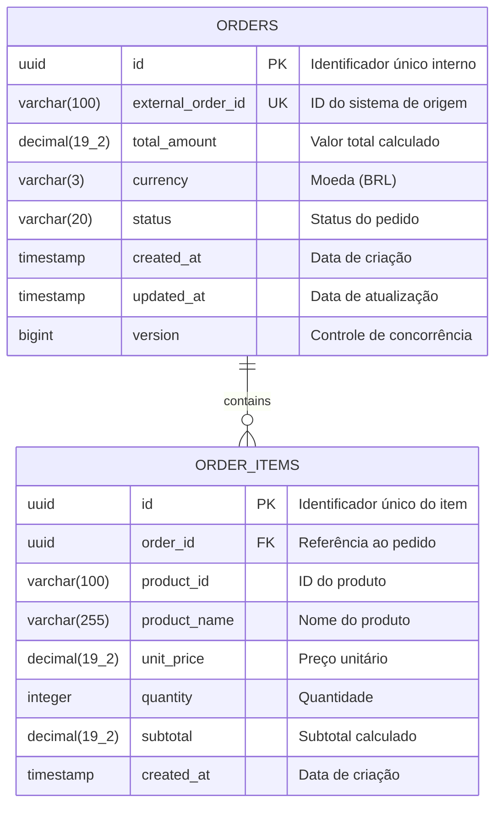
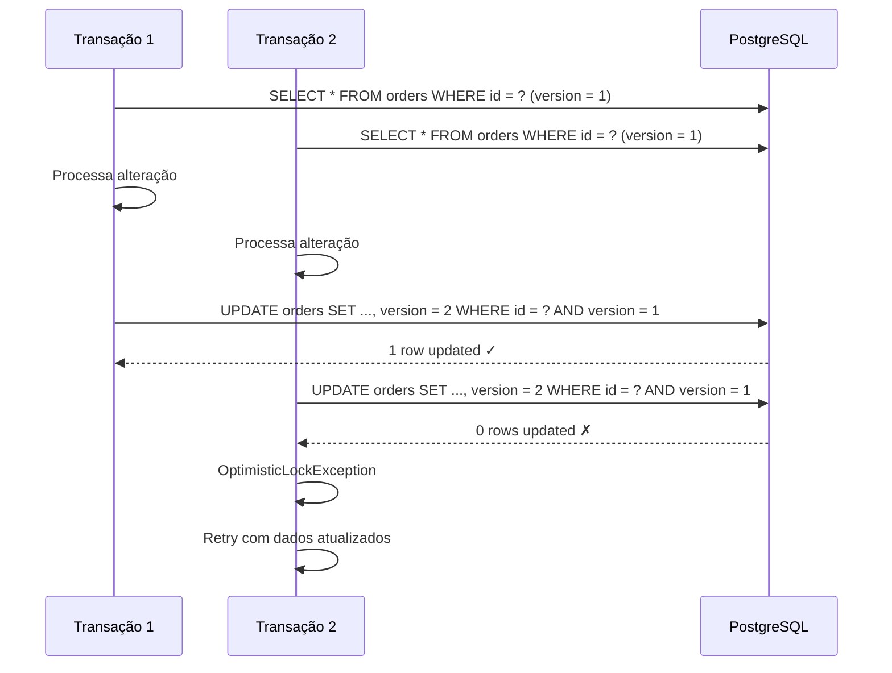
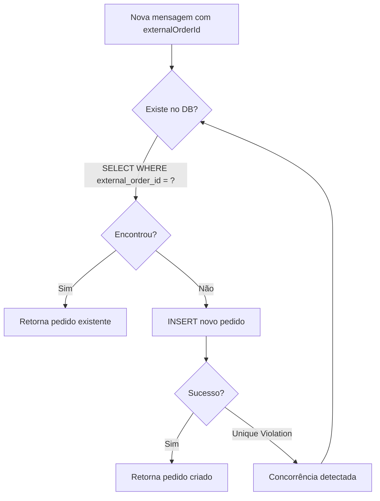
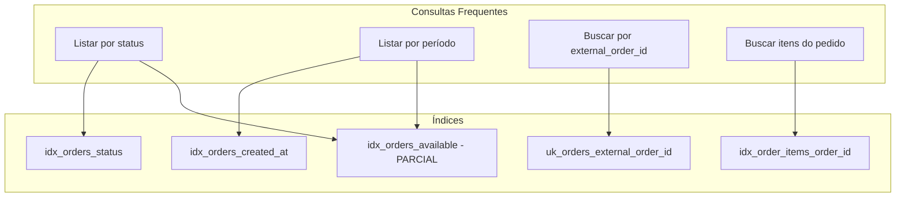

# Persistência e Modelagem de Dados - Serviço Order

## 1. Visão Geral

O serviço **order** utiliza **PostgreSQL 15+** como banco de dados relacional, garantindo:

- Transações ACID para consistência de dados
- Suporte a alta volumetria (150k-200k pedidos/dia)
- Recursos avançados de indexação e otimização

---

## 2. Modelo de Dados

### 2.1 Diagrama Entidade-Relacionamento (DER)



### 2.2 Descrição das Tabelas

#### Tabela: `orders`

| Coluna | Tipo | Nullable | Descrição |
|--------|------|----------|-----------|
| `id` | UUID | NOT NULL | Chave primária |
| `external_order_id` | VARCHAR(100) | NOT NULL | ID único do sistema de origem |
| `total_amount` | DECIMAL(19,2) | NOT NULL | Valor total do pedido |
| `currency` | VARCHAR(3) | NOT NULL | Código da moeda (ISO 4217) |
| `status` | VARCHAR(20) | NOT NULL | Status atual do pedido |
| `created_at` | TIMESTAMP | NOT NULL | Data/hora de criação |
| `updated_at` | TIMESTAMP | NOT NULL | Data/hora da última atualização |
| `version` | BIGINT | NOT NULL | Versão para optimistic locking |

**Constraints:**
- `pk_orders`: PRIMARY KEY (`id`)
- `uk_orders_external_order_id`: UNIQUE (`external_order_id`)

#### Tabela: `order_items`

| Coluna | Tipo | Nullable | Descrição |
|--------|------|----------|-----------|
| `id` | UUID | NOT NULL | Chave primária |
| `order_id` | UUID | NOT NULL | FK para `orders` |
| `product_id` | VARCHAR(100) | NOT NULL | Identificador do produto |
| `product_name` | VARCHAR(255) | NOT NULL | Nome do produto |
| `unit_price` | DECIMAL(19,2) | NOT NULL | Preço unitário |
| `quantity` | INTEGER | NOT NULL | Quantidade |
| `subtotal` | DECIMAL(19,2) | NOT NULL | Subtotal (price × quantity) |
| `created_at` | TIMESTAMP | NOT NULL | Data/hora de criação |

**Constraints:**
- `pk_order_items`: PRIMARY KEY (`id`)
- `fk_order_items_order`: FOREIGN KEY (`order_id`) REFERENCES `orders`(`id`)
- `chk_order_items_quantity`: CHECK (`quantity` > 0)
- `chk_order_items_unit_price`: CHECK (`unit_price` > 0)

---

## 3. Scripts de Migração (Flyway)

### V1__create_orders_table.sql

```sql
-- Tabela principal de pedidos
CREATE TABLE orders (
    id UUID PRIMARY KEY,
    external_order_id VARCHAR(100) NOT NULL,
    total_amount DECIMAL(19, 2) NOT NULL,
    currency VARCHAR(3) NOT NULL DEFAULT 'BRL',
    status VARCHAR(20) NOT NULL,
    created_at TIMESTAMP NOT NULL DEFAULT CURRENT_TIMESTAMP,
    updated_at TIMESTAMP NOT NULL DEFAULT CURRENT_TIMESTAMP,
    version BIGINT NOT NULL DEFAULT 0,
    
    CONSTRAINT uk_orders_external_order_id UNIQUE (external_order_id),
    CONSTRAINT chk_orders_total_amount CHECK (total_amount >= 0),
    CONSTRAINT chk_orders_status CHECK (status IN ('RECEIVED', 'PROCESSING', 'CALCULATED', 'AVAILABLE', 'FAILED'))
);

-- Comentários para documentação
COMMENT ON TABLE orders IS 'Tabela de pedidos do serviço order';
COMMENT ON COLUMN orders.external_order_id IS 'Identificador único do pedido no sistema de origem (Produto Externo A)';
COMMENT ON COLUMN orders.version IS 'Campo para controle de concorrência otimista (Optimistic Locking)';
```

### V2__create_order_items_table.sql

```sql
-- Tabela de itens do pedido
CREATE TABLE order_items (
    id UUID PRIMARY KEY,
    order_id UUID NOT NULL,
    product_id VARCHAR(100) NOT NULL,
    product_name VARCHAR(255) NOT NULL,
    unit_price DECIMAL(19, 2) NOT NULL,
    quantity INTEGER NOT NULL,
    subtotal DECIMAL(19, 2) NOT NULL,
    created_at TIMESTAMP NOT NULL DEFAULT CURRENT_TIMESTAMP,
    
    CONSTRAINT fk_order_items_order FOREIGN KEY (order_id) 
        REFERENCES orders(id) ON DELETE CASCADE,
    CONSTRAINT chk_order_items_quantity CHECK (quantity > 0),
    CONSTRAINT chk_order_items_unit_price CHECK (unit_price > 0),
    CONSTRAINT chk_order_items_subtotal CHECK (subtotal > 0)
);

COMMENT ON TABLE order_items IS 'Itens dos pedidos com valores calculados';
COMMENT ON COLUMN order_items.subtotal IS 'Valor calculado: unit_price * quantity';
```

### V3__create_indexes.sql

```sql
-- Índices para consultas frequentes
CREATE INDEX idx_orders_status ON orders(status);
CREATE INDEX idx_orders_created_at ON orders(created_at DESC);
CREATE INDEX idx_orders_status_created_at ON orders(status, created_at DESC);

-- Índice para busca de itens por pedido
CREATE INDEX idx_order_items_order_id ON order_items(order_id);

-- Índice parcial para pedidos disponíveis (otimização para consultas do Produto B)
CREATE INDEX idx_orders_available ON orders(created_at DESC) 
    WHERE status = 'AVAILABLE';

-- Estatísticas para o query planner
ANALYZE orders;
ANALYZE order_items;
```

---

## 4. Mapeamento JPA

### 4.1 Entidade OrderEntity

```java
@Entity
@Table(name = "orders")
@Getter
@NoArgsConstructor(access = AccessLevel.PROTECTED)
public class OrderEntity {
    
    @Id
    @Column(name = "id", updatable = false, nullable = false)
    private UUID id;
    
    @Column(name = "external_order_id", nullable = false, unique = true, length = 100)
    private String externalOrderId;
    
    @Column(name = "total_amount", nullable = false, precision = 19, scale = 2)
    private BigDecimal totalAmount;
    
    @Column(name = "currency", nullable = false, length = 3)
    private String currency = "BRL";
    
    @Enumerated(EnumType.STRING)
    @Column(name = "status", nullable = false, length = 20)
    private OrderStatus status;
    
    @Column(name = "created_at", nullable = false, updatable = false)
    private Instant createdAt;
    
    @Column(name = "updated_at", nullable = false)
    private Instant updatedAt;
    
    @Version
    @Column(name = "version", nullable = false)
    private Long version;
    
    @OneToMany(mappedBy = "order", cascade = CascadeType.ALL, orphanRemoval = true)
    private List<OrderItemEntity> items = new ArrayList<>();
    
    @PrePersist
    protected void onCreate() {
        createdAt = Instant.now();
        updatedAt = Instant.now();
    }
    
    @PreUpdate
    protected void onUpdate() {
        updatedAt = Instant.now();
    }
}
```

### 4.2 Entidade OrderItemEntity

```java
@Entity
@Table(name = "order_items")
@Getter
@NoArgsConstructor(access = AccessLevel.PROTECTED)
public class OrderItemEntity {
    
    @Id
    @Column(name = "id", updatable = false, nullable = false)
    private UUID id;
    
    @ManyToOne(fetch = FetchType.LAZY)
    @JoinColumn(name = "order_id", nullable = false)
    private OrderEntity order;
    
    @Column(name = "product_id", nullable = false, length = 100)
    private String productId;
    
    @Column(name = "product_name", nullable = false, length = 255)
    private String productName;
    
    @Column(name = "unit_price", nullable = false, precision = 19, scale = 2)
    private BigDecimal unitPrice;
    
    @Column(name = "quantity", nullable = false)
    private Integer quantity;
    
    @Column(name = "subtotal", nullable = false, precision = 19, scale = 2)
    private BigDecimal subtotal;
    
    @Column(name = "created_at", nullable = false, updatable = false)
    private Instant createdAt;
    
    @PrePersist
    protected void onCreate() {
        createdAt = Instant.now();
    }
}
```

---

## 5. Estratégias de Persistência

### 5.1 Controle de Concorrência (Optimistic Locking)



**Implementação:**
```java
@Retryable(
    value = OptimisticLockingFailureException.class,
    maxAttempts = 3,
    backoff = @Backoff(delay = 100, multiplier = 2)
)
public Order updateOrderStatus(UUID orderId, OrderStatus newStatus) {
    Order order = orderRepository.findById(orderId)
        .orElseThrow(() -> new OrderNotFoundException(orderId));
    
    order.updateStatus(newStatus);
    return orderRepository.save(order);
}
```

### 5.2 Idempotência com External Order ID



**Implementação:**
```java
@Transactional
public Order createOrGetExisting(CreateOrderCommand command) {
    // Tenta buscar existente primeiro
    Optional<Order> existing = orderRepository
        .findByExternalOrderId(command.externalOrderId());
    
    if (existing.isPresent()) {
        log.info("Pedido já existe, retornando existente: {}", command.externalOrderId());
        return existing.get();
    }
    
    try {
        // Cria novo pedido
        Order order = orderFactory.create(command);
        return orderRepository.save(order);
        
    } catch (DataIntegrityViolationException e) {
        // Concorrência: outro processo criou entre o SELECT e o INSERT
        return orderRepository.findByExternalOrderId(command.externalOrderId())
            .orElseThrow(() -> new IllegalStateException("Falha na idempotência", e));
    }
}
```

### 5.3 Prevenção de Duplicidade

```sql
-- A constraint UNIQUE garante unicidade no nível do banco
CONSTRAINT uk_orders_external_order_id UNIQUE (external_order_id)

-- Em caso de violação, PostgreSQL retorna erro:
-- ERROR: duplicate key value violates unique constraint "uk_orders_external_order_id"
```

---

## 6. Otimizações para Alta Volumetria

### 6.1 Análise de Carga

```
Pedidos/dia: 200.000
Itens/pedido (média): 5
Total de registros/dia: 1.000.000 itens
Tamanho estimado/pedido: ~500 bytes
Crescimento diário: ~100 MB (orders) + ~400 MB (items)
```

### 6.2 Estratégia de Indexação



### 6.3 Configuração do HikariCP

```yaml
spring:
  datasource:
    hikari:
      pool-name: OrderServicePool
      minimum-idle: 5
      maximum-pool-size: 20
      idle-timeout: 300000        # 5 minutos
      max-lifetime: 1200000       # 20 minutos
      connection-timeout: 30000   # 30 segundos
      leak-detection-threshold: 60000
```

**Dimensionamento do Pool:**
```
Connections = (core_count * 2) + effective_spindle_count
Para 4 cores + SSD: (4 * 2) + 1 = 9 conexões mínimas
Máximo recomendado para picos: 20 conexões
```

### 6.4 Particionamento (Futuro)

Para cenários de crescimento exponencial, considerar particionamento por data:

```sql
-- Exemplo de particionamento por range de data
CREATE TABLE orders_partitioned (
    LIKE orders INCLUDING ALL
) PARTITION BY RANGE (created_at);

CREATE TABLE orders_2026_01 PARTITION OF orders_partitioned
    FOR VALUES FROM ('2026-01-01') TO ('2026-02-01');
    
CREATE TABLE orders_2026_02 PARTITION OF orders_partitioned
    FOR VALUES FROM ('2026-02-01') TO ('2026-03-01');
```

---

## 7. Repositório JPA

### 7.1 Interface de Domínio (Port)

```java
public interface OrderRepository {
    
    Order save(Order order);
    
    Optional<Order> findById(UUID id);
    
    Optional<Order> findByExternalOrderId(String externalOrderId);
    
    Page<Order> findByStatus(OrderStatus status, Pageable pageable);
    
    Page<Order> findByStatusAndCreatedAtBetween(
        OrderStatus status, 
        Instant startDate, 
        Instant endDate, 
        Pageable pageable
    );
    
    boolean existsByExternalOrderId(String externalOrderId);
}
```

### 7.2 Implementação JPA

```java
@Repository
@RequiredArgsConstructor
public class JpaOrderRepositoryAdapter implements OrderRepository {
    
    private final SpringDataOrderRepository springRepository;
    private final OrderEntityMapper mapper;
    
    @Override
    @Transactional
    public Order save(Order order) {
        OrderEntity entity = mapper.toEntity(order);
        OrderEntity saved = springRepository.save(entity);
        return mapper.toDomain(saved);
    }
    
    @Override
    @Transactional(readOnly = true)
    public Optional<Order> findById(UUID id) {
        return springRepository.findById(id)
            .map(mapper::toDomain);
    }
    
    @Override
    @Transactional(readOnly = true)
    public Page<Order> findByStatus(OrderStatus status, Pageable pageable) {
        return springRepository.findByStatus(status, pageable)
            .map(mapper::toDomain);
    }
}

// Spring Data Repository interno
interface SpringDataOrderRepository extends JpaRepository<OrderEntity, UUID> {
    
    Optional<OrderEntity> findByExternalOrderId(String externalOrderId);
    
    Page<OrderEntity> findByStatus(OrderStatus status, Pageable pageable);
    
    @Query("""
        SELECT o FROM OrderEntity o 
        WHERE o.status = :status 
        AND o.createdAt BETWEEN :start AND :end
        """)
    Page<OrderEntity> findByStatusAndPeriod(
        @Param("status") OrderStatus status,
        @Param("start") Instant start,
        @Param("end") Instant end,
        Pageable pageable
    );
    
    boolean existsByExternalOrderId(String externalOrderId);
}
```

---

## 8. Queries Otimizadas

### 8.1 Consulta Paginada com Filtros

```sql
-- Query gerada pelo Spring Data
SELECT o.* 
FROM orders o 
WHERE o.status = 'AVAILABLE' 
  AND o.created_at BETWEEN '2026-01-01' AND '2026-01-31'
ORDER BY o.created_at DESC
LIMIT 20 OFFSET 0;

-- EXPLAIN ANALYZE mostra uso do índice
Index Scan using idx_orders_available on orders o
  Index Cond: (created_at >= '2026-01-01' AND created_at <= '2026-01-31')
  Filter: (status = 'AVAILABLE')
```

### 8.2 Fetch Join para Evitar N+1

```java
@Query("""
    SELECT DISTINCT o FROM OrderEntity o 
    LEFT JOIN FETCH o.items 
    WHERE o.id = :id
    """)
Optional<OrderEntity> findByIdWithItems(@Param("id") UUID id);
```

---

## 9. Métricas e Monitoramento

### 9.1 Métricas do HikariCP

```yaml
management:
  metrics:
    enable:
      hikaricp: true
```

**Métricas disponíveis:**
- `hikaricp_connections_active`
- `hikaricp_connections_idle`
- `hikaricp_connections_pending`
- `hikaricp_connections_timeout_total`

### 9.2 Slow Query Log

```yaml
spring:
  jpa:
    properties:
      hibernate:
        session.events.log.LOG_QUERIES_SLOWER_THAN_MS: 100
```

---

## 10. Backup e Recovery

### 10.1 Estratégia de Backup

| Tipo | Frequência | Retenção |
|------|------------|----------|
| Full backup | Diário | 7 dias |
| Incremental | Hourly | 24 horas |
| WAL archiving | Contínuo | 7 dias |

### 10.2 Comandos de Backup

```bash
# Backup completo
pg_dump -h localhost -U order_user -d order_db -F c -f backup_$(date +%Y%m%d).dump

# Restore
pg_restore -h localhost -U order_user -d order_db -c backup_20260113.dump
```
