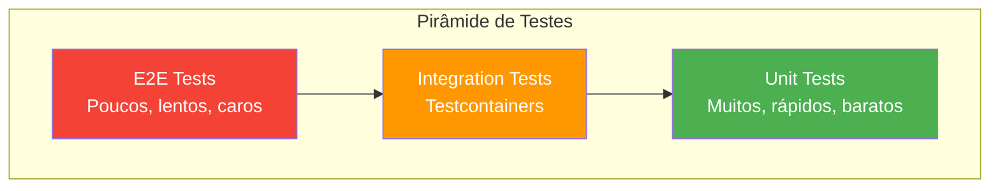

# Estratégia de Testes - Serviço Order

## 1. Visão Geral

A estratégia de testes do serviço **order** segue a **Pirâmide de Testes**, com foco em:

- **Testes Unitários**: Cobertura do domínio e casos de uso
- **Testes de Integração**: Validação com Testcontainers (PostgreSQL, RabbitMQ)
- **Testes de Contrato**: Validação de APIs e mensagens



---

## 2. Dependências de Teste

```xml
<!-- pom.xml -->
<dependencies>
    <!-- Spring Boot Test -->
    <dependency>
        <groupId>org.springframework.boot</groupId>
        <artifactId>spring-boot-starter-test</artifactId>
        <scope>test</scope>
    </dependency>
    
    <!-- Testcontainers -->
    <dependency>
        <groupId>org.testcontainers</groupId>
        <artifactId>testcontainers</artifactId>
        <version>1.19.3</version>
        <scope>test</scope>
    </dependency>
    <dependency>
        <groupId>org.testcontainers</groupId>
        <artifactId>postgresql</artifactId>
        <version>1.19.3</version>
        <scope>test</scope>
    </dependency>
    <dependency>
        <groupId>org.testcontainers</groupId>
        <artifactId>rabbitmq</artifactId>
        <version>1.19.3</version>
        <scope>test</scope>
    </dependency>
    <dependency>
        <groupId>org.testcontainers</groupId>
        <artifactId>junit-jupiter</artifactId>
        <version>1.19.3</version>
        <scope>test</scope>
    </dependency>
    
    <!-- AssertJ -->
    <dependency>
        <groupId>org.assertj</groupId>
        <artifactId>assertj-core</artifactId>
        <scope>test</scope>
    </dependency>
    
    <!-- ArchUnit -->
    <dependency>
        <groupId>com.tngtech.archunit</groupId>
        <artifactId>archunit-junit5</artifactId>
        <version>1.2.1</version>
        <scope>test</scope>
    </dependency>
    
    <!-- Awaitility (testes assíncronos) -->
    <dependency>
        <groupId>org.awaitility</groupId>
        <artifactId>awaitility</artifactId>
        <scope>test</scope>
    </dependency>
</dependencies>
```

---

## 3. Estrutura de Testes

```
src/test/java/com/order/
├── unit/
│   ├── domain/
│   │   ├── entity/
│   │   │   ├── OrderTest.java
│   │   │   └── OrderItemTest.java
│   │   ├── valueobject/
│   │   │   └── MoneyTest.java
│   │   └── service/
│   │       └── OrderCalculationServiceTest.java
│   ├── application/
│   │   └── usecase/
│   │       ├── ProcessOrderUseCaseTest.java
│   │       └── GetOrdersUseCaseTest.java
│   └── interfaces/
│       └── rest/
│           └── OrderControllerTest.java
├── integration/
│   ├── IntegrationTestBase.java
│   ├── persistence/
│   │   └── OrderRepositoryIntegrationTest.java
│   ├── messaging/
│   │   └── OrderMessageConsumerIntegrationTest.java
│   └── api/
│       └── OrderApiIntegrationTest.java
├── architecture/
│   └── ArchitectureRulesTest.java
└── fixtures/
    ├── OrderFixture.java
    └── OrderEventFixture.java
```

---

## 4. Testes Unitários

### 4.1 Princípios

- **Isolados**: Sem dependências externas (DB, rede, filesystem)
- **Rápidos**: Execução em milissegundos
- **Determinísticos**: Mesmo resultado em qualquer ambiente
- **Focados**: Um conceito por teste

### 4.2 Testes de Domínio

#### OrderTest.java

```java
@DisplayName("Order Entity Tests")
class OrderTest {
    
    @Nested
    @DisplayName("Cálculo de Total")
    class CalculoTotal {
        
        @Test
        @DisplayName("Deve calcular total corretamente para múltiplos itens")
        void deveCalcularTotalParaMultiplosItens() {
            // Arrange
            Order order = OrderFixture.umPedidoComItens(
                OrderItemFixture.umItem("PROD-1", new BigDecimal("50.00"), 2),  // 100.00
                OrderItemFixture.umItem("PROD-2", new BigDecimal("30.00"), 3)   // 90.00
            );
            
            // Act
            order.calculateTotal();
            
            // Assert
            assertThat(order.getTotalAmount().getValue())
                .isEqualByComparingTo(new BigDecimal("190.00"));
        }
        
        @Test
        @DisplayName("Deve usar BigDecimal com precisão correta")
        void deveUsarPrecisaoCorreta() {
            // Arrange
            Order order = OrderFixture.umPedidoComItens(
                OrderItemFixture.umItem("PROD-1", new BigDecimal("10.33"), 3)  // 30.99
            );
            
            // Act
            order.calculateTotal();
            
            // Assert
            assertThat(order.getTotalAmount().getValue())
                .isEqualByComparingTo(new BigDecimal("30.99"));
            assertThat(order.getTotalAmount().getValue().scale())
                .isEqualTo(2);
        }
        
        @Test
        @DisplayName("Deve retornar zero para pedido sem itens")
        void deveRetornarZeroParaPedidoSemItens() {
            // Arrange
            Order order = OrderFixture.umPedidoVazio();
            
            // Act
            order.calculateTotal();
            
            // Assert
            assertThat(order.getTotalAmount().getValue())
                .isEqualByComparingTo(BigDecimal.ZERO);
        }
    }
    
    @Nested
    @DisplayName("Transição de Status")
    class TransicaoStatus {
        
        @Test
        @DisplayName("Deve permitir transição RECEIVED -> PROCESSING")
        void devePermitirTransicaoReceivedParaProcessing() {
            // Arrange
            Order order = OrderFixture.umPedidoComStatus(OrderStatus.RECEIVED);
            
            // Act
            order.startProcessing();
            
            // Assert
            assertThat(order.getStatus()).isEqualTo(OrderStatus.PROCESSING);
        }
        
        @Test
        @DisplayName("Deve lançar exceção para transição inválida")
        void deveLancarExcecaoParaTransicaoInvalida() {
            // Arrange
            Order order = OrderFixture.umPedidoComStatus(OrderStatus.AVAILABLE);
            
            // Act & Assert
            assertThatThrownBy(() -> order.startProcessing())
                .isInstanceOf(InvalidOrderStatusTransitionException.class)
                .hasMessageContaining("AVAILABLE")
                .hasMessageContaining("PROCESSING");
        }
    }
}
```

#### MoneyTest.java

```java
@DisplayName("Money Value Object Tests")
class MoneyTest {
    
    @Test
    @DisplayName("Deve somar valores monetários corretamente")
    void deveSomarValores() {
        Money a = Money.of(new BigDecimal("10.50"));
        Money b = Money.of(new BigDecimal("5.25"));
        
        Money result = a.add(b);
        
        assertThat(result.getValue())
            .isEqualByComparingTo(new BigDecimal("15.75"));
    }
    
    @Test
    @DisplayName("Deve multiplicar por quantidade")
    void deveMultiplicarPorQuantidade() {
        Money price = Money.of(new BigDecimal("10.33"));
        
        Money result = price.multiply(3);
        
        assertThat(result.getValue())
            .isEqualByComparingTo(new BigDecimal("30.99"));
    }
    
    @Test
    @DisplayName("Deve rejeitar valor negativo")
    void deveRejeitarValorNegativo() {
        assertThatThrownBy(() -> Money.of(new BigDecimal("-10.00")))
            .isInstanceOf(IllegalArgumentException.class)
            .hasMessageContaining("negativo");
    }
    
    @Test
    @DisplayName("Deve usar RoundingMode HALF_UP")
    void deveUsarRoundingModeHalfUp() {
        Money price = Money.of(new BigDecimal("10.005"));
        
        assertThat(price.getValue())
            .isEqualByComparingTo(new BigDecimal("10.01")); // Arredondado para cima
    }
}
```

### 4.3 Testes de Casos de Uso

```java
@ExtendWith(MockitoExtension.class)
@DisplayName("ProcessOrderUseCase Tests")
class ProcessOrderUseCaseTest {
    
    @Mock
    private OrderRepository orderRepository;
    
    @Mock
    private OrderCalculationService calculationService;
    
    @InjectMocks
    private ProcessOrderUseCase useCase;
    
    @Test
    @DisplayName("Deve processar pedido novo com sucesso")
    void deveProcessarPedidoNovo() {
        // Arrange
        CreateOrderCommand command = OrderCommandFixture.umComando();
        Order calculatedOrder = OrderFixture.umPedidoCalculado();
        
        when(orderRepository.findByExternalOrderId(command.externalOrderId()))
            .thenReturn(Optional.empty());
        when(calculationService.calculate(any(Order.class)))
            .thenReturn(calculatedOrder);
        when(orderRepository.save(any(Order.class)))
            .thenReturn(calculatedOrder);
        
        // Act
        Order result = useCase.execute(command);
        
        // Assert
        assertThat(result.getStatus()).isEqualTo(OrderStatus.AVAILABLE);
        verify(orderRepository).save(any(Order.class));
    }
    
    @Test
    @DisplayName("Deve retornar pedido existente quando duplicado")
    void deveRetornarPedidoExistente() {
        // Arrange
        CreateOrderCommand command = OrderCommandFixture.umComando();
        Order existingOrder = OrderFixture.umPedidoExistente();
        
        when(orderRepository.findByExternalOrderId(command.externalOrderId()))
            .thenReturn(Optional.of(existingOrder));
        
        // Act
        Order result = useCase.execute(command);
        
        // Assert
        assertThat(result).isEqualTo(existingOrder);
        verify(orderRepository, never()).save(any());
        verify(calculationService, never()).calculate(any());
    }
}
```

### 4.4 Testes de Controller (MockMvc)

```java
@WebMvcTest(OrderController.class)
@DisplayName("OrderController Tests")
class OrderControllerTest {
    
    @Autowired
    private MockMvc mockMvc;
    
    @MockBean
    private GetOrdersUseCase getOrdersUseCase;
    
    @Autowired
    private ObjectMapper objectMapper;
    
    @Test
    @DisplayName("GET /api/v1/orders - Deve retornar lista paginada")
    void deveRetornarListaPaginada() throws Exception {
        // Arrange
        Page<Order> orders = new PageImpl<>(
            List.of(OrderFixture.umPedidoDisponivel()),
            PageRequest.of(0, 20),
            1
        );
        when(getOrdersUseCase.execute(any())).thenReturn(orders);
        
        // Act & Assert
        mockMvc.perform(get("/api/v1/orders")
                .param("status", "AVAILABLE")
                .contentType(MediaType.APPLICATION_JSON))
            .andExpect(status().isOk())
            .andExpect(jsonPath("$.content").isArray())
            .andExpect(jsonPath("$.content[0].status").value("AVAILABLE"))
            .andExpect(jsonPath("$.page.totalElements").value(1));
    }
    
    @Test
    @DisplayName("GET /api/v1/orders/{id} - Deve retornar 404 quando não encontrado")
    void deveRetornar404QuandoNaoEncontrado() throws Exception {
        // Arrange
        UUID orderId = UUID.randomUUID();
        when(getOrdersUseCase.findById(orderId)).thenReturn(Optional.empty());
        
        // Act & Assert
        mockMvc.perform(get("/api/v1/orders/{id}", orderId)
                .contentType(MediaType.APPLICATION_JSON))
            .andExpect(status().isNotFound())
            .andExpect(jsonPath("$.code").value("ORDER_NOT_FOUND"));
    }
}
```

---

## 5. Testes de Integração (Testcontainers)

### 5.1 Classe Base

```java
@SpringBootTest(webEnvironment = SpringBootTest.WebEnvironment.RANDOM_PORT)
@Testcontainers
@ActiveProfiles("test")
public abstract class IntegrationTestBase {
    
    @Container
    static PostgreSQLContainer<?> postgres = new PostgreSQLContainer<>("postgres:15-alpine")
        .withDatabaseName("order_test")
        .withUsername("test")
        .withPassword("test")
        .withReuse(true);
    
    @Container
    static RabbitMQContainer rabbitmq = new RabbitMQContainer("rabbitmq:3.12-management-alpine")
        .withReuse(true);
    
    @DynamicPropertySource
    static void configureProperties(DynamicPropertyRegistry registry) {
        // PostgreSQL
        registry.add("spring.datasource.url", postgres::getJdbcUrl);
        registry.add("spring.datasource.username", postgres::getUsername);
        registry.add("spring.datasource.password", postgres::getPassword);
        
        // RabbitMQ
        registry.add("spring.rabbitmq.host", rabbitmq::getHost);
        registry.add("spring.rabbitmq.port", rabbitmq::getAmqpPort);
        registry.add("spring.rabbitmq.username", rabbitmq::getAdminUsername);
        registry.add("spring.rabbitmq.password", rabbitmq::getAdminPassword);
    }
    
    @Autowired
    protected TestRestTemplate restTemplate;
    
    @Autowired
    protected RabbitTemplate rabbitTemplate;
    
    @Autowired
    protected OrderRepository orderRepository;
    
    @BeforeEach
    void cleanDatabase() {
        // Limpa dados entre testes
        orderRepository.deleteAll();
    }
}
```

### 5.2 Teste de Repositório

```java
@DisplayName("OrderRepository Integration Tests")
class OrderRepositoryIntegrationTest extends IntegrationTestBase {
    
    @Test
    @DisplayName("Deve persistir e recuperar pedido com itens")
    void devePersistirERecuperarPedido() {
        // Arrange
        Order order = OrderFixture.umPedidoCompleto();
        
        // Act
        Order saved = orderRepository.save(order);
        Optional<Order> found = orderRepository.findById(saved.getId());
        
        // Assert
        assertThat(found).isPresent();
        assertThat(found.get().getExternalOrderId())
            .isEqualTo(order.getExternalOrderId());
        assertThat(found.get().getItems()).hasSize(order.getItems().size());
    }
    
    @Test
    @DisplayName("Deve detectar duplicidade via external_order_id")
    void deveDetectarDuplicidade() {
        // Arrange
        Order order1 = OrderFixture.umPedido("EXT-001");
        Order order2 = OrderFixture.umPedido("EXT-001");
        
        // Act
        orderRepository.save(order1);
        
        // Assert
        assertThatThrownBy(() -> orderRepository.save(order2))
            .isInstanceOf(DataIntegrityViolationException.class);
    }
    
    @Test
    @DisplayName("Deve aplicar optimistic locking em atualizações concorrentes")
    void deveAplicarOptimisticLocking() {
        // Arrange
        Order order = orderRepository.save(OrderFixture.umPedido());
        
        // Simula duas transações carregando o mesmo pedido
        Order orderTx1 = orderRepository.findById(order.getId()).orElseThrow();
        Order orderTx2 = orderRepository.findById(order.getId()).orElseThrow();
        
        // Act - Primeira transação atualiza
        orderTx1.updateStatus(OrderStatus.PROCESSING);
        orderRepository.save(orderTx1);
        
        // Assert - Segunda transação deve falhar
        orderTx2.updateStatus(OrderStatus.CALCULATED);
        assertThatThrownBy(() -> orderRepository.save(orderTx2))
            .isInstanceOf(OptimisticLockingFailureException.class);
    }
}
```

### 5.3 Teste de Mensageria

```java
@DisplayName("OrderMessageConsumer Integration Tests")
class OrderMessageConsumerIntegrationTest extends IntegrationTestBase {
    
    @Test
    @DisplayName("Deve processar mensagem e persistir pedido")
    void deveProcessarMensagem() {
        // Arrange
        OrderCreatedEvent event = OrderEventFixture.umEvento("EXT-001");
        
        // Act
        rabbitTemplate.convertAndSend(
            RabbitMQConfig.EXCHANGE_NAME,
            RabbitMQConfig.ROUTING_KEY,
            event
        );
        
        // Assert (aguarda processamento assíncrono)
        await()
            .atMost(Duration.ofSeconds(10))
            .untilAsserted(() -> {
                Optional<Order> order = orderRepository
                    .findByExternalOrderId("EXT-001");
                
                assertThat(order).isPresent();
                assertThat(order.get().getStatus()).isEqualTo(OrderStatus.AVAILABLE);
            });
    }
    
    @Test
    @DisplayName("Deve tratar duplicidade de forma idempotente")
    void deveTratarDuplicidadeIdempotente() {
        // Arrange
        OrderCreatedEvent event = OrderEventFixture.umEvento("EXT-002");
        
        // Act - Envia a mesma mensagem duas vezes
        rabbitTemplate.convertAndSend(
            RabbitMQConfig.EXCHANGE_NAME,
            RabbitMQConfig.ROUTING_KEY,
            event
        );
        rabbitTemplate.convertAndSend(
            RabbitMQConfig.EXCHANGE_NAME,
            RabbitMQConfig.ROUTING_KEY,
            event
        );
        
        // Assert - Deve existir apenas um pedido
        await()
            .atMost(Duration.ofSeconds(10))
            .untilAsserted(() -> {
                List<Order> orders = orderRepository.findAll();
                long count = orders.stream()
                    .filter(o -> o.getExternalOrderId().equals("EXT-002"))
                    .count();
                
                assertThat(count).isEqualTo(1);
            });
    }
}
```

### 5.4 Teste de API End-to-End

```java
@DisplayName("Order API Integration Tests")
class OrderApiIntegrationTest extends IntegrationTestBase {
    
    @Test
    @DisplayName("Fluxo completo: mensagem -> processamento -> consulta")
    void fluxoCompleto() {
        // Arrange - Publica evento
        OrderCreatedEvent event = OrderEventFixture.umEvento("EXT-E2E-001");
        rabbitTemplate.convertAndSend(
            RabbitMQConfig.EXCHANGE_NAME,
            RabbitMQConfig.ROUTING_KEY,
            event
        );
        
        // Aguarda processamento
        await()
            .atMost(Duration.ofSeconds(10))
            .until(() -> orderRepository.existsByExternalOrderId("EXT-E2E-001"));
        
        // Act - Consulta via API
        ResponseEntity<OrderDetailResponse> response = restTemplate.getForEntity(
            "/api/v1/orders/external/EXT-E2E-001",
            OrderDetailResponse.class
        );
        
        // Assert
        assertThat(response.getStatusCode()).isEqualTo(HttpStatus.OK);
        assertThat(response.getBody()).isNotNull();
        assertThat(response.getBody().externalOrderId()).isEqualTo("EXT-E2E-001");
        assertThat(response.getBody().status()).isEqualTo("AVAILABLE");
        assertThat(response.getBody().totalAmount().value())
            .isEqualByComparingTo(new BigDecimal("190.00"));
    }
    
    @Test
    @DisplayName("GET /api/v1/orders - Deve filtrar por status")
    void deveFiltrarPorStatus() {
        // Arrange
        orderRepository.save(OrderFixture.umPedidoComStatus(OrderStatus.AVAILABLE));
        orderRepository.save(OrderFixture.umPedidoComStatus(OrderStatus.PROCESSING));
        
        // Act
        ResponseEntity<PageResponse> response = restTemplate.getForEntity(
            "/api/v1/orders?status=AVAILABLE",
            PageResponse.class
        );
        
        // Assert
        assertThat(response.getStatusCode()).isEqualTo(HttpStatus.OK);
        assertThat(response.getBody().content()).hasSize(1);
    }
}
```

---

## 6. Testes de Arquitetura (ArchUnit)

```java
@AnalyzeClasses(packages = "com.order")
@DisplayName("Architecture Rules Tests")
class ArchitectureRulesTest {
    
    @ArchTest
    static final ArchRule domain_should_not_depend_on_other_layers =
        noClasses()
            .that().resideInAPackage("..domain..")
            .should().dependOnClassesThat()
            .resideInAnyPackage("..application..", "..infrastructure..", "..interfaces..");
    
    @ArchTest
    static final ArchRule application_should_only_depend_on_domain =
        noClasses()
            .that().resideInAPackage("..application..")
            .should().dependOnClassesThat()
            .resideInAnyPackage("..infrastructure..", "..interfaces..");
    
    @ArchTest
    static final ArchRule controllers_should_not_access_repositories_directly =
        noClasses()
            .that().resideInAPackage("..interfaces.rest..")
            .should().dependOnClassesThat()
            .resideInAPackage("..persistence..");
    
    @ArchTest
    static final ArchRule entities_should_be_in_domain_package =
        classes()
            .that().areAnnotatedWith(Entity.class)
            .should().resideInAPackage("..infrastructure.persistence.entity..");
}
```

---

## 7. Fixtures e Test Data Builders

```java
public class OrderFixture {
    
    public static Order umPedido() {
        return umPedido("EXT-" + UUID.randomUUID().toString().substring(0, 8));
    }
    
    public static Order umPedido(String externalOrderId) {
        return Order.builder()
            .id(UUID.randomUUID())
            .externalOrderId(externalOrderId)
            .status(OrderStatus.RECEIVED)
            .items(List.of(OrderItemFixture.umItem()))
            .build();
    }
    
    public static Order umPedidoComItens(OrderItem... items) {
        return Order.builder()
            .id(UUID.randomUUID())
            .externalOrderId("EXT-" + UUID.randomUUID())
            .status(OrderStatus.RECEIVED)
            .items(Arrays.asList(items))
            .build();
    }
    
    public static Order umPedidoComStatus(OrderStatus status) {
        return Order.builder()
            .id(UUID.randomUUID())
            .externalOrderId("EXT-" + UUID.randomUUID())
            .status(status)
            .items(List.of(OrderItemFixture.umItem()))
            .totalAmount(Money.of(new BigDecimal("100.00")))
            .build();
    }
}

public class OrderItemFixture {
    
    public static OrderItem umItem() {
        return umItem("PROD-001", new BigDecimal("50.00"), 2);
    }
    
    public static OrderItem umItem(String productId, BigDecimal price, int quantity) {
        return OrderItem.builder()
            .id(UUID.randomUUID())
            .productId(productId)
            .productName("Produto " + productId)
            .unitPrice(Money.of(price))
            .quantity(quantity)
            .build();
    }
}
```

---

## 8. Configuração do SonarQube

### 8.1 sonar-project.properties

```properties
sonar.projectKey=order-service
sonar.projectName=Order Service
sonar.projectVersion=1.0.0

sonar.sources=src/main/java
sonar.tests=src/test/java
sonar.java.binaries=target/classes
sonar.java.test.binaries=target/test-classes

sonar.coverage.jacoco.xmlReportPaths=target/site/jacoco/jacoco.xml

# Exclusões de cobertura
sonar.coverage.exclusions=\
  **/config/**,\
  **/dto/**,\
  **/*Application.java,\
  **/*Config.java

# Quality Gate
sonar.qualitygate.wait=true
```

### 8.2 Configuração JaCoCo

```xml
<plugin>
    <groupId>org.jacoco</groupId>
    <artifactId>jacoco-maven-plugin</artifactId>
    <version>0.8.11</version>
    <executions>
        <execution>
            <goals>
                <goal>prepare-agent</goal>
            </goals>
        </execution>
        <execution>
            <id>report</id>
            <phase>verify</phase>
            <goals>
                <goal>report</goal>
            </goals>
        </execution>
        <execution>
            <id>check</id>
            <goals>
                <goal>check</goal>
            </goals>
            <configuration>
                <rules>
                    <rule>
                        <element>BUNDLE</element>
                        <limits>
                            <limit>
                                <counter>LINE</counter>
                                <value>COVEREDRATIO</value>
                                <minimum>0.80</minimum>
                            </limit>
                        </limits>
                    </rule>
                </rules>
            </configuration>
        </execution>
    </executions>
</plugin>
```

---

## 9. Comandos de Execução

```bash
# Executar todos os testes
./mvnw test

# Executar apenas testes unitários
./mvnw test -Dtest="**/unit/**"

# Executar apenas testes de integração
./mvnw verify -Dtest="**/integration/**"

# Executar testes com cobertura
./mvnw verify jacoco:report

# Enviar para SonarQube
./mvnw verify sonar:sonar \
  -Dsonar.host.url=http://localhost:9000 \
  -Dsonar.token=<TOKEN>

# Ver relatório de cobertura
open target/site/jacoco/index.html
```

---

## 10. Métricas de Qualidade

| Métrica | Meta | Descrição |
|---------|------|-----------|
| **Cobertura de Linha** | > 80% | Percentual de linhas executadas |
| **Cobertura de Branch** | > 70% | Percentual de branches cobertos |
| **Duplicação** | < 3% | Código duplicado |
| **Bugs** | 0 | Bugs detectados pelo Sonar |
| **Vulnerabilidades** | 0 | Problemas de segurança |
| **Code Smells** | < 10 | Problemas de manutenibilidade |
