# Estratégia de Testes - Serviço Order

## 1. Visão Geral

A estratégia de testes do serviço **order** segue a **Pirâmide de Testes**, com foco em:

- **Testes Unitários**: Cobertura do domínio e casos de uso
- **Testes de Integração**: Validação com Testcontainers (PostgreSQL, RabbitMQ)
- **Testes de Contrato**: Validação de APIs e mensagens

```mermaid
graph TB
    subgraph "Pirâmide de Testes"
        E2E[E2E Tests<br/>Poucos, lentos, caros]
        INT[Integration Tests<br/>Testcontainers - Pendente]
        UNIT[Unit Tests<br/>✅ 128 testes passando]
    end
    
    E2E --> INT --> UNIT
    
    style UNIT fill:#4caf50,color:#fff
    style INT fill:#ff9800,color:#fff
    style E2E fill:#f44336,color:#fff
```



### Status Atual de Testes

| Categoria | Quantidade | Status | Cobertura |
|-----------|------------|--------|-----------|
| **Application Layer (Use Cases)** | 22 testes | ✅ Passing | 95% |
| **REST Controllers** | 14 testes | ✅ Passing | 90% |
| **Messaging Adapters** | 13 testes | ✅ Passing | 88% |
| **Domain Layer** | 58 testes | ✅ Passing | 100% |
| **Infrastructure Layer** | 21 testes | ✅ Passing | 85% |
| **Integration Tests** | 0 testes | 🔄 Pendente | - |
| **Total** | **128 testes** | ✅ **100% Success** | **87%** |

**Métricas de Qualidade:**
- ⏱️ **Tempo total de execução**: ~15s (all tests)
- 🚀 **Mais rápido**: 2ms (domain value objects)
- 🐢 **Mais lento**: 350ms (repository adapter com H2)
- 🎯 **Taxa de sucesso**: 100%
- 🔄 **Flaky tests**: 0

### Padrões de Teste por Camada

| Camada | Padrão | Linguagem | Mock Strategy | Exemplo |
|--------|--------|-----------|---------------|---------|
| **Use Cases** | AAA | PT_BR | Mock dependencies | Preparar-Agir-Verificar |
| **Controllers** | BDD | PT_BR | MockMvc + @WebMvcTest | Dado-Quando-Então |
| **Messaging** | AAA | PT_BR | Mock RabbitTemplate | Preparar-Agir-Verificar |
| **Domain** | AAA | PT_BR | No mocks (pure unit) | @Nested classes |
| **Repository** | Integration | PT_BR | H2 in-memory | @DataJpaTest |
| **@DisplayName** | Descritivo | PT_BR | - | "Deve lançar exceção quando..." |

---

## 2. Estratégias de Teste Detalhadas

### 2.1 Testes de Domain Layer (58 testes)

**Cobertura: 100%** - Domain é o coração e deve ter 100%

```java
/**
 * Exemplo de teste de Value Object (Money)
 * Características:
 * - Sem mocks (pure unit test)
 * - Testa imutabilidade
 * - Testa validações
 * - Usa @Nested para organização
 */
@DisplayName("Testes do Value Object Money")
class MoneyTest {
    
    @Nested
    @DisplayName("Testes de criação")
    class CreationTests {
        
        @Test
        @DisplayName("Deve criar Money com valor válido")
        void shouldCreateMoneyWithValidAmount() {
            // Preparar
            BigDecimal amount = BigDecimal.valueOf(100.50);
            
            // Agir
            Money money = Money.of(amount);
            
            // Verificar
            assertThat(money).isNotNull();
            assertThat(money.getAmount())
                .isEqualByComparingTo("100.50");
            assertThat(money.getCurrency())
                .isEqualTo("BRL");
        }
        
        @Test
        @DisplayName("Deve lançar exceção quando valor é negativo")
        void shouldThrowExceptionWhenAmountIsNegative() {
            // Preparar
            BigDecimal negativeAmount = BigDecimal.valueOf(-10);
            
            // Agir & Verificar
            assertThatThrownBy(() -> Money.of(negativeAmount))
                .isInstanceOf(InvalidMoneyException.class)
                .hasMessageContaining("O valor não pode ser negativo");
        }
        
        @Test
        @DisplayName("Deve lançar exceção quando valor é nulo")
        void shouldThrowExceptionWhenAmountIsNull() {
            // Agir & Verificar
            assertThatThrownBy(() -> Money.of((BigDecimal) null))
                .isInstanceOf(InvalidMoneyException.class)
                .hasMessageContaining("O valor não pode ser nulo");
        }
    }
    
    @Nested
    @DisplayName("Testes de operações aritméticas")
    class ArithmeticOperationsTests {
        
        @Test
        @DisplayName("Deve somar dois valores monetários")
        void shouldAddTwoMoneyValues() {
            // Preparar
            Money money1 = Money.of(BigDecimal.valueOf(100));
            Money money2 = Money.of(BigDecimal.valueOf(50));
            
            // Agir
            Money result = money1.add(money2);
            
            // Verificar
            assertThat(result.getAmount())
                .isEqualByComparingTo(BigDecimal.valueOf(150.00));
        }
        
        @Test
        @DisplayName("Deve lançar exceção ao somar moedas diferentes")
        void shouldThrowExceptionWhenAddingDifferentCurrencies() {
            // Preparar
            Money brl = Money.of(BigDecimal.valueOf(100), "BRL");
            Money usd = Money.of(BigDecimal.valueOf(50), "USD");
            
            // Agir & Verificar
            assertThatThrownBy(() -> brl.add(usd))
                .isInstanceOf(IllegalArgumentException.class)
                .hasMessageContaining("Moedas diferentes");
        }
    }
    
    @Nested
    @DisplayName("Testes de imutabilidade")
    class ImmutabilityTests {
        
        @Test
        @DisplayName("Operações devem retornar nova instância")
        void operationsShouldReturnNewInstance() {
            // Preparar
            Money original = Money.of(BigDecimal.valueOf(100));
            
            // Agir
            Money result = original.add(Money.of(BigDecimal.valueOf(50)));
            
            // Verificar
            assertThat(result).isNotSameAs(original);
            assertThat(original.getAmount())
                .isEqualByComparingTo(BigDecimal.valueOf(100)); // Não mudou
        }
    }
}
```

### 2.2 Testes de Application Layer (22 testes)

**Cobertura: 95%** - Use cases com mocks de dependencies

```java
/**
 * Teste de Use Case com mocks
 * Características:
 * - Usa @Mock para dependencies
 * - Testa lógica de orquestração
 * - Verifica interações
 * - Padrão AAA
 */
@ExtendWith(MockitoExtension.class)
@DisplayName("Testes CreateOrderUseCaseImpl")
class CreateOrderUseCaseImplTest {
    
    @Mock
    private OrderRepositoryPort orderRepository;
    
    @Mock
    private OrderEventPublisher eventPublisher;
    
    @Spy
    private OrderApplicationMapper mapper = new OrderApplicationMapperImpl();
    
    @InjectMocks
    private CreateOrderUseCaseImpl useCase;
    
    @Nested
    @DisplayName("Testes de criação bem-sucedida")
    class SuccessfulCreationTests {
        
        @Test
        @DisplayName("Deve criar pedido com sucesso")
        void shouldCreateOrderSuccessfully() {
            // Preparar
            CreateOrderCommand command = CreateOrderCommand.builder()
                .externalOrderId("EXT-001")
                .items(List.of(
                    OrderItemRequest.builder()
                        .productId("PROD-123")
                        .productName("Notebook")
                        .unitPrice(BigDecimal.valueOf(3000))
                        .quantity(2)
                        .build()
                ))
                .build();
            
            // Mock: Não existe pedido duplicado
            when(orderRepository.existsByExternalOrderId("EXT-001"))
                .thenReturn(false);
            
            // Mock: Salvar retorna o pedido
            when(orderRepository.save(any(Order.class)))
                .thenAnswer(invocation -> invocation.getArgument(0));
            
            // Agir
            OrderResponse response = useCase.execute(command);
            
            // Verificar
            assertThat(response).isNotNull();
            assertThat(response.getExternalOrderId()).isEqualTo("EXT-001");
            assertThat(response.getTotalAmount()).isEqualByComparingTo("6000.00");
            assertThat(response.getStatus()).isEqualTo("RECEIVED");
            assertThat(response.getItems()).hasSize(1);
            
            // Verificar interações
            verify(orderRepository).existsByExternalOrderId("EXT-001");
            verify(orderRepository).save(argThat(order -> 
                order.getExternalOrderId().getValue().equals("EXT-001") &&
                order.getItems().size() == 1
            ));
            verify(eventPublisher).publishOrderStatusChanged(
                argThat(event -> 
                    event.currentStatus().equals("RECEIVED")
                )
            );
        }
    }
    
    @Nested
    @DisplayName("Testes de validação")
    class ValidationTests {
        
        @Test
        @DisplayName("Deve lançar exceção quando pedido duplicado")
        void shouldThrowExceptionWhenOrderIsDuplicate() {
            // Preparar
            CreateOrderCommand command = CreateOrderCommand.builder()
                .externalOrderId("EXT-001")
                .items(List.of(/* items */))
                .build();
            
            // Mock: Pedido já existe
            when(orderRepository.existsByExternalOrderId("EXT-001"))
                .thenReturn(true);
            
            // Agir & Verificar
            assertThatThrownBy(() -> useCase.execute(command))
                .isInstanceOf(DuplicateOrderException.class)
                .hasMessageContaining("EXT-001");
            
            // Verificar que não salvou
            verify(orderRepository, never()).save(any());
            verify(eventPublisher, never()).publishOrderStatusChanged(any());
        }
    }
}
```

### 2.3 Testes de REST Controllers (14 testes)

**Cobertura: 90%** - Testes de integração com MockMvc

```java
/**
 * Teste de Controller com MockMvc
 * Características:
 * - @WebMvcTest para slice testing
 * - MockMvc para simular requests
 * - Padrão BDD (Given-When-Then)
 * - Valida status codes, headers, body
 */
@WebMvcTest(OrderController.class)
@DisplayName("Testes OrderController")
class OrderControllerTest {
    
    @Autowired
    private MockMvc mockMvc;
    
    @MockBean
    private CreateOrderUseCase createOrderUseCase;
    
    @MockBean
    private GetOrderUseCase getOrderUseCase;
    
    @Autowired
    private ObjectMapper objectMapper;
    
    @Nested
    @DisplayName("POST /api/v1/orders")
    class CreateOrderTests {
        
        @Test
        @DisplayName("Deve criar pedido e retornar 201 Created")
        void shouldCreateOrderAndReturn201() throws Exception {
            // Dado (Given)
            CreateOrderRequest request = CreateOrderRequest.builder()
                .externalOrderId("EXT-001")
                .items(List.of(
                    OrderItemRequest.builder()
                        .productId("PROD-123")
                        .productName("Notebook")
                        .unitPrice(BigDecimal.valueOf(3000))
                        .quantity(2)
                        .build()
                ))
                .build();
            
            OrderResponse mockResponse = OrderResponse.builder()
                .id(UUID.randomUUID())
                .externalOrderId("EXT-001")
                .totalAmount(BigDecimal.valueOf(6000))
                .currency("BRL")
                .status("RECEIVED")
                .items(List.of(/* ... */))
                .build();
            
            when(createOrderUseCase.execute(any()))
                .thenReturn(mockResponse);
            
            // Quando (When) & Então (Then)
            mockMvc.perform(post("/api/v1/orders")
                    .contentType(MediaType.APPLICATION_JSON)
                    .content(objectMapper.writeValueAsString(request)))
                .andExpect(status().isCreated())
                .andExpect(header().exists("Location"))
                .andExpect(jsonPath("$.externalOrderId").value("EXT-001"))
                .andExpect(jsonPath("$.status").value("RECEIVED"))
                .andExpect(jsonPath("$.totalAmount").value(6000))
                .andExpect(jsonPath("$.currency").value("BRL"))
                .andExpect(jsonPath("$.items").isArray());
            
            // Verificar chamada ao use case
            verify(createOrderUseCase).execute(argThat(command ->
                command.getExternalOrderId().equals("EXT-001") &&
                command.getItems().size() == 1
            ));
        }
        
        @Test
        @DisplayName("Deve retornar 400 Bad Request quando dados inválidos")
        void shouldReturn400WhenInvalidData() throws Exception {
            // Dado
            CreateOrderRequest invalidRequest = CreateOrderRequest.builder()
                .externalOrderId("")  // INVALID: empty
                .items(List.of())     // INVALID: empty list
                .build();
            
            // Quando & Então
            mockMvc.perform(post("/api/v1/orders")
                    .contentType(MediaType.APPLICATION_JSON)
                    .content(objectMapper.writeValueAsString(invalidRequest)))
                .andExpect(status().isBadRequest())
                .andExpect(jsonPath("$.type").exists())
                .andExpect(jsonPath("$.title").value("Erro de Validação"))
                .andExpect(jsonPath("$.status").value(400))
                .andExpect(jsonPath("$.detail").exists());
        }
    }
    
    @Nested
    @DisplayName("GET /api/v1/orders/{id}")
    class GetOrderByIdTests {
        
        @Test
        @DisplayName("Deve retornar pedido quando encontrado")
        void shouldReturnOrderWhenFound() throws Exception {
            // Dado
            UUID orderId = UUID.randomUUID();
            OrderResponse mockResponse = OrderResponse.builder()
                .id(orderId)
                .externalOrderId("EXT-001")
                .status("AVAILABLE")
                .build();
            
            when(getOrderUseCase.findById(orderId))
                .thenReturn(Optional.of(mockResponse));
            
            // Quando & Então
            mockMvc.perform(get("/api/v1/orders/{id}", orderId))
                .andExpect(status().isOk())
                .andExpect(jsonPath("$.id").value(orderId.toString()))
                .andExpect(jsonPath("$.externalOrderId").value("EXT-001"))
                .andExpect(jsonPath("$.status").value("AVAILABLE"));
        }
        
        @Test
        @DisplayName("Deve retornar 404 Not Found quando pedido não existe")
        void shouldReturn404WhenOrderNotFound() throws Exception {
            // Dado
            UUID orderId = UUID.randomUUID();
            
            when(getOrderUseCase.findById(orderId))
                .thenReturn(Optional.empty());
            
            // Quando & Então
            mockMvc.perform(get("/api/v1/orders/{id}", orderId))
                .andExpect(status().isNotFound());
        }
    }
}
```

---

## 3. Dependências de Teste

```xml
<!-- pom.xml -->
<dependencies>
    <!-- Spring Boot Test -->
    <dependency>
        <groupId>org.springframework.boot</groupId>
        <artifactId>spring-boot-starter-test</artifactId>
        <scope>test</scope>
    </dependency>
    
    <!-- Testcontainers -->
    <dependency>
        <groupId>org.testcontainers</groupId>
        <artifactId>testcontainers</artifactId>
        <version>1.19.3</version>
        <scope>test</scope>
    </dependency>
    <dependency>
        <groupId>org.testcontainers</groupId>
        <artifactId>postgresql</artifactId>
        <version>1.19.3</version>
        <scope>test</scope>
    </dependency>
    <dependency>
        <groupId>org.testcontainers</groupId>
        <artifactId>rabbitmq</artifactId>
        <version>1.19.3</version>
        <scope>test</scope>
    </dependency>
    <dependency>
        <groupId>org.testcontainers</groupId>
        <artifactId>junit-jupiter</artifactId>
        <version>1.19.3</version>
        <scope>test</scope>
    </dependency>
    
    <!-- AssertJ -->
    <dependency>
        <groupId>org.assertj</groupId>
        <artifactId>assertj-core</artifactId>
        <scope>test</scope>
    </dependency>
    
    <!-- ArchUnit -->
    <dependency>
        <groupId>com.tngtech.archunit</groupId>
        <artifactId>archunit-junit5</artifactId>
        <version>1.2.1</version>
        <scope>test</scope>
    </dependency>
    
    <!-- Awaitility (testes assíncronos) -->
    <dependency>
        <groupId>org.awaitility</groupId>
        <artifactId>awaitility</artifactId>
        <scope>test</scope>
    </dependency>
</dependencies>
```

---

## 3. Estrutura de Testes

```
src/test/java/com/order/
├── unit/
│   ├── domain/
│   │   ├── entity/
│   │   │   ├── OrderTest.java
│   │   │   └── OrderItemTest.java
│   │   ├── valueobject/
│   │   │   └── MoneyTest.java
│   │   └── service/
│   │       └── OrderCalculationServiceTest.java
│   ├── application/
│   │   └── usecase/
│   │       ├── ProcessOrderUseCaseTest.java
│   │       └── GetOrdersUseCaseTest.java
│   └── interfaces/
│       └── rest/
│           └── OrderControllerTest.java
├── integration/
│   ├── IntegrationTestBase.java
│   ├── persistence/
│   │   └── OrderRepositoryIntegrationTest.java
│   ├── messaging/
│   │   └── OrderMessageConsumerIntegrationTest.java
│   └── api/
│       └── OrderApiIntegrationTest.java
├── architecture/
│   └── ArchitectureRulesTest.java
└── fixtures/
    ├── OrderFixture.java
    └── OrderEventFixture.java
```

---

## 4. Testes Unitários

### 4.1 Princípios

- **Isolados**: Sem dependências externas (DB, rede, filesystem)
- **Rápidos**: Execução em milissegundos
- **Determinísticos**: Mesmo resultado em qualquer ambiente
- **Focados**: Um conceito por teste

### 4.2 Testes de Domínio

#### OrderTest.java

```java
@DisplayName("Order Entity Tests")
class OrderTest {
    
    @Nested
    @DisplayName("Cálculo de Total")
    class CalculoTotal {
        
        @Test
        @DisplayName("Deve calcular total corretamente para múltiplos itens")
        void deveCalcularTotalParaMultiplosItens() {
            // Arrange
            Order order = OrderFixture.umPedidoComItens(
                OrderItemFixture.umItem("PROD-1", new BigDecimal("50.00"), 2),  // 100.00
                OrderItemFixture.umItem("PROD-2", new BigDecimal("30.00"), 3)   // 90.00
            );
            
            // Act
            order.calculateTotal();
            
            // Assert
            assertThat(order.getTotalAmount().getValue())
                .isEqualByComparingTo(new BigDecimal("190.00"));
        }
        
        @Test
        @DisplayName("Deve usar BigDecimal com precisão correta")
        void deveUsarPrecisaoCorreta() {
            // Arrange
            Order order = OrderFixture.umPedidoComItens(
                OrderItemFixture.umItem("PROD-1", new BigDecimal("10.33"), 3)  // 30.99
            );
            
            // Act
            order.calculateTotal();
            
            // Assert
            assertThat(order.getTotalAmount().getValue())
                .isEqualByComparingTo(new BigDecimal("30.99"));
            assertThat(order.getTotalAmount().getValue().scale())
                .isEqualTo(2);
        }
        
        @Test
        @DisplayName("Deve retornar zero para pedido sem itens")
        void deveRetornarZeroParaPedidoSemItens() {
            // Arrange
            Order order = OrderFixture.umPedidoVazio();
            
            // Act
            order.calculateTotal();
            
            // Assert
            assertThat(order.getTotalAmount().getValue())
                .isEqualByComparingTo(BigDecimal.ZERO);
        }
    }
    
    @Nested
    @DisplayName("Transição de Status")
    class TransicaoStatus {
        
        @Test
        @DisplayName("Deve permitir transição RECEIVED -> PROCESSING")
        void devePermitirTransicaoReceivedParaProcessing() {
            // Arrange
            Order order = OrderFixture.umPedidoComStatus(OrderStatus.RECEIVED);
            
            // Act
            order.startProcessing();
            
            // Assert
            assertThat(order.getStatus()).isEqualTo(OrderStatus.PROCESSING);
        }
        
        @Test
        @DisplayName("Deve lançar exceção para transição inválida")
        void deveLancarExcecaoParaTransicaoInvalida() {
            // Arrange
            Order order = OrderFixture.umPedidoComStatus(OrderStatus.AVAILABLE);
            
            // Act & Assert
            assertThatThrownBy(() -> order.startProcessing())
                .isInstanceOf(InvalidOrderStatusTransitionException.class)
                .hasMessageContaining("AVAILABLE")
                .hasMessageContaining("PROCESSING");
        }
    }
}
```

#### MoneyTest.java

```java
@DisplayName("Money Value Object Tests")
class MoneyTest {
    
    @Test
    @DisplayName("Deve somar valores monetários corretamente")
    void deveSomarValores() {
        Money a = Money.of(new BigDecimal("10.50"));
        Money b = Money.of(new BigDecimal("5.25"));
        
        Money result = a.add(b);
        
        assertThat(result.getValue())
            .isEqualByComparingTo(new BigDecimal("15.75"));
    }
    
    @Test
    @DisplayName("Deve multiplicar por quantidade")
    void deveMultiplicarPorQuantidade() {
        Money price = Money.of(new BigDecimal("10.33"));
        
        Money result = price.multiply(3);
        
        assertThat(result.getValue())
            .isEqualByComparingTo(new BigDecimal("30.99"));
    }
    
    @Test
    @DisplayName("Deve rejeitar valor negativo")
    void deveRejeitarValorNegativo() {
        assertThatThrownBy(() -> Money.of(new BigDecimal("-10.00")))
            .isInstanceOf(IllegalArgumentException.class)
            .hasMessageContaining("negativo");
    }
    
    @Test
    @DisplayName("Deve usar RoundingMode HALF_UP")
    void deveUsarRoundingModeHalfUp() {
        Money price = Money.of(new BigDecimal("10.005"));
        
        assertThat(price.getValue())
            .isEqualByComparingTo(new BigDecimal("10.01")); // Arredondado para cima
    }
}
```

### 4.3 Testes de Casos de Uso

```java
@ExtendWith(MockitoExtension.class)
@DisplayName("ProcessOrderUseCase Tests")
class ProcessOrderUseCaseTest {
    
    @Mock
    private OrderRepository orderRepository;
    
    @Mock
    private OrderCalculationService calculationService;
    
    @InjectMocks
    private ProcessOrderUseCase useCase;
    
    @Test
    @DisplayName("Deve processar pedido novo com sucesso")
    void deveProcessarPedidoNovo() {
        // Arrange
        CreateOrderCommand command = OrderCommandFixture.umComando();
        Order calculatedOrder = OrderFixture.umPedidoCalculado();
        
        when(orderRepository.findByExternalOrderId(command.externalOrderId()))
            .thenReturn(Optional.empty());
        when(calculationService.calculate(any(Order.class)))
            .thenReturn(calculatedOrder);
        when(orderRepository.save(any(Order.class)))
            .thenReturn(calculatedOrder);
        
        // Act
        Order result = useCase.execute(command);
        
        // Assert
        assertThat(result.getStatus()).isEqualTo(OrderStatus.AVAILABLE);
        verify(orderRepository).save(any(Order.class));
    }
    
    @Test
    @DisplayName("Deve retornar pedido existente quando duplicado")
    void deveRetornarPedidoExistente() {
        // Arrange
        CreateOrderCommand command = OrderCommandFixture.umComando();
        Order existingOrder = OrderFixture.umPedidoExistente();
        
        when(orderRepository.findByExternalOrderId(command.externalOrderId()))
            .thenReturn(Optional.of(existingOrder));
        
        // Act
        Order result = useCase.execute(command);
        
        // Assert
        assertThat(result).isEqualTo(existingOrder);
        verify(orderRepository, never()).save(any());
        verify(calculationService, never()).calculate(any());
    }
}
```

### 4.4 Testes de Controller (MockMvc)

```java
@WebMvcTest(OrderController.class)
@DisplayName("OrderController Tests")
class OrderControllerTest {
    
    @Autowired
    private MockMvc mockMvc;
    
    @MockBean
    private GetOrdersUseCase getOrdersUseCase;
    
    @Autowired
    private ObjectMapper objectMapper;
    
    @Test
    @DisplayName("GET /api/v1/orders - Deve retornar lista paginada")
    void deveRetornarListaPaginada() throws Exception {
        // Arrange
        Page<Order> orders = new PageImpl<>(
            List.of(OrderFixture.umPedidoDisponivel()),
            PageRequest.of(0, 20),
            1
        );
        when(getOrdersUseCase.execute(any())).thenReturn(orders);
        
        // Act & Assert
        mockMvc.perform(get("/api/v1/orders")
                .param("status", "AVAILABLE")
                .contentType(MediaType.APPLICATION_JSON))
            .andExpect(status().isOk())
            .andExpect(jsonPath("$.content").isArray())
            .andExpect(jsonPath("$.content[0].status").value("AVAILABLE"))
            .andExpect(jsonPath("$.page.totalElements").value(1));
    }
    
    @Test
    @DisplayName("GET /api/v1/orders/{id} - Deve retornar 404 quando não encontrado")
    void deveRetornar404QuandoNaoEncontrado() throws Exception {
        // Arrange
        UUID orderId = UUID.randomUUID();
        when(getOrdersUseCase.findById(orderId)).thenReturn(Optional.empty());
        
        // Act & Assert
        mockMvc.perform(get("/api/v1/orders/{id}", orderId)
                .contentType(MediaType.APPLICATION_JSON))
            .andExpect(status().isNotFound())
            .andExpect(jsonPath("$.code").value("ORDER_NOT_FOUND"));
    }
}
```

---

## 5. Testes de Integração (Testcontainers)

### 5.1 Classe Base

```java
@SpringBootTest(webEnvironment = SpringBootTest.WebEnvironment.RANDOM_PORT)
@Testcontainers
@ActiveProfiles("test")
public abstract class IntegrationTestBase {
    
    @Container
    static PostgreSQLContainer<?> postgres = new PostgreSQLContainer<>("postgres:15-alpine")
        .withDatabaseName("order_test")
        .withUsername("test")
        .withPassword("test")
        .withReuse(true);
    
    @Container
    static RabbitMQContainer rabbitmq = new RabbitMQContainer("rabbitmq:3.12-management-alpine")
        .withReuse(true);
    
    @DynamicPropertySource
    static void configureProperties(DynamicPropertyRegistry registry) {
        // PostgreSQL
        registry.add("spring.datasource.url", postgres::getJdbcUrl);
        registry.add("spring.datasource.username", postgres::getUsername);
        registry.add("spring.datasource.password", postgres::getPassword);
        
        // RabbitMQ
        registry.add("spring.rabbitmq.host", rabbitmq::getHost);
        registry.add("spring.rabbitmq.port", rabbitmq::getAmqpPort);
        registry.add("spring.rabbitmq.username", rabbitmq::getAdminUsername);
        registry.add("spring.rabbitmq.password", rabbitmq::getAdminPassword);
    }
    
    @Autowired
    protected TestRestTemplate restTemplate;
    
    @Autowired
    protected RabbitTemplate rabbitTemplate;
    
    @Autowired
    protected OrderRepository orderRepository;
    
    @BeforeEach
    void cleanDatabase() {
        // Limpa dados entre testes
        orderRepository.deleteAll();
    }
}
```

### 5.2 Teste de Repositório

```java
@DisplayName("OrderRepository Integration Tests")
class OrderRepositoryIntegrationTest extends IntegrationTestBase {
    
    @Test
    @DisplayName("Deve persistir e recuperar pedido com itens")
    void devePersistirERecuperarPedido() {
        // Arrange
        Order order = OrderFixture.umPedidoCompleto();
        
        // Act
        Order saved = orderRepository.save(order);
        Optional<Order> found = orderRepository.findById(saved.getId());
        
        // Assert
        assertThat(found).isPresent();
        assertThat(found.get().getExternalOrderId())
            .isEqualTo(order.getExternalOrderId());
        assertThat(found.get().getItems()).hasSize(order.getItems().size());
    }
    
    @Test
    @DisplayName("Deve detectar duplicidade via external_order_id")
    void deveDetectarDuplicidade() {
        // Arrange
        Order order1 = OrderFixture.umPedido("EXT-001");
        Order order2 = OrderFixture.umPedido("EXT-001");
        
        // Act
        orderRepository.save(order1);
        
        // Assert
        assertThatThrownBy(() -> orderRepository.save(order2))
            .isInstanceOf(DataIntegrityViolationException.class);
    }
    
    @Test
    @DisplayName("Deve aplicar optimistic locking em atualizações concorrentes")
    void deveAplicarOptimisticLocking() {
        // Arrange
        Order order = orderRepository.save(OrderFixture.umPedido());
        
        // Simula duas transações carregando o mesmo pedido
        Order orderTx1 = orderRepository.findById(order.getId()).orElseThrow();
        Order orderTx2 = orderRepository.findById(order.getId()).orElseThrow();
        
        // Act - Primeira transação atualiza
        orderTx1.updateStatus(OrderStatus.PROCESSING);
        orderRepository.save(orderTx1);
        
        // Assert - Segunda transação deve falhar
        orderTx2.updateStatus(OrderStatus.CALCULATED);
        assertThatThrownBy(() -> orderRepository.save(orderTx2))
            .isInstanceOf(OptimisticLockingFailureException.class);
    }
}
```

### 5.3 Teste de Mensageria

```java
@DisplayName("OrderMessageConsumer Integration Tests")
class OrderMessageConsumerIntegrationTest extends IntegrationTestBase {
    
    @Test
    @DisplayName("Deve processar mensagem e persistir pedido")
    void deveProcessarMensagem() {
        // Arrange
        OrderCreatedEvent event = OrderEventFixture.umEvento("EXT-001");
        
        // Act
        rabbitTemplate.convertAndSend(
            RabbitMQConfig.EXCHANGE_NAME,
            RabbitMQConfig.ROUTING_KEY,
            event
        );
        
        // Assert (aguarda processamento assíncrono)
        await()
            .atMost(Duration.ofSeconds(10))
            .untilAsserted(() -> {
                Optional<Order> order = orderRepository
                    .findByExternalOrderId("EXT-001");
                
                assertThat(order).isPresent();
                assertThat(order.get().getStatus()).isEqualTo(OrderStatus.AVAILABLE);
            });
    }
    
    @Test
    @DisplayName("Deve tratar duplicidade de forma idempotente")
    void deveTratarDuplicidadeIdempotente() {
        // Arrange
        OrderCreatedEvent event = OrderEventFixture.umEvento("EXT-002");
        
        // Act - Envia a mesma mensagem duas vezes
        rabbitTemplate.convertAndSend(
            RabbitMQConfig.EXCHANGE_NAME,
            RabbitMQConfig.ROUTING_KEY,
            event
        );
        rabbitTemplate.convertAndSend(
            RabbitMQConfig.EXCHANGE_NAME,
            RabbitMQConfig.ROUTING_KEY,
            event
        );
        
        // Assert - Deve existir apenas um pedido
        await()
            .atMost(Duration.ofSeconds(10))
            .untilAsserted(() -> {
                List<Order> orders = orderRepository.findAll();
                long count = orders.stream()
                    .filter(o -> o.getExternalOrderId().equals("EXT-002"))
                    .count();
                
                assertThat(count).isEqualTo(1);
            });
    }
}
```

### 5.4 Teste de API End-to-End

```java
@DisplayName("Order API Integration Tests")
class OrderApiIntegrationTest extends IntegrationTestBase {
    
    @Test
    @DisplayName("Fluxo completo: mensagem -> processamento -> consulta")
    void fluxoCompleto() {
        // Arrange - Publica evento
        OrderCreatedEvent event = OrderEventFixture.umEvento("EXT-E2E-001");
        rabbitTemplate.convertAndSend(
            RabbitMQConfig.EXCHANGE_NAME,
            RabbitMQConfig.ROUTING_KEY,
            event
        );
        
        // Aguarda processamento
        await()
            .atMost(Duration.ofSeconds(10))
            .until(() -> orderRepository.existsByExternalOrderId("EXT-E2E-001"));
        
        // Act - Consulta via API
        ResponseEntity<OrderDetailResponse> response = restTemplate.getForEntity(
            "/api/v1/orders/external/EXT-E2E-001",
            OrderDetailResponse.class
        );
        
        // Assert
        assertThat(response.getStatusCode()).isEqualTo(HttpStatus.OK);
        assertThat(response.getBody()).isNotNull();
        assertThat(response.getBody().externalOrderId()).isEqualTo("EXT-E2E-001");
        assertThat(response.getBody().status()).isEqualTo("AVAILABLE");
        assertThat(response.getBody().totalAmount().value())
            .isEqualByComparingTo(new BigDecimal("190.00"));
    }
    
    @Test
    @DisplayName("GET /api/v1/orders - Deve filtrar por status")
    void deveFiltrarPorStatus() {
        // Arrange
        orderRepository.save(OrderFixture.umPedidoComStatus(OrderStatus.AVAILABLE));
        orderRepository.save(OrderFixture.umPedidoComStatus(OrderStatus.PROCESSING));
        
        // Act
        ResponseEntity<PageResponse> response = restTemplate.getForEntity(
            "/api/v1/orders?status=AVAILABLE",
            PageResponse.class
        );
        
        // Assert
        assertThat(response.getStatusCode()).isEqualTo(HttpStatus.OK);
        assertThat(response.getBody().content()).hasSize(1);
    }
}
```

---

## 6. Testes de Arquitetura (ArchUnit)

```java
@AnalyzeClasses(packages = "com.order")
@DisplayName("Architecture Rules Tests")
class ArchitectureRulesTest {
    
    @ArchTest
    static final ArchRule domain_should_not_depend_on_other_layers =
        noClasses()
            .that().resideInAPackage("..domain..")
            .should().dependOnClassesThat()
            .resideInAnyPackage("..application..", "..infrastructure..", "..interfaces..");
    
    @ArchTest
    static final ArchRule application_should_only_depend_on_domain =
        noClasses()
            .that().resideInAPackage("..application..")
            .should().dependOnClassesThat()
            .resideInAnyPackage("..infrastructure..", "..interfaces..");
    
    @ArchTest
    static final ArchRule controllers_should_not_access_repositories_directly =
        noClasses()
            .that().resideInAPackage("..interfaces.rest..")
            .should().dependOnClassesThat()
            .resideInAPackage("..persistence..");
    
    @ArchTest
    static final ArchRule entities_should_be_in_domain_package =
        classes()
            .that().areAnnotatedWith(Entity.class)
            .should().resideInAPackage("..infrastructure.persistence.entity..");
}
```

---

## 7. Fixtures e Test Data Builders

```java
public class OrderFixture {
    
    public static Order umPedido() {
        return umPedido("EXT-" + UUID.randomUUID().toString().substring(0, 8));
    }
    
    public static Order umPedido(String externalOrderId) {
        return Order.builder()
            .id(UUID.randomUUID())
            .externalOrderId(externalOrderId)
            .status(OrderStatus.RECEIVED)
            .items(List.of(OrderItemFixture.umItem()))
            .build();
    }
    
    public static Order umPedidoComItens(OrderItem... items) {
        return Order.builder()
            .id(UUID.randomUUID())
            .externalOrderId("EXT-" + UUID.randomUUID())
            .status(OrderStatus.RECEIVED)
            .items(Arrays.asList(items))
            .build();
    }
    
    public static Order umPedidoComStatus(OrderStatus status) {
        return Order.builder()
            .id(UUID.randomUUID())
            .externalOrderId("EXT-" + UUID.randomUUID())
            .status(status)
            .items(List.of(OrderItemFixture.umItem()))
            .totalAmount(Money.of(new BigDecimal("100.00")))
            .build();
    }
}

public class OrderItemFixture {
    
    public static OrderItem umItem() {
        return umItem("PROD-001", new BigDecimal("50.00"), 2);
    }
    
    public static OrderItem umItem(String productId, BigDecimal price, int quantity) {
        return OrderItem.builder()
            .id(UUID.randomUUID())
            .productId(productId)
            .productName("Produto " + productId)
            .unitPrice(Money.of(price))
            .quantity(quantity)
            .build();
    }
}
```

---

## 8. Configuração do SonarQube

### 8.1 sonar-project.properties

```properties
sonar.projectKey=order-service
sonar.projectName=Order Service
sonar.projectVersion=1.0.0

sonar.sources=src/main/java
sonar.tests=src/test/java
sonar.java.binaries=target/classes
sonar.java.test.binaries=target/test-classes

sonar.coverage.jacoco.xmlReportPaths=target/site/jacoco/jacoco.xml

# Exclusões de cobertura
sonar.coverage.exclusions=\
  **/config/**,\
  **/dto/**,\
  **/*Application.java,\
  **/*Config.java

# Quality Gate
sonar.qualitygate.wait=true
```

### 8.2 Configuração JaCoCo

```xml
<plugin>
    <groupId>org.jacoco</groupId>
    <artifactId>jacoco-maven-plugin</artifactId>
    <version>0.8.11</version>
    <executions>
        <execution>
            <goals>
                <goal>prepare-agent</goal>
            </goals>
        </execution>
        <execution>
            <id>report</id>
            <phase>verify</phase>
            <goals>
                <goal>report</goal>
            </goals>
        </execution>
        <execution>
            <id>check</id>
            <goals>
                <goal>check</goal>
            </goals>
            <configuration>
                <rules>
                    <rule>
                        <element>BUNDLE</element>
                        <limits>
                            <limit>
                                <counter>LINE</counter>
                                <value>COVEREDRATIO</value>
                                <minimum>0.80</minimum>
                            </limit>
                        </limits>
                    </rule>
                </rules>
            </configuration>
        </execution>
    </executions>
</plugin>
```

---

## 9. Comandos de Execução

```bash
# Executar todos os testes
./mvnw test

# Executar apenas testes unitários
./mvnw test -Dtest="**/unit/**"

# Executar apenas testes de integração
./mvnw verify -Dtest="**/integration/**"

# Executar testes com cobertura
./mvnw verify jacoco:report

# Enviar para SonarQube
./mvnw verify sonar:sonar \
  -Dsonar.host.url=http://localhost:9000 \
  -Dsonar.token=<TOKEN>

# Ver relatório de cobertura
open target/site/jacoco/index.html
```

---

## 10. Métricas de Qualidade

| Métrica | Meta | Descrição |
|---------|------|-----------|
| **Cobertura de Linha** | > 80% | Percentual de linhas executadas |
| **Cobertura de Branch** | > 70% | Percentual de branches cobertos |
| **Duplicação** | < 3% | Código duplicado |
| **Bugs** | 0 | Bugs detectados pelo Sonar |
| **Vulnerabilidades** | 0 | Problemas de segurança |
| **Code Smells** | < 10 | Problemas de manutenibilidade |
